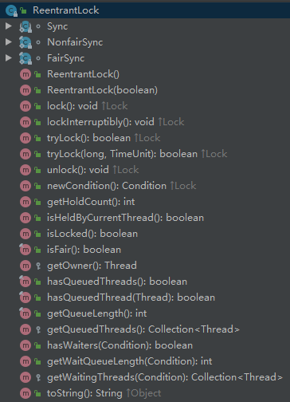

## Java 8 阅读手册


## java.util.concurrent

### 1. locks

#### 1.1 ReentrantLock

##### 前言

Java中的大部分同步类（Lock、Semaphore、ReentrantLock等）都是基于AbstractQueuedSynchronizer（简称为AQS）实现的。在Java5.0之前，在协调对共享对象的访问时可以使用的机制只有synchronized和volatile。Java5.0增加了一种新的机制：ReentrantLock。ReentrantLock并不是一种替代内置加锁的方法，而是作为一种可选择的高级功能。ReentrantLock实现了Lock接口，提供了一种无条件的、可轮询的、定时的以及可中断的锁获取操作，所有加锁和解锁方法都是显式的。

我们基本不会直接使用AQS，AQS是一个构建锁和同步器的框架，许多同步器都可以通过AQS很容易高效的构造出来，基本能够满足绝大多数情况的需求。不仅ReentrantLock，Semaphore、CountDownLatch、ReentrantReadWriteLock、FutureTask也是基于AQS构建的。AQS解决了实现同步器的大量细节，等待线程采用FIFO队列操作顺序；还负责管理同步器类中的状态 ，可以通过getState,setState以及compareAndSetState方法来操作。

##### 文档导读

- ReentrantLock继承树及重要方法
- 非公平锁及公平锁的获取
- tryLock()，lockInterruptibly()
- 释放资源
- ReentrantLock相关面试题
- 总结

##### Reentrantlock 使用实例

```java
public class ReentrantLock01 {
    // ReentrantLock
    public static ReentrantLock reentrantLock = new ReentrantLock();
    public static int count = 0;

    public static void main(String[] args) {
        ReentrantLock01 lock = new ReentrantLock01();
        lock.run();
        System.out.println("计算结果 = " + count);
    }
    public void run() {
        // 加锁
        reentrantLock.lock();
        try {
            for (int i = 0; i < 1000; i++) {
                count++;
            }
        } finally {
            reentrantLock.unlock();
        }
    }
}
```

以上代码通过lock来实现 count++的原子操作

-  reentrantLock.lock() 用来获取锁
-  reentrantLock.unlock()用来释放锁。

那么多线程下，如何保证同步操作？如何释放锁？如何判断没有竞争到锁的线程处于等待状态？什么时候唤醒等待线程？

##### ReentrantLock继承关系概述

（1）**继承关系概述** 

首先看一下继承关系图，对它整体的构造有一个初步的认识。

  

我们发现，ReenTrantLock实现了公平锁和非公平锁，都通过它们的父类 Sync 调度

- **Sync**：是提供AQS实现的工具，类似于适配器，提供了抽象的lock()，便于快速创建非公平锁。
- **FairSync**(公平锁)：线程获取锁的顺序和调用lock()的顺序一样，FIFO。
- **NoFairSync**(非公平锁)：线程获取锁的顺序和调用lock()的顺序无关，抢到CPU的时间片即可调度。

##### ReentrantLock 重要方法

**（1）构造方法**

- 无参构造方法，默认创建非公平锁
- 有参构造方法，当 fair==true时，创建公平锁。

```java
    //维护了一个Sync，对于锁的操作都交给sync来处理
    private final Sync sync;
    public ReentrantLock() { sync = new NonfairSync();}
    public ReentrantLock(boolean fair) {  sync = fair ? new FairSync() : new NonfairSync(); }
```

**（2）获取锁：可以看出请求都是交给 Sync 来调度的**

```java
    //请求锁资源，会阻塞且 不处理中断请求，
    //没有调用unLock()，则会一直被阻塞。
    public void lock() {  sync.lock();}
    
    //线程在请求lock并被阻塞时，如果被interrupt，则此线程会被唤醒并被要求处理, 加锁的同时处理中断请求
    public void lockInterruptibly() throws InterruptedException { sync.acquireInterruptibly(1);}
    
    //尝试获取锁，默认获取的是非公平锁，失败后不会阻塞
    //直接返回true或false
    public boolean tryLock() {  return sync.nonfairTryAcquire(1);}
   
    //重载方法，在规定时间内获取锁，获取不到则返回false
    public boolean tryLock(long timeout, TimeUnit unit) throws InterruptedException {
        return sync.tryAcquireNanos(1, unit.toNanos(timeout));
    }
```

**（3）释放锁：** 不管是公平还是非公平锁，都会调用AQS.release(1)，给当前线程持有锁的数量-1。

```java
  // 如果是当前线程持有锁，就将持有锁的数量减一，直到持有锁的数量为零时，释放锁
  public void unlock() { sync.release(1); }
```


**相关文章：**

1. [Java并发包中锁原理剖析](https://blog.csdn.net/qq_41893274/article/details/105554149) 
2. [从ReentrantLock的实现看AQS的原理及应用](https://tech.meituan.com/2019/12/05/aqs-theory-and-apply.html) —美团技术团队
3. [不可不说的Java“锁”事](https://tech.meituan.com/2018/11/15/java-lock.html) —美团技术团队
4. [深度分析ReentrantLock源码及AQS源码](https://juejin.cn/post/6897852570962755597) 

### 2. atomic

#### 2.1 AtomicInteger