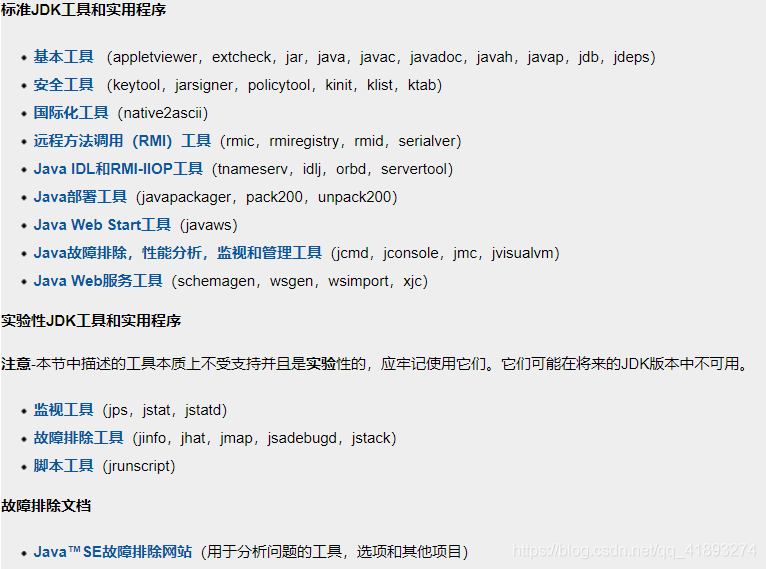

## Java 虚拟机

线上故障主要会包括cpu、磁盘、内存以及网络问题，而大多数故障可能会包含不止一个层面的问题，所以进行排查时候尽量四个方面依次排查一遍。同时例如jstack、jmap等工具也是不囿于一个方面的问题的，基本上出问题就是df、free、top 三连，然后依次jstack、jmap伺候，具体问题具体分析即可。

- 官网工具地址：<https://docs.oracle.com/javase/8/docs/technotes/tools/> 

 

## 性能监控和故障处理


## 故障排除工具

### 堆内存分析工具

内存问题排查起来相对比CPU麻烦一些，场景也比较多。主要包括OOM、GC问题和堆外内存。一般来讲，我们会先用`free`命令先来检查一发内存的各种情况。

- 内存问题大多还都是堆内内存问题。表象上主要分为OOM和StackOverflow。

#### _OOM

#### _**Stack Overflow** 

**分析过程** ：

1. 关于OOM和StackOverflow的代码排查方面，我们一般使用JMAP`jmap -dump:format=b,file=filename pid`来导出dump文件  
2. 通过mat(Eclipse Memory Analysis Tools)导入dump文件进行分析，内存泄漏问题一般我们直接选Leak Suspects即可，mat给出了内存泄漏的建议。另外也可以选择Top Consumers来查看最大对象报告。和线程相关的问题可以选择thread overview进行分析。除此之外就是选择Histogram类概览来自己慢慢分析，大家可以搜搜mat的相关教程。


- mat
- jmap

> **堆内存OOM分析案例** 

1. [排查堆内存溢出](https://mp.weixin.qq.com/s/7XGD-Z3wrThv5HyoK3B8AQ) 

### 栈内存分析工具

#### _使用jstack分析cpu问题

**分析过程：** 

1. 先用ps命令找到对应进程的pid(如果你有好几个目标进程，可以先用top看一下哪个占用比较高) 
2. 用`top -H -p pid`来找到cpu使用率比较高的一些线程
3. 将占用最高的pid转换为16进制`printf '%x\n' pid`得到nid 
4. 直接在jstack中找到相应的堆栈信息`jstack pid |grep 'nid' -C5 –color` 
5. `cat jstack.log | grep "java.lang.Thread.State" | sort -nr | uniq -c`来对jstack的状态有一个整体的把握 

> **栈内存分析案例**

1. [**业务逻辑问题(死循环)、频繁gc**以及**上下文切换过多**](https://blog.csdn.net/qq_41893274/article/details/108901595)  
2. [CPU打到100%](https://mp.weixin.qq.com/s/roEMz-5tzBZvGxbjq8NhOQ) 

#### _频繁GC

使用**jstat -gc pid 1000**命令来对gc分代变化情况进行观察

- 1000表示采样间隔(ms)
- S0C/S1C、S0U/S1U、EC/EU、OC/OUMC/MU分别代表两个Survivor区、Eden区、老年代、元数据区的容量和使用
- YGC/YGT、FGC/FGCT、GCT则代表YoungGc、FullGc的耗时和次数以及总耗时

> GC分析案例

1. [排查YGC问题](https://mp.weixin.qq.com/s/LRx9tLtx1tficWPvUWUTuQ) 

#### _上下文切换

- **vmstat** - 内存，进程和分页等的简要信息。
- **iostat** - CPU统计信息，设备和分区的输入/输出统计信息

## 常见经典异常问题

### 1. Java heap space

#### （1）背景介绍

> 案例分析

```java
       /**
         * 创建一个插入对象为一亿，误报率为0.01%的布隆过滤器
         */
        BloomFilter<CharSequence> bloomFilter = 
                                 BloomFilter.create(Funnels.stringFunnel(Charset.forName("utf-8")), 100000000, 0.0001);
        bloomFilter.put("121");
        bloomFilter.put("122");
        bloomFilter.put("123");
        System.out.println(bloomFilter.mightContain("121"));
```

- 异常提示

```java
Exception in thread "main" java.lang.OutOfMemoryError: Java heap space
	at java.util.concurrent.atomic.AtomicLongArray.<init>(AtomicLongArray.java:81)
	at com.google.common.hash.BloomFilterStrategies$LockFreeBitArray.<init>(BloomFilterStrategies.java:158)
	at com.google.common.hash.BloomFilter.create(BloomFilter.java:429)
	at com.google.common.hash.BloomFilter.create(BloomFilter.java:405)
	at com.google.common.hash.BloomFilter.create(BloomFilter.java:379)
	at com.wxw.common.bloomfilter.BloomFilterTools.main(BloomFilterTools.java:19)
```

- 问题分析

 在 JVM 中如果98%的时间是用于 GC(Garbage Collection) 且可用的 Heap size 不足2%的时候将抛出异常信息：

` java.lang.OutOfMemoryError: Java heap space。 ` 所以产生这个异样的原因通常有两种：

1. 程序中出现了死循环
2. 程序占用内存太多，超过了 JVM 堆设置的最大值

#### （2）解决方案与分析

- 对于第一种需要根据jdk分析工具，找对应的代码分析，具体方案可以参考 [文章](https://blog.csdn.net/qq_41893274/article/details/108901595) 
- 第二种问题处理方案：我们手工扩大JVM堆的参数设置

**Jvm 堆的设置**： 是指Java程序运行过程中JVM可以调配使用的内存空间的设置

在 JVM 启动时，JVM 会自动设置 heap size 值。通常情况下，初始空间（-Xms）默认值是物理内存的1/64，最大空间是物理内存的1/4，可以利用JVM 提供的 ` -Xmn、 -Xms 、 -Xmx ` 等选项进行设置。

```xml
-Xms：初始值 
-Xmx：最大值 
-Xmn：最小值 
```

Heap Size 设置不宜太大，也不宜太小。设置太大程序的响应速度就会变慢了，因为GC占用了更多的时间，这样应用分配到的执行时间就会越少，太大也会造成空间的浪费，而且也会影响其它程序的正常运行。

- Heap Size 最大最好不要超过可用物理内存的80%，建议将 ` -Xms 和 -Xmx` 选项设置为相同，而·` -Xmn` 为 1/4的` -Xmx` 值

**设置方法如下：** 

1. 在执行Java类文件时，加上这个参数

   ```java
   java -Xms32m -Xmx800m className 
   ```

   如果是开发测试，则可以设置环境参数：` VM arguments 中输入-Xms32m -Xmx800m这个参数` 

2. 可以在windows 更改系统环境变量加上 ` JAVA_OPTS=-Xms64m -Xmx512` 

3. 如果用的tomcat则windows下的 tomcat目录下catalina.bat 文件设置 ` set JAVA_OPTS=-Xms64m -Xmx256m` 

   位置在: rem Guess CATALINA_HOME if not defined 这行的下面加合适

4. 如果是Linux系统则设置如下

   ```java
   在{tomcat_home}/bin/catalina.sh的前面，加 set JAVA_OPTS='-Xms64 -Xmx512'
   ```


