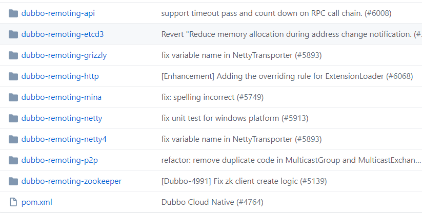
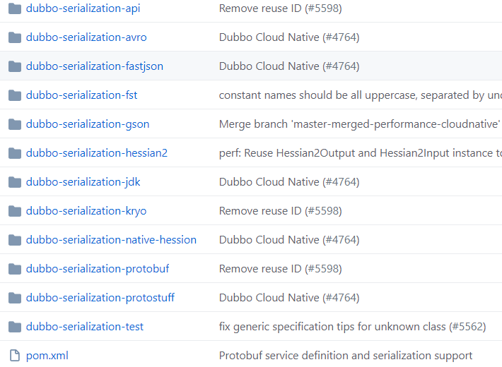

### Dubbo 源码解析

----

​        Apache Dubbo是一个基于Java的高性能开源RPC框架

​       [](https://travis-ci.org/apache/dubbo)[ ](https://codecov.io/gh/apache/dubbo)[](https://gitter.im/alibaba/dubbo?utm_source=badge&utm_medium=badge&utm_campaign=pr-badge)


- Dubbo源码解析  [入口1](https://segmentfault.com/a/1190000016741532)   

### （一）Hello Dubbo 

#### 1、Dubbo 是什么？

先给出一套官方的说法：Apache Dubbo是一款高性能、轻量级基于Java的RPC开源框架。  

- 什么事RPC?

> 文档地址：http://dubbo.apache.org/zh-cn/docs/user/preface/background.html

​       文档简短

形象的对单一应用架构、垂直应用架构、分布式服务架构、流动计算架构做了一个对比，可以很明白的看出这四个架构所适用的场景，因为业务需求越来越复杂，才会有这一系列的演变。

​       **RPC**英文全名为Remote Procedure Call，也叫远程过程调用，其实就是一个计算机通信协议，它是一种通过网络从远程计算机程序上请求服务,而不需要了解底层网络技术的协议。计算机通信协议有很多种，对于开发来说，很多熟悉的是HTTP协议，我这里就做个简单的比较，HTTP协议是属于应用层的，而RPC跨越了传输层和应用层。HTTP本身的三次握手协议，每发送一次请求，都会有一次建立连接的过程，就会带来一定的延迟，并且HTTP本身的报文庞大，而RPC可以按需连接，调用结束后就断掉，也可以是长链接，多个远程过程调用共享同一个链接，可以看出来RPC的效率要高于HTTP，但是相对于开发简单快速的HTTP服务,RPC服务就会显得复杂一些。

​       回到原先的话题，继续来聊聊dubbo。关于dubbo 的特点分别有连通性、健壮性、伸缩性、以及向未来架构的升级性。特点的详细介绍也可以参考上述链接的官方文档。官方文档拥有的内容我在这就不一一进行阐述了。

​        因为接下来需要对dubbo各个模块的源码以及原理进行解析，所以介绍一下dubbo的源码库，dubbo框架已经交由Apache基金会进行孵化，被挂在github开源。

> github地址入口：https://github.com/apache/dubbo

​      然后讲一下dubbo的版本策略：两个大版本并行发展，2.5.x是稳定版本，2.6.x是新功能实验版本。2.6上实验都稳定了以后，会迁移到2.5，所以如果你想了解dubbo最新的牛逼特性，就选择2.6，否则用2.5版本。我接下来介绍都是基于2.6.x版本

#### 2、Dubbo架构设计摸块

- 源码中各个模块之间的依赖关系


##### （1）**dubbo-registry—注册中心**

- 官方解释：基于注册中心下发地址的集群方式，以及对各种注册中心的抽象。

- **dubbo-registry** 下目录结构如下：

  

   dubbo的注册中心实现有Multicast注册中心、Zookeeper注册中心、Redis注册中心、Simple注册中心等

1. dubbo-registry-api：抽象了注册中心的注册和发现，实现了一些公用的方法，让子类只关注部分关键方法。
2. 以下四个包是分别是四种注册中心实现方法的封装，其中dubbo-registry-default就是官方文档里面的Simple注册中心。

##### （2）**dubbo-cluster—集群模块**

​     官方文档的解释：将多个服务提供方伪装为一个提供方，包括：负载均衡, 容错，路由等，集群的地址列表可以是静态配置的，也可以是由注册中心下发。


我的理解：它就是一个解决出错情况采用的策略，这个模块里面封装了多种策略的实现方法，并且也支持自己扩展集群容错策略，cluster把多个Invoker伪装成一个Invoker，并且在伪装过程中加入了容错逻辑，失败了，重试下一个。

**cluster的目录结构：**


1. configurator包：配置包，dubbo的基本设计原则是采用URL作为配置信息的统一格式，所有拓展点都通过传递URL携带配置信息，这个包就是用来根据统一的配置规则生成配置信息。
2. directory包：Directory 代表了多个 Invoker，并且它的值会随着注册中心的服务变更推送而变化 。这里介绍一下Invoker，Invoker是Provider的一个调用Service的抽象，Invoker封装了Provider地址以及Service接口信息。
3. loadbalance包：封装了负载均衡的实现，负责利用负载均衡算法从多个Invoker中选出具体的一个Invoker用于此次的调用，如果调用失败，则需要重新选择。
4. merger包：封装了合并返回结果，分组聚合到方法，支持多种数据结构类型。
5. router包：封装了路由规则的实现，路由规则决定了一次dubbo服务调用的目标服务器，路由规则分两种：条件路由规则和脚本路由规则，并且支持可拓展。
6. support包：封装了各类Invoker和cluster，包括集群容错模式和分组聚合的cluster以及相关的Invoker。

##### （3）**dubbo-common—公共逻辑**

这个应该很通俗易懂，工具类就是一些公用的方法，通用模型就是贯穿整个项目的统一格式的模型，比如URL，上述就提到了URL贯穿了整个项目。

**common的目录：**


##### （4）**dubbo-config—配置模块**

用户都是使用配置来使用dubbo，dubbo也提供了四种配置方式，包括XML配置、属性配置、API配置、注解配置，配置模块就是实现了这四种配置的功能。

config的目录


1. dubbo-config-api：实现了API配置和属性配置的功能。
2. dubbo-config-spring：实现了XML配置和注解配置的功能。

##### （5）**dubbo-rpc—远程调用**

- 远程调用，最主要的肯定是协议，dubbo提供了许许多多的协议实现，不过官方推荐时使用dubbo自己的协议，还给出了一份性能测试报告。

> 性能测试报告地址：[http://dubbo.apache.org/zh-cn...](http://dubbo.apache.org/zh-cn/docs/user/perf-test.html)

这个模块依赖于dubbo-remoting模块，抽象了各类的协议。

看看rpc的目录：


##### （6）**dubbo-remoting—远程通信**

- 提供了多种客户端和服务端通信功能，比如基于Grizzly、Netty、Tomcat等等，RPC用除了RMI的协议都要用到此模块。
- remoting的目录



1. dubbo-remoting-api：定义了客户端和服务端的接口。
2. dubbo-remoting-grizzly：基于Grizzly实现的Client和Server。
3. dubbo-remoting-http：基于Jetty或Tomcat实现的Client和Server。
4. dubbo-remoting-mina：基于Mina实现的Client和Server。
5. dubbo-remoting-netty：基于Netty3实现的Client和Server。
6. Dubbo-remoting-netty4：基于Netty4实现的Client和Server。
7. dubbo-remoting-p2p：P2P服务器，注册中心multicast中会用到这个服务器使用。
8. dubbo-remoting-zookeeper：封装了Zookeeper Client ，和 Zookeeper Server 通信。

##### （7）**dubbo-container—容器模块**

- 因为后台服务不需要Tomcat/JBoss 等 Web 容器的功能，不需要用这些厚实的容器去加载服务提供方，既资源浪费，又增加复杂度。服务容器只是一个简单的Main方法，加载一些内置的容器，也支持扩展容器。

- container的目录

  

1. dubbo-container-api：定义了Container接口，实现了服务加载的Main方法。
2. 其他三个分别提供了对应的容器，供Main方法加载。

##### （8）**dubbo-monitor—监控模块**

- 统计服务调用次数，调用时间的，调用链跟踪的服务，对服务的监控

- monitor的目录

  

1. dubbo-monitor-api：定义了monitor相关的接口，实现了监控所需要的过滤器。
2. dubbo-monitor-default：实现了dubbo监控相关的功能。

##### （9）**dubbo-bootstrap—清理模块**

- 这个模块只有一个类，是作为dubbo的引导类，并且在停止期间进行清理资源。具体的介绍我在后续文章中讲解

##### （10）**dubbo-demo—示例模块**

- 这个模块是快速启动示例，其中包含了服务提供方和调用方，注册中心用的是multicast，用XML配置方法，具体的介绍可以看官方文档。

> 示例介绍地址：[http://dubbo.apache.org/zh-cn...](http://dubbo.apache.org/zh-cn/docs/user/quick-start.html)

##### （11）**dubbo-filter—过滤器**

- filter的目录


1. dubbo-filter-cache：提供缓存过滤器。
2. dubbo-filter-validation：提供参数验证过滤器。

##### （12）**dubbo-plugin—插件模块**

- 该模块提供了内置的插件


1. dubbo-qos：提供了在线运维的命令。

##### （13）**dubbo-serialization—序列化**

- 封装了各类序列化框架的支持实现

  

1. dubbo-serialization-api：定义了Serialization的接口以及数据输入输出的接口。
2. 其他的包都是实现了对应的序列化框架的方法。dubbo内置的就是这几类的序列化框架，序列化也支持扩展。

#### 3、Maven相关的pom文件

```scss
<properties>
    <dubbo.version>2.7.7</dubbo.version>
</properties>
    
<dependencies>
    <dependency>
        <groupId>org.apache.dubbo</groupId>
        <artifactId>dubbo</artifactId>
        <version>${dubbo.version}</version>
    </dependency>
    <dependency>
        <groupId>org.apache.dubbo</groupId>
        <artifactId>dubbo-dependencies-zookeeper</artifactId>
        <version>${dubbo.version}</version>
        <type>pom</type>
    </dependency>
</dependencies>
```

- dubbo-bom/pom.xml，利用Maven BOM统一定义了dubbo的版本号。dubbo-test和dubbo-demo的pom文件中都会引用dubbo-bom/pom.xml，以dubbo-demo都pom举例子：


- dubbo-dependencies-bom/pom.xml：利用Maven BOM统一定义了dubbo依赖的第三方库的版本号。dubbo-parent会引入该bom：


- all/pow.xml：定义了dubbo的打包脚本，使用dubbo库的时候，需要引入改pom文件。
- dubbo-parent：是dubbo的父pom，dubbo的maven模块都会引入该pom文件。

### （二）Dubbo前言

#### （1）什么是SPI ？

- SPI ，全称为 Service Provider Interface，是一种**服务发现机制**。它通过在ClassPath路径下的META-INF/services文件夹查找文件，

  自动加载文件里所定义的类。

- 具体事例：https://www.jianshu.com/p/3a3edbcd8f24

> 目标：让读者知道JDK的SPI思想，dubbo的SPI思想，dubbo扩展机制SPI的原理，能够读懂实现扩展机制的源码。

#### （2）前言

##### 1、 背景

   随着Internet的快速发展，Web应用程序的规模不断扩大，最后我们发现传统的垂直体系结构（单片式）已无法解决。分布式服务体系结构和流计算体系结构势在必行，迫切需要一个治理系统来确保体系结构的有序发展。


- 整体架构

当流量非常低时，只有一个应用程序，所有功能都部署在一起以减少部署节点和成本。在这一点上，数据访问框架（ORM）是简化CRUD工作量的关键。

- 垂直架构

当流量增加时，添加单片应用程序实例不能很好地加速访问，提高效率的一种方法是将单片应用程序拆分为离散的应用程序。此时，用于加速前端页面开发的Web框架（MVC）是关键。

- 分布式服务架构

当垂直应用程序越来越多时，应用程序之间的交互是不可避免的，一些核心业务被提取出来并作为独立的服务提供服务，逐渐形成一个稳定的服务中心，这样前端应用程序可以更好地响应不断变化的市场需求。很快。此时，用于业务重用和集成的分布式服务框架（RPC）是关键。

- 流计算架构

当服务越来越多时，容量评估变得困难，而且小规模的服务也经常造成资源浪费。为解决这些问题，应添加调度中心，以根据流量管理集群容量并提高集群利用率。目前，用于提高机器利用率的资源调度和治理中心（SOA）是关键。

##### 2、Dubbo 服务治理


- 在大型服务出现之前，应用程序可能只是通过使用RMI或Hessian公开或引用远程服务，调用是通过配置服务URL来完成的，而负载平衡是通过硬件（例如F5）来完成的。

- **当服务越来越多时，配置服务URL变得非常困难，F5硬件负载平衡器的单点压力也在增加。**此时，需要一个服务注册表来动态注册和发现服务，以使服务的位置透明。通过获取用户方的服务提供商地址列表，可以实现软负载平衡和故障转移，从而减少了对F5硬件负载平衡器的依赖性以及某些成本。

- **当事情进一步发展时，服务依赖关系变得如此复杂，以至于它甚至无法告诉您先启动哪个应用程序，甚至架构师也无法完全描述应用程序架构之间的关系**。这时，需要自动绘制应用程序的依赖关系图，以帮助架构师清除关系。

- **然后，流量变得更大，服务的容量问题暴露出来，需要多少台机器来支持该服务？何时应添加机器？**为了解决这些问题，首先，应将日常服务电话和响应时间视为容量规划的参考。其次，动态调整权重，增加在线计算机的权重，并记录响应时间的变化，直到达到阈值为止，记录此时的访问次数，然后将此访问次数乘以计算机总数，以计算出容量依次。

##### 3、服务构建


- 单词解释： subscribe(定期订购) 、notify(通知) 、invoke（调用）、count(监控)

-  **节点角色规范**

| 节点        | 角色规格                       |
| ----------- | ------------------------------ |
| `Provider`  | 提供者公开远程服务             |
| `Consumer`  | 消费者致电远程服务             |
| `Registry`  | 注册表负责服务发现和配置       |
| `Monitor`   | 监视器计算服务调用的数量和耗时 |
| `Container` | 容器管理服务的生命周期         |

- **服务关系**

1. `Container`负责启动，加载和运行服务`Provider`。
2. `Provider` 负责 `Register`在启动时向其注册服务。
3. `Consumer` 会从`Register`启动时开始订阅所需的服务。
4. `Register`将`Provider`s列表返回到`Consumer`，更改时，`Register`将`Consumer`通过长连接将更改后的数据推送到。
5. `Consumer` `Provider`根据软负载平衡算法选择s 之一并执行调用，如果失败，它将选择另一个`Provider`。
6. 两者`Consumer`和`Provider`都会计算内存中调用服务的次数和耗时，并将统计信息发送到`Monitor`每分钟。

Dubbo具有以下功能：连接性，鲁棒性，可伸缩性和可升级性。

- **连接性**

- `Register`负责注册和搜索服务地址（例如目录服务），`Provider`和`Consumer`仅在启动期间与注册表交互，而且注册表不会转发请求，因此压力较小
- “监视器”负责计算服务调用的数量和耗时，统计信息将首先在`Provider`和`Consumer`的内存中汇总，然后发送到`Monitor`
- “提供者”将服务注册到“注册中心”，并将耗时的统计信息（不包括网络开销）报告给“监控器”
- “消费之”从中获取服务提供者的地址列表，`Registry`根据LB算法直接致电提供商，向上报耗时的统计信息`Monitor`，其中包括网络开销
- 之间的连接`Register`，`Provider`和`Consumer`是长连接，`Moniter`是一个例外
- `Register` `Provider`通过长连接意识到存在，当断开连接时`Provider`，`Register`会将事件推送到`Consumer`
- 它不影响已经运行的实例`Provider`和`Consumer`甚至所有`Register`和`Monitor` 都宕机，因为`Consumer`会缓存`Provider` 列表，并从中获取
- `Register`和`Monitor`是可选的（可有可无），`Consumer`可以和`Provider`进行直接连接

- **稳定性**

- `Monitor`的停机时间不会影响使用情况，只会丢失一些采样数据
- 当数据库服务器关闭时，`Register`可以通过检查其缓存将服务`Provider`列表返回到`Consumer`，但是新服务器`Provider`无法注册任何服务
- `Register` 是一个对等集群，当任何实例出现故障时，它将自动切换到另一个集群
- 即使所有`Register`实例都发生故障，`Provider`和`Consumer`仍然可以通过检查其本地缓存来进行通信
- 服务`Provider`是无状态的，一个实例的停机时间不会影响使用情况
- `Provider`一个服务的连接出现故障后，`Consumer`无法使用该服务，并无限地重新连接以等待服务`Provider`恢复 （CP）

- **可扩展性**
- `Register` 是一个可以动态增加其实例的对等群集，所有客户端将自动发现新实例。
- `Provider`是无状态的，它可以动态地增加部署实例，并且注册表会将新的服务提供者信息推送到`Consumer`。

- 可升级性

- 当服务集群进一步扩展并且IT治理结构进一步升级时，需要动态部署，并且当前的服务体系结构不会带来阻力，这是未来可能的架构。


**节点角色规范**

| 节点         | 角色规格                                       |
| ------------ | ---------------------------------------------- |
| `Deployer`   | 用于自动服务部署的本地代理                     |
| `Repository` | 该存储库用于存储应用程序包                     |
| `Scheduler`  | 调度程序会根据访问压力自动增加或减少服务提供商 |
| `Admin`      | 统一管理控制台                                 |
| `Registry`   | 注册表负责服务发现和配置                       |
| `Monitor`    | 监控器计算服务呼叫时间和时间                   |

#### （3）架构设计

- 地址入口：http://dubbo.apache.org/en-us/docs/dev/design.html


图片描述：

- 浅蓝色背景的左侧区域显示服务使用者接口，浅绿色背景的右侧区域显示服务提供者接口，中间区域显示两侧。
- 图像从底部到顶部分为10层，并且这些层是单向依赖的。右侧的黑色箭头表示各层之间的依赖性，可以从上层剥离各层以进行重用，Service和Config层是API，其他层是SPI。
- 绿色框是扩展接口，蓝色框是实现类，图像仅显示关联层的实现类。
- 蓝色虚线是初始化过程，启动时是程序集链，红色是方法调用过程，即运行时的调用链，继承了紫色三角形箭头，可以将子类视为父类的相同节点，文本行是方法调用。

- **config层**：外部config接口，`ServiceConfig`并且`ReferenceConfig`是该层的中心，您可以直接初始化config类，也可以通过spring生成config类。
- **代理层**：服务接口的透明代理，生成服务的客户端存根和服务器的服务骨架，`ServiceProxy`为中心，扩展接口为`ProxyFactory`。
- **注册层**：服务注册和发现的封装，服务URL为中心，扩展接口`RegistryFactory`，`Registry`和`RegistryService`。
- **集群层**：muliple提供商和负载平衡，和桥接登记中心的簇的封装，`Invoker`是中心，扩展接口是`Cluster`，`Directory`，`Router`，`LoadBalance`。
- **显示器层**：的RPC调用时间和呼叫监视执行时间，`Statistics`在中心，扩展接口是`MonitorFactory`，`Monitor`，`MonitorService`
- **协议层**：RPC的封装，`Invocation`并且`Result`是中心，扩展接口是`Protocol`，`Invoker`，`Exporter`
- **交换层**：的请求和响应，同步传输异步封装，`Request`并且`Response`是中心，扩展接口是`Exchanger`，`ExchangeChannel`，`ExchangeClient`，`ExchangeServer`
- **传输层**：米娜和网状的抽象，`Message`是中心，扩展接口是`Channel`，`Transporter`，`Client`，`Server`，`Codec`
- **连载层**：可重复使用的工具，扩展接口`Serialization`，`ObjectInput`，`ObjectOutput`，`ThreadPool`

##### 1、依赖关系


- 蓝色表示与业务交互，绿色表示仅与Dubbo内部交互。
- 该映像仅包括RPC层，不包括Remoting层，整个Remoting隐藏在Protocol层中。

##### 2、通话链

- 展开总体设计图的红色调用链


##### 3、发布服务顺序

- 扩展服务提供商的初始化链以暴露服务，该服务位于整体设计图的左侧，时序图如下所示：


#### （4）初始化过程

##### 1、服务发布

- #### 仅公开服务端口：

没有注册表时，直接向提供者公开，解析的URL格式为： ` `ServiceConfig`： `dubbo://service-host/com.foo.FooService?version=1.0.0`。` 

基于扩展点自适应机制，通过识别URL的协议头来调用服务器的export() 方法 DubboProtocol 并打开服务器端口 ` dubbo://` 。

- #### 公开到注册表：

将提供者的地址公开给Registry, URL格式解析为`ServiceConfig`：

`registry://registry-host/org.apache.dubbo.registry.RegistryService?export=URL.encode("dubbo://service-host/com.foo.FooService?version=1.0.0")`，

基于扩展点自适应机制，通过识别URL的协议头来调用服务器的export() 方法 DubboProtocol 并打开服务器端口 ` dubbo://` 。


