## Redis 基础和应用

- Redis数据类型简介。<http://redis.io/topics/data-types-intro>
- 直接在浏览器中尝试Redis。[http://try.redis.io](http://try.redis.io/)
- Redis命令的完整列表。<http://redis.io/commands>
- Redis官方文档中还有更多内容。<http://redis.io/documentation>
- Redis 源码：https://github.com/redis/redis
- Redis 专题：https://blog.csdn.net/qq_41893274/category_10057661.html

### Redis 概述

首先从宏观的角度回顾一下Redis实现高可用相关技术。它包括：持久化、复制、哨兵和集群，主要作用与解决的问题是：

- 持久化：持久化是最简单的高可用方法（有时甚至不被归为高可用的手段），主要作用是数据备份，即将数据存储在硬盘，保证数据不会因进程退出而丢失
- 主存复制：复制是高可用Redis的基础，哨兵和集群都在复制基础上实现高可用的。复制主要实现了数据的多机备份，以及读操作的负载均衡和简单的故障转移。缺陷：故障恢复无法自动化。写操作无法负载均衡、存储能力受到单机器的限制
- 哨兵：在复制的基础上，哨兵实现了自动化的故障恢复。缺陷：写操作无法负载均衡；存储能力受到单机的限制。
- 集群：通过集群，Redis解决了写操作无法负载均衡，以及存储能力受到单机限制的问题，实现了较为完善的高可用方案。

 

### Redis 五种基本数据类型

#### 1.1 字符串—String

Redis 中的字符串是一种 **动态字符串**，它的底层实现有一个字符数组，从源码的 **sds.h/sdshdr 文件** 中可以看到 Redis 底层对于字符串的定义 **SDS**，即 *Simple Dynamic String* 结构，

- string类型是二进制安全的。意思是redis的string可以包含任何数据。比如jpg图片或者序列化的对象。
- string类型是Redis最基本的数据类型，一个value 最大能存储512MB

**应用场景：** 

> 字符串类型的使用场景：信息缓存（单点登录存储用户信息）、计数器、分布式锁、限流等等。

常用命令：get/set/del/incr/decr/incrby/decrby

（1）**记录每一个用户的访问次数，或者记录每一个商品的浏览次数** ——做埋点：Redis计数器的功能 incr

**方案：**  

常用键名：userid:pageview 或者 pageview:userid，如果一个用户的id为123，那对应的redis key就为pageview:123，value就为用户的访问次数，增加次数可以使用命令：incr。

使用理由：每一个用户访问次数或者商品浏览次数的修改是很频繁的，如果使用mysql这种文件系统频繁修改会造成mysql压力，效率也低。而使用redis的好处有二：使用内存，很快；单线程，所以无竞争，数据不会被改乱。

（2）**实战场景2：缓存频繁读取，但是不常修改的信息，如用户信息，视频信息** ——信息缓存

**方案：** 

- **业务逻辑上**：先从redis读取，有值就从redis读取，没有则从mysql读取，并写一份到redis中作为缓存，注意要设置过期时间。
- **键值设计上**：直接将用户一条mysql记录做序列化(通常序列化为json)作为值，userInfo:userid 作为key，键名如：userInfo:123，value存储对应用户信息的json串。如 key为："user:id:name:1",  value为"{"name":"leijia","age":18}"。

（3）**限定某个ip特定时间内的访问次数** ——基于过期时间——限流

**方案：** 

用key记录IP，value记录访问次数，同时key的过期时间设置为60秒，如果key过期了则重新设置，否则进行判断，当一分钟内访问超过100次，则禁止访问。

（4）**实战场景4:分布式session** ——单点登录、分布式锁

我们知道session是以文件的形式保存在服务器中的；如果你的应用做了负载均衡，将网站的项目放在多个服务器上，当用户在服务器A上进行登陆，session文件会写在A服务器；当用户跳转页面时，请求被分配到B服务器上的时候，就找不到这个session文件，用户就要重新登陆。

如果想要多个服务器共享一个session，可以将session存放在redis中，redis可以独立于所有负载均衡服务器，也可以放在其中一台负载均衡服务器上；但是所有应用所在的服务器连接的都是同一个redis服务器。

#### 1.2 列表—list

Redis 的列表相当于 Java 语言中的 **LinkedList**，注意它是链表而不是数组。这意味着：

-  list 的插入和删除操作非常快，时间复杂度为 O(1)，
- 但是索引定位很慢，时间复杂度为 O(n)。

**链表的基本操作** 

- `LPUSH` 和 `RPUSH` 分别可以向 list 的左边（头部）和右边（尾部）添加一个新元素；
- `LRANGE` 命令可以从 list 中取出一定范围的元素；
- `LINDEX` 命令可以从 list 中取出指定下表的元素，相当于 Java 链表操作中的 `get(int index)` 操作；

**应用场景** 

1. l**ist 实现队列**（左进右出）是先进先出的数据结构，常用于消息排队和异步逻辑处理，它会确保元素的访问顺序：
2. **list 实现栈**（右进右出）是先进后出的数据结构，跟队列正好相反

列表本质是一个有序的，元素可重复的队列。

> List 应用场景：https://www.cnblogs.com/pangzizhe/p/10674501.html

（1）实战场景：**高性能分页**

（2）实战场景：**最新列表**：每次通过lpush命令往列表里插入新的元素，然后通过lrange命令读取最新的元素列表，如朋友圈的点赞列表、评论列表。

（3）实战场景：消息队列

（4）**实战场景：定时排行榜** 

list类型的lrange命令可以分页查看队列中的数据。可将每隔一段时间计算一次的排行榜存储在list类型中，每日计算一次，存储在list类型中，接口访问时，通过page和size分页获取打擂金曲

- 如京东每日的手机销量排行、学校每次月考学生的成绩排名、斗鱼年终盛典主播排名等


- 如QQ音乐内地排行榜，每周计算一次存储再list类型中，访问接口时通过page和size分页转化成lrange命令获取排行榜数据。

 


但是，并不是所有的排行榜都能用list类型实现，**只有定时计算的排行榜才适合使用list类型存储** ，

与定时计算的排行榜相对应的是**实时计算的排行榜**，list类型不能支持实时计算的排行榜，下面介绍有序集合sorted set的应用场景时会详细介绍实时计算的排行榜的实现。

#### 1.3 字典—hash

Redis hash 是一个键值(key=>value)对集合。Redis hash是一个string类型的field和value的映射表，hash特别适合用于存储对象。

Redis 中的字典相当于 Java 中的 HashMap，内部实现也差不多类似，都是通过 "数组 + 链表" 的链地址法来解决部分 哈希冲突，同时这样的结构也吸收了两种不同数据结构的优点。

**字典的基本操作** 

hash 也有缺点，hash 结构的存储消耗要高于单个字符串，所以到底该使用 hash 还是字符串，需要根据实际情况再三权衡：

```scss
> HSET books java "think in java"    # 命令行的字符串如果包含空格则需要使用引号包裹
(integer) 1
> HSET books python "python cookbook"
(integer) 1
> HGETALL books    # key 和 value 间隔出现
1) "java"
2) "think in java"
3) "python"
4) "python cookbook"
> HGET books java
"think in java"
> HSET books java "head first java"  
(integer) 0        # 因为是更新操作，所以返回 0
> HMSET books java "effetive  java" python "learning python"    # 批量操作
OK
```

应用场景：

（1）存储对象：hash类型的(key, field, value)的结构与对象的(对象id, 属性, 值)的结构相似，也可以用来存储对象。

（1）购物车：　以用户id为key，商品id为field，商品数量为value，恰好构成了购物车的3个要素

以购物车为例子，用户id设置为key，那么购物车里所有的商品就是用户key对应的值了，每个商品有id和购买数量，对应hash的结构就是商品id为field，商品数量为value。如图所示：


如果将商品id和商品数量序列化成json字符串，那么也可以用上面讲的string类型存储。下面对比一下这两种数据结构：

| 对比项 | string（json） | hash     |
| ------ | -------------- | -------- |
| 效率   | 很高           | 高       |
| 容量   | 低             | 低       |
| 灵活性 | **低**         | 高       |
| 序列化 | 简单           | **复杂** |

**总结一下：** 

当对象的某个属性需要频繁修改时，不适合用string+json，因为它不够灵活，每次修改都需要重新将整个对象序列化并赋值；

- 如果使用hash类型，则可以针对某个属性单独修改，没有序列化，也不需要修改整个对象。比如，商品的价格、销量、关注数、评价数等可能经常发生变化的属性，就适合存储在hash类型里。

#### 1.4 集合—set

Redis的Set是string类型的无序集合。集合是通过哈希表实现的，所以添加，删除，查找的复杂度都是O(1)。

Redis 的集合相当于 Java 语言中的 HashSet，它内部的键值对是无序、唯一的。它的内部实现相当于一个特殊的字典，字典中所有的 value 都是一个值 NULL。

**集合 set 的基本使用** 

```scss
> SADD books java
(integer) 1
> SADD books java    # 重复
(integer) 0
> SADD books python golang
(integer) 2
> SMEMBERS books    # 注意顺序，set 是无序的
1) "java"
2) "python"
3) "golang"
> SISMEMBER books java    # 查询某个 value 是否存在，相当于 contains
(integer) 1
> SCARD books    # 获取长度
(integer) 3
> SPOP books     # 弹出一个
"java"
```

**应用场景** 

set类型是string类型的集合，其特点是集合元素无序且不重复，每个集合最多可以存储 2^32 - 1 个元素（40多亿），set类型主要有以下应用场景。

（1）**实战场景：**好友/关注/粉丝/感兴趣的人集合 

set类型唯一的特点使得其适合用于存储好友/关注/粉丝/感兴趣的人集合，集合中的元素数量可能很多，每次全部取出来成本不小，set类型提供了一些很实用的命令用于直接操作这些集合，如

　　　  a. sinter命令可以获得A和B两个用户的共同好友

　　      b. sismember命令可以判断A是否是B的好友

​      　　c. scard命令可以获取好友数量

​              d. sdiff 命令可以求差集，可能认识的好友 

​      　　e. 关注时，ismove命令可以将B从A的粉丝集合转移到A的好友集合

  **商品筛选** 

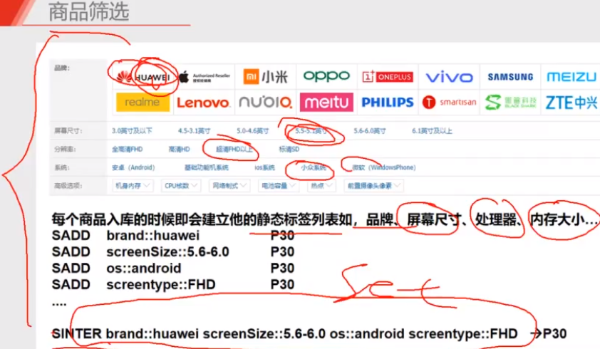 

**（2）黑名单/白名单**

经常有业务出于安全性方面的考虑，需要设置用户黑名单、ip黑名单、设备黑名单等，set类型适合存储这些黑名单数据，sismember命令可用于判断用户、ip、设备是否处于黑名单之中。

**（3）随机展示** 

　通常，app首页的展示区域有限，但是又不能总是展示固定的内容，一种做法是先确定一批需要展示的内容，再从中随机获取。

- 例如下图所示，酷狗音乐K歌擂台赛当日的打擂歌曲共29首，首页随机展示5首；昨日打擂金曲共200首，首页随机展示30首。

 

**（4）点赞/打卡/签到** 

 

#### 1.5 有序列表—zset

Redis zset 和 set 一样也是string类型元素的集合,且不允许重复的成员。不同的是每个元素都会关联一个double类型的分数。

这可能使 Redis 最具特色的一个数据结构了，它类似于 Java 中 SortedSet 和 HashMap 的结合体，一方面它是一个 set，保证了内部 value 的唯一性，另一方面它可以为每个 value 赋予一个 score 值，用来代表排序的权重。

它的内部实现用的是一种叫做 **「跳跃表」** 的数据结构。

**有序列表 zset 基础操作** 

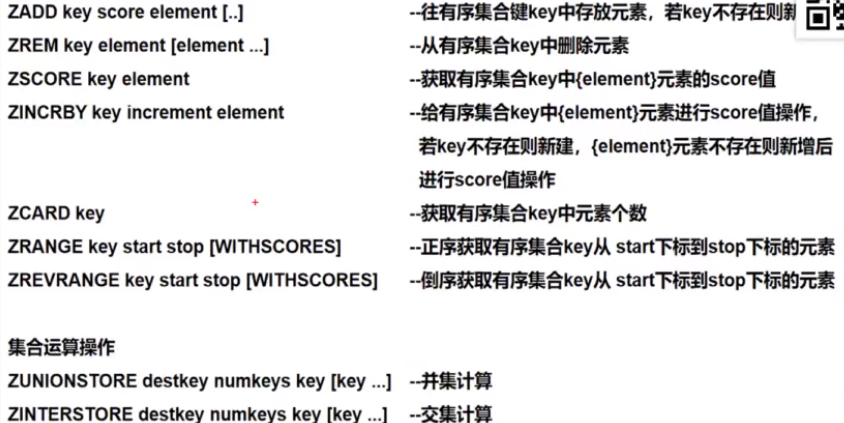 

```java
> ZADD books 9.0 "think in java"
> ZADD books 8.9 "java concurrency"
> ZADD books 8.6 "java cookbook"

> ZRANGE books 0 -1     # 按 score 排序列出，参数区间为排名范围
1) "java cookbook"
2) "java concurrency"
3) "think in java"

> ZREVRANGE books 0 -1  # 按 score 逆序列出，参数区间为排名范围
1) "think in java"
2) "java concurrency"
3) "java cookbook"

> ZCARD books           # 相当于 count()
(integer) 3

> ZSCORE books "java concurrency"   # 获取指定 value 的 score
"8.9000000000000004"                # 内部 score 使用 double 类型进行存储，所以存在小数点精度问题

> ZRANK books "java concurrency"    # 排名
(integer) 1

> ZRANGEBYSCORE books 0 8.91        # 根据分值区间遍历 zset
1) "java cookbook"
2) "java concurrency"

> ZRANGEBYSCORE books -inf 8.91 withscores  # 根据分值区间 (-∞, 8.91] 遍历 zset，同时返回分值。inf 代表 infinite，无穷大的意思。
1) "java cookbook"
2) "8.5999999999999996"
3) "java concurrency"
4) "8.9000000000000004"

> ZREM books "java concurrency"             # 删除 value
(integer) 1
> ZRANGE books 0 -1
1) "java cookbook"
2) "think in java"
```

**应用场景** 

有序集合的特点是有序，无重复值。与set不同的是sorted set每个元素都会关联一个score属性，redis正是通过score来为集合中的成员进行从小到大的排序。

（1）**实战场景：实时排行榜** 

 

QQ音乐中有多种实时榜单，比如飙升榜、热歌榜、新歌榜，可以用redis key存储榜单类型，score为点击量，value为歌曲id，用户每点击一首歌曲会更新redis数据，sorted set会依据score即点击量将歌曲id排序。

（2）某日销售业绩

 

（3）定时任务的数据来源

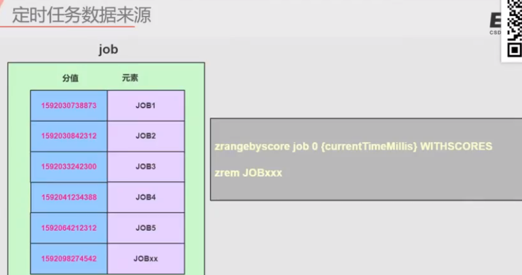 

> 来源：[Redis—5种基本数据结构](https://mp.weixin.qq.com/s/MT1tB2_7f5RuOxKhuEm1vQ) 

相关文章：

- [Redis在互联网应用中的妙用](https://live.csdn.net/room/weixin_48013460/3cQ1hRbn) 

### Redis 持久化

#### 1.1 RDB

RDB(Redis Database)持久化是把当前内存数据生成快照保存到硬盘的过程，触发RDB持久化过程分为**手动触发**和**自动触发**。

（1）手动触发

手动触发对应save命令，会阻塞当前Redis服务器，直到RDB过程完成为止，对于内存比较大的实例会造成长时间阻塞，线上环境不建议使用。

（2）自动触发

自动触发对应bgsave命令，Redis进程执行fork操作创建子进程，RDB持久化过程由子进程负责，完成后自动结束。阻塞只发生在fork阶段，一般时间很短。

在redis.conf配置文件中可以配置：

```conf
save <seconds> <changes>  // save 900 1
```

表示xx秒内数据修改xx次时自动触发bgsave。

- 如果想关闭自动触发，可以在save命令后面加一个空串，即：` save ""` 

还有其他常见可以触发bgsave，如：

- 如果从节点执行全量复制操作，主节点自动执行bgsave生成RDB文件并发送给从节点。
- 默认情况下执行shutdown命令时，如果没有开启AOF持久化功能则 自动执行bgsave。

**bgsave工作机制**

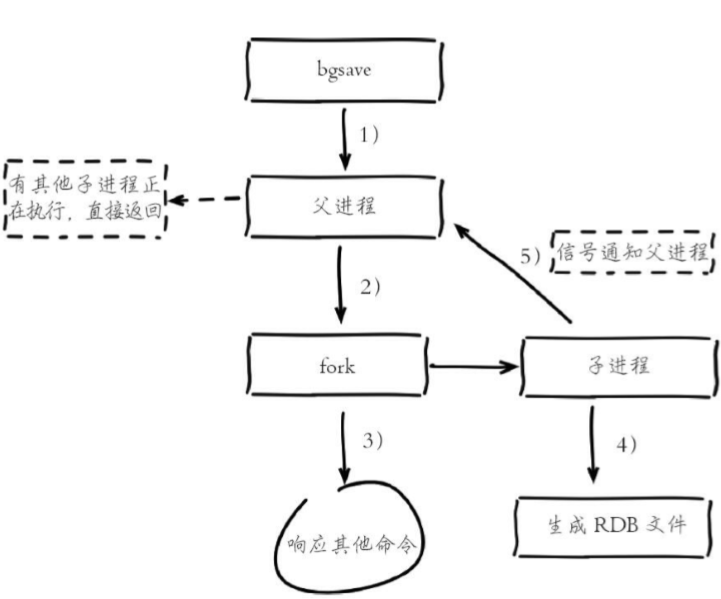 

1. 执行bgsave命令，Redis父进程判断当前是否存在正在执行的子进 程，如RDB/AOF子进程，如果存在，bgsave命令直接返回。
2. 父进程执行fork操作创建子进程，fork操作过程中父进程会阻塞，通 过info stats命令查看latest_fork_usec选项，可以获取最近一个fork操作的耗时，单位为微秒
3. 父进程fork完成后，bgsave命令返回“Background saving started”信息并不再阻塞父进程，可以继续响应其他命令。
4. 子进程创建RDB文件，根据父进程内存生成临时快照文件，完成后对原有文件进行原子替换。执行lastsave命令可以获取最后一次生成RDB的 时间，对应info统计的rdb_last_save_time选项。
5. 进程发送信号给父进程表示完成，父进程更新统计信息，具体见 info Persistence下的rdb_*相关选项。

#### 1.2 AOF 

AOF（append only file）持久化：以独立日志的方式记录每次写命令， 重启时再重新执行AOF文件中的命令达到恢复数据的目的。AOF的主要作用是解决了数据持久化的实时性，目前已经是Redis持久化的主流方式。

**AOF持久化工作机制** 

- 开启AOF功能需要配置：appendonly yes，默认不开启。
- AOF文件名 通过appendfilename配置设置，默认文件名是appendonly.aof。保存路径同 RDB持久化方式一致，通过dir配置指定。
- AOF的工作流程操作：命令写入 （append）、文件同步（sync）、文件重写（rewrite）、重启加载 （load）。

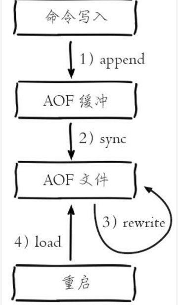 

1. 所有的写入命令会追加到aof_buf（缓冲区）中。
2. AOF缓冲区根据对应的策略向硬盘做同步操作。

> AOF为什么把命令追加到aof_buf中？

Redis使用单线程响应命令，如果每次写AOF文件命令都直接追加到硬盘，那么性能完全取决于当前硬盘负载。先写入缓冲区aof_buf中，还有另一个好处，Redis可以提供多种缓冲区同步硬盘的策略，在性能和安全性方面做出平衡。

3. 随着AOF文件越来越大，需要定期对AOF文件进行重写，达到压缩的目的。
4. 当Redis服务器重启时，可以加载AOF文件进行数据恢复。

**AOF重写（rewrite）机制** 

重写的目的：

- 减小AOF文件占用空间；
- 更小的AOF 文件可以更快地被Redis加载恢复。

AOF重写可以分为手动触发和自动触发：

- 手动触发：直接调用bgrewriteaof命令。
- 自动触发：根据auto-aof-rewrite-min-size和auto-aof-rewrite-percentage参数确定自动触发时机。

```bash
auto-aof-rewrite-min-size：表示运行AOF重写时文件最小体积，默认 为64MB。
auto-aof-rewrite-percentage：代表当前AOF文件空间 （aof_current_size）和上一次重写后AOF文件空间（aof_base_size）的比值。
```

自动触发时机

当aof_current_size>auto-aof-rewrite-minsize 并且（aof_current_size-aof_base_size）/aof_base_size>=auto-aof-rewritepercentage。

其中aof_current_size和aof_base_size可以在info Persistence统计信息中查看。

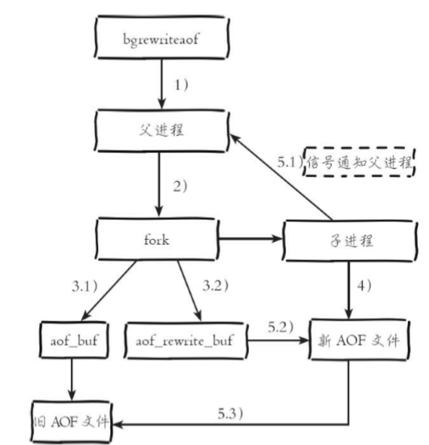 

AOF文件重写后为什么会变小？

（1）旧的AOF文件含有无效的命令，如：del key1， hdel key2等。重写只保留最终数据的写入命令。

（2）多条命令可以合并，如lpush list a，lpush list b，lpush list c可以直接转化为lpush list a b c。

**AOF文件数据恢复** 

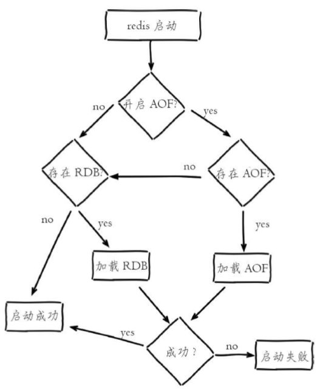 

数据恢复流程说明：

（1）AOF持久化开启且存在AOF文件时，优先加载AOF文件。

（2）AOF关闭或者AOF文件不存在时，加载RDB文件。

（3）加载AOF/RDB文件成功后，Redis启动成功。

（4）AOF/RDB文件存在错误时，Redis启动失败并打印错误信息。

### Redis 事务

> 常见问题

1. Redis为什么不支持回滚（roll back）？
2. Redis事务相关的命令有哪几个？

有事务机制。Redis事务生命周期：

- 开启事务：使用MULTI开启一个事务
- 命令入队列：每次操作的命令都会加入到一个队列中，但命令此时不会真正被执行
- 提交事务：使用EXEC命令提交事务，开始顺序执行队列中的命令

**Redis 事务相关的命令** 

- **WATCH**：可以为Redis事务提供 check-and-set （CAS）行为。被WATCH的键会被监视，并会发觉这些键是否被改动过了。如果有至少一个被监视的键在 EXEC 执行之前被修改了， 那么整个事务都会被取消， EXEC 返回nil-reply来表示事务已经失败。
- **MULTI** ：用于开启一个事务，它总是返回OK。MULTI执行之后,客户端可以继续向服务器发送任意多条命令， 这些命令不会立即被执行，而是被放到一个队列中，当 EXEC命令被调用时， 所有队列中的命令才会被执行。
- **UNWATCH** ：取消 WATCH 命令对所有 key 的监视，一般用于DISCARD和EXEC命令之前。如果在执行 WATCH 命令之后， EXEC 命令或 DISCARD 命令先被执行了的话，那么就不需要再执行 UNWATCH 了。因为 EXEC 命令会执行事务，因此 WATCH 命令的效果已经产生了；而 DISCARD 命令在取消事务的同时也会取消所有对 key 的监视，因此这两个命令执行之后，就没有必要执行 UNWATCH 了。
- **DISCARD** ：当执行 DISCARD 命令时， 事务会被放弃， 事务队列会被清空，并且客户端会从事务状态中退出。
- **EXEC** ：负责触发并执行事务中的所有命令：如果客户端成功开启事务后执行EXEC，那么事务中的所有命令都会被执行

如果客户端在使用MULTI开启了事务后，却因为断线而没有成功执行EXEC,那么事务中的所有命令都不会被执行。需要特别注意的是：即使事务中有某条/某些命令执行失败了，事务队列中的其他命令仍然会继续执行，Redis不会停止执行事务中的命令，而不会像我们通常使用的关系型数据库一样进行回滚。


### Redis 主存复制工作原理

#### 1.1 一主二从windows环境配置

> 来源地址：[我的csdn](https://blog.csdn.net/qq_41893274/article/details/107372973) 

 

**主从复制测试：**

 

**主从同步过程简述** 

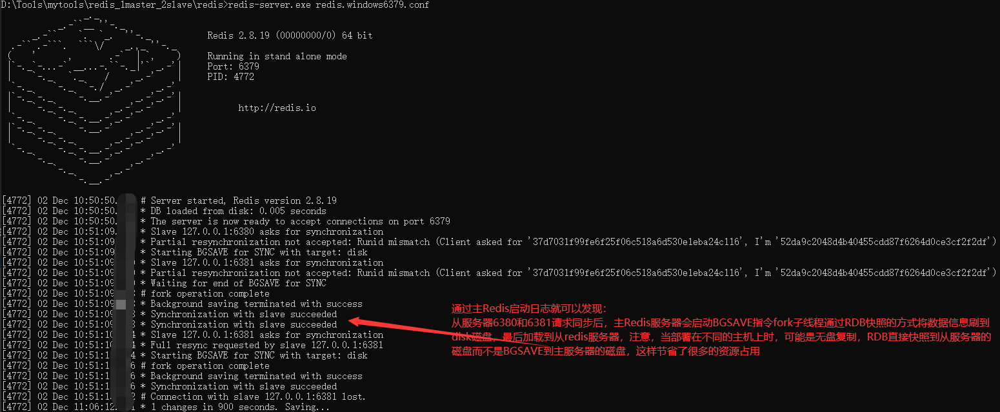 

**相关文章** 

1. [redis环境搭建-主从模式](https://www.cnblogs.com/CSunShine/p/11475152.html) 

#### 1.2 Redis 主存复制

主从复制，是指将一台Redis服务器的数据，复制到其他的Redis服务器。前者称为主节点(master)，后者称为从节点(slave)；数据的复制是单向的，只能由主节点到从节点。

> 来源：[csdn](https://blog.csdn.net/qq_41893274/article/details/109121045) 

**主从复制的作用** 

- 数据冗余：主从复制实现了数据的热备份，是持久化之外的一种数据冗余方式。
- 故障恢复：当主节点出现问题时，可以由从节点提供服务，实现快速的故障恢复；实际上是一种服务的冗余。
- 负载均衡：在主从复制的基础上，配合读写分离，可以由主节点提供写服务，由从节点提供读服务，分担服务器负载；尤其是在写少读多的场景下，通过多个从节点分担读负载，可以大大提高Redis服务器的并发量。
- 高可用基石：主从复制还是哨兵和集群能够实施的基础，因此说主从复制是Redis高可用的基础。

**主从复制实现原理**

主从复制过程主要可以分为3个阶段：连接建立阶段、数据同步阶段、命令传播阶段。


### Redis 哨兵模式工作原理

**经典文章** 

> 来源：[我的 CSDN](https://blog.csdn.net/qq_41893274/article/details/107371963) 

Redis 的主从复制模式下，一旦主节点由于故障不能提供服务，需要手动将从节点晋升为主节点，同时还要通知客户端更新主节点地址，这种故障处理方式从一定程度上是无法接受的。

Redis 2.8 以后提供了 Redis Sentinel 哨兵机制来解决这个问题。

Redis Sentinel 是 Redis 高可用的实现方案。Sentinel 是一个管理多个 Redis 实例的工具，它可以实现对 Redis 的监控、通知、自动故障转移。

Redis Sentinel架构图如下：

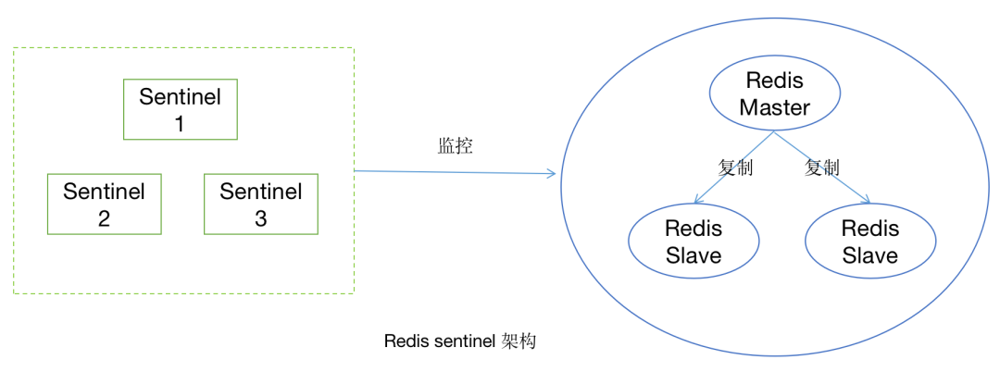 

#### **哨兵模式的原理**

哨兵模式的主要作用在于它能够自动完成故障发现和故障转移，并通知客户端，从而实现高可用。哨兵模式通常由一组 Sentinel 节点和一组（或多组）主从复制节点组成。

#### **心跳机制**  

**（1）Sentinel与Redis Node** 

Redis Sentinel 是一个特殊的 Redis 节点。在哨兵模式创建时，需要通过配置指定 Sentinel 与 Redis Master Node 之间的关系，然后 Sentinel 会从主节点上获取所有从节点的信息，之后 Sentinel 会定时向主节点和从节点发送 info 命令获取其拓扑结构和状态信息。

**（2）Sentinel与Sentinel** 

基于 Redis 的订阅发布功能， 每个 Sentinel 节点会向主节点的 **sentinel**：hello 频道上发送该 Sentinel 节点对于主节点的判断以及当前 Sentinel 节点的信息 ，同时每个 Sentinel 节点也会订阅该频道， 来获取其他 Sentinel 节点的信息以及它们对主节点的判断。

通过以上两步所有的 Sentinel 节点以及它们与所有的 Redis 节点之间都已经彼此感知到，之后每个 Sentinel 节点会向主节点、从节点、以及其余 Sentinel 节点定时发送 ping 命令作为心跳检测， 来确认这些节点是否可达。

#### **故障转移**

每个 Sentinel 都会定时进行心跳检查，当发现主节点出现心跳检测超时的情况时，此时认为该主节点已经不可用，这种判定称为**主观下线**。

之后该 Sentinel 节点会通过 sentinel ismaster-down-by-addr 命令向其他 Sentinel 节点询问对主节点的判断， 当 quorum（法定人数） 个 Sentinel 节点都认为该节点故障时，则执行**客观下线**，即认为该节点已经不可用。这也同时解释了为什么必须需要一组 Sentinel 节点，因为单个 Sentinel 节点很容易对故障状态做出误判。

> 这里 quorum 的值是我们在哨兵模式搭建时指定的，后文会有说明，通常为 Sentinel节点总数/2+1，即半数以上节点做出主观下线判断就可以执行客观下线。

因为故障转移的工作只需要一个 Sentinel 节点来完成，所以 Sentinel 节点之间会再做一次选举工作， 基于 Raft 算法选出一个 Sentinel 领导者来进行故障转移的工作。

被选举出的 Sentinel 领导者进行故障转移的具体步骤如下：

（1）在从节点列表中选出一个节点作为新的主节点

- 过滤不健康或者不满足要求的节点；
- 选择 slave-priority（优先级）最高的从节点， 如果存在则返回， 不存在则继续；
- 选择复制偏移量最大的从节点 ， 如果存在则返回， 不存在则继续；
- 选择 runid 最小的从节点。

（2）Sentinel 领导者节点会对选出来的从节点执行 slaveof no one 命令让其成为主节点。

（3）Sentinel 领导者节点会向剩余的从节点发送命令，让他们从新的主节点上复制数据。

（4）Sentinel 领导者会将原来的主节点更新为从节点， 并对其进行监控， 当其恢复后命令它去复制新的主节点。

**相关文章** 

- [Redis Sentinel文档](https://github.com/redis/redis-doc/blob/master/topics/sentinel.md) 
- [sentinet-clients](https://github.com/redis/redis-doc/blob/master/topics/sentinel-clients.md) 

### Redis 集群模式工作原理

引入Cluster模式的原因：

不管是主从模式还是哨兵模式都只能由一个master在写数据，在海量数据高并发场景，一个节点写数据容易出现瓶颈，引入Cluster模式可以实现多个节点同时写数据。

Redis-Cluster采用无中心结构，每个节点都保存数据，节点之间互相连接从而知道整个集群状态。

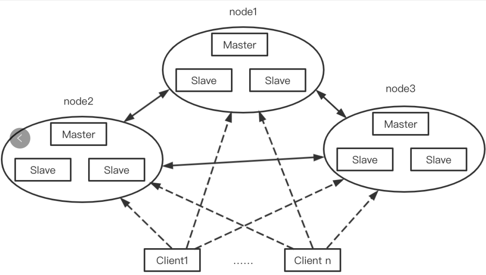 

如图所示Cluster模式其实就是多个主从复制的结构组合起来的，每一个主从复制结构可以看成一个节点，那么上面的Cluster集群中就有三个节点。


### Redis 布隆过滤器

> **场景分析**

 假如我们在使用新闻客户端看新闻时，它会给我们不停的推荐新的内容，而它每次推荐时，都要去重，以去掉那些我们已经看过的内容。那么问题来了，新闻客户端推荐系统是如何实现推送去重的？

你可能会想到：服务器已经记录了用户看过的所有历史记录，当推荐系统推送新闻时可以从每个用户的历史记录里进行筛选，以过滤掉那些已经存在的记录。问题是，当用户量很大、每个用户看过的新闻又很多的情况下，使用这种方式，推荐系统的去重工作在性能上能跟的上吗？

实际上，如果历史记录存储在关系数据库里，去重就需要频繁地对数据库进行exists查询，当系统并发量很高时，数据库是很难扛住压力的。

你可能又想到了缓存，但是将如此多的历史记录全部缓存起来，那得浪费多大的存储空间啊？而且这个存储空间是随着时间线性增长的，就算你撑得住一个月，你能撑得住几年吗？但是不缓存的话，性能又跟不上，这该怎么办？


高级数据结构布隆过滤器（Bloom Filter）登场了，它就是专门用来解决这种去重问题的。它在起到去重作用的同时，在空间上还能节省90%以上，只是稍微有那么点不准确，也就是有一定的误判率。

#### 1.1 布隆过滤器是什么

布隆过滤器（Bloom Filter）是1970年由[布隆](https://baike.baidu.com/item/%E5%B8%83%E9%9A%86/14216465)提出的。布隆过滤器可以用于检索一个元素是否在一个集合中，但是它可能会误判。它的优点是高效地插入和查询，缺点是有一定的误识别率和删除困难。

- 当布隆过滤器说某个值存在时，这个值可能不存在
- 当布隆过滤器说某个值不存在时，这个值一定不存在

套在上面的使用场景中，布隆过滤器能准确过滤掉那些用户已经看过的内容，那些用户没有看过的内容，它会过滤掉极小一部分（误判），但是绝大多数内容它都能准确识别。这样就可以保证推荐给用户的内容都是无重复的。

#### 1.2 Redis 中的布隆过滤器

redis 在 4.0 的版本中加入了 module 功能，布隆过滤器可以通过 module 的形式添加到 redis 中，所以使用 redis 4.0 以上的版本可以通过加载 [module](https://github.com/RedisLabsModules/rebloom) 来使用 redis 中的布隆过滤器。但是这不是最简单的方式

- 使用 docker 可以直接在 redis 中体验布隆过滤器。

```bash
> docker run -d -p 6379:6379 --name bloomfilter redislabs/rebloom
> docker exec -it bloomfilter redis-cli
```

- 给Redis安装布隆过滤器模块

  下载地址：<https://github.com/RedisBloom/RedisBloom>

- redis 布隆过滤器主要就两个命令：

```bash
- bf.add 添加元素到布隆过滤器中: bf.add urls https://jaychen.cc  ## 它在第一次add时创建过滤器
- bf.exists 判断某个元素是否在过滤器中: bf.exists urls https://jaychen.cc
- bf.reserve 显式创建布隆过滤器， 如果key已经存在，则bf.reserve 会报错
```

上面说过布隆过滤器存在误判的情况，在 redis 中有两个值决定布隆过滤器的准确率：

- `error_rate `：允许布隆过滤器的错误率，这个值越低过滤器的位数组的大小越大，占用空间也就越大。
- `initial_size `：布隆过滤器可以储存的元素个数，当实际存储的元素个数超过这个值之后，过滤器的准确率会下降。

redis 中有一个命令可以来设置这两个值：

```bash
bf.reserve urls 0.01 100

三个参数的含义：
  第一个值是过滤器的名字
  第二个值为 error_rate 的值（错误率）默认值 0.01
  第三个值为 initial_size 的值，默认值是 100
```

使用这个命令要注意一点：**执行这个命令之前过滤器的名字应该不存在，如果执行之前就存在会报错：(error) ERR item exists**

> **注意事项** 

1. 布隆过滤器的 ` initial_size` 设置过大，会浪费存储空间，设置的过小，就会影响准确率，用户在使用之前一定要尽可能的精确估计元素数量，还需要加上一定的冗余空间以避免实际元素可能会意外高出估计值很多，导致误判率上升。

2. 布隆过滤器的 ` error_rate` 越小，需要的存储空间就越大，对于不需要过于精确的场合，` error_rate` 设置稍微大一点也无伤大雅。

   比如：新闻客户端去重应用上，误判率高一点只会让小部分文章不能被合适的人看的，文章的整体阅读量不会因为这点误判率带来巨大的改变。

#### 1.3 布隆过滤器的原理

学会了布隆过滤器的使用，下面有必要解释一下原理。

**（1）HashMap 的问题** 

讲述布隆过滤器的原理之前，我们先思考一下，通常你判断某个元素是否存在用的是什么？应该蛮多人回答 HashMap 吧，确实可以将值映射到 HashMap 的 Key，然后可以在 O(1) 的时间复杂度内返回结果，效率很高。

但是 HashMap 的实现也有缺点：

1. **假如存储容量占比高，考虑到负载因子的存在，通常空间是不能被用满的**，而一旦你的值很多例如上亿的时候，那 HashMap 占据的内存大小就变得很大了。
2. 数据集存储在远程服务器上，本地服务接受输入，而数据集非常大不可能一次性读进内存构建 HashMap 的时候，也会存在问题

**（2）布隆过滤器原理** 

bitmap可以实现从一个比较大的整数集合中判断一个数字是否存在，但是实际场景中往往还会有其他的场景，**比如：** 

从10亿个身份证判断某个身份证号码是否存在，很显然采用bitmap就无法实现了，因为**bitmap只能判断整数**是否存在。所以如果有一种方式能够将身份证号码的字符串转换成一个整数，那么就可以使用bitmap来实现判断字符串是否存在于一个集合中的需求了。而通过字符串转换成整数的方式也很普遍，那就是采用hash函数通过计算字符串的hashCode来转换成整数。

而布隆过滤器实际就是一系列的hash函数+bitmap实现的。

> **字符串存入bitmap中** 

布隆过滤器是通过bitmap实现的，只不过在bitmap之上添加了多个hash函数来对传入的数据转换正常整数类型。如下图示

 

字符串hello和字符串world，通过hash计算之后分别hashCode值为1和8，那么就可以通过bitmap的功能将1和8分别存入bitmap中，就相当于hello和world两个字符串存入了bitmap中。判断字符串是否存在时就可以通过计算hashCode的方式，判断对应的hash值是否存在于bitmap中即可可以判断字符串是否存在于bitmap中了 

> **hash碰撞问题** 

虽然通过字符串计算hash值存入bitmap中表面上没有什么问题，但是hash函数是存在一定的碰撞概率的，也就是多个字符串计算出来的hash值是一样的，此时就会出现误判的情况。

 

如上图，判断字符串XXXX是否存在，就需要先计算hashCode值，结果为8，此时判断结果为hashCode为8已经存在于bitmap中的，此时就会得到错误的判断是字符串XXXX已经存在了，但是实际是并不存在的，而是出现了hashCode碰撞的情况。但是如果对应的hashCode在bitmap中不存在，那么就可以确认当前字符串不存在。而hashCode存在的情况下，只能说明当前字符串是可能存在。

所以你通过布隆过滤器只能实现的功能为：能够确认一个字符串不存在于集合中，但是无法确认一个字符串存在于集合中。

> **hash碰撞问题优化** 

由于hash函数会存在hash碰撞的情况，就导致布隆过滤器的功能会出现比较大的误差，那么既然一个hash函数存在hash碰撞，就可以采用多个hash函数来降低hash碰撞的概率。比较不同的字符串通过多个不同的hash函数还碰撞的概率会大大降低。如下图：

 

字符串hello通过三个hash函数分别计算出来的hash值为1、5、8；字符串world通过三个hash函数计算出来的hash值为5、8、15，虽然hash值为15发生了hash碰撞的情况，但是两位两个hash值均没有发生hash碰撞，只有当通过三个hash函数计算出来的hash值都存在时才能够判断一个字符串可能存在，如果某个字符串通过三个hash函数计算出来的hash值只有部分存在，那么就是存在hash碰撞，且该字符串肯定不存在。

虽然通过多个hash函数可以对于误判的情况进行优化，但是并没有本质上解决误判的情况，因为毕竟从理论上还是可能会存在多个hash值发生了hash碰撞的情况的。比如一个字符串通过三个hash函数计算的值分别为1、5、15，那么虽然和上面两个字符串都不是全部冲突了，但是1和hello发生了冲突，5和15和world发生了冲突，如果hello和world都存在，那么就会导致hash值为1、5、15的字符串产生误判的情况。

> **布隆过滤器删除元素** 

bitmap是支持删除元素的，因为bitmap不存在冲突的情况，每一个数字只会对应一个元素，而布隆过滤器的每一个元素都有可能会对应多个元素，所以不能通过删除的方式删除元素，因为这样可能会导致其他元素查询的结果不正确。

比如上图的例子，如果将world字符串删除，那么就需要将5、15、25三个位置的值置为0，此时再判断hello是否存在结果25的位置为0，那么就导致判断结果为hello字符串不存在了。

可以通过对每一位数字计算的方式判断每一位被hash冲突了多少次来实现删除元素的方式，但是每一位增加计算就会大大增加存储的空间。

#### 1.4 布隆过滤器的应用

1. 网页爬虫对 URL 去重，避免爬取相同的 URL 地址；

2. 邮箱系统的从数十亿的垃圾邮件过滤一些垃圾邮件和黑名单查询

3. 集合重复元素的判别

4. Google Chrome 使用布隆过滤器识别恶意 URL；

5. 查询加速（比如基于key-value的存储系统）

6. 新闻推送系统，使用布隆过滤器避免推荐给用户已经读过的文章，短信推送

7. **redis缓存穿透问题的解决** 

   所谓的缓存穿透就是服务调用方每次都是查询不在缓存中的数据，这样每次服务调用都会到数据库中进行查询，如果这类请求比较多的话，就会导致数据库压力增大，这样缓存就失去了意义。

   所以先将需要查询的数据存入布隆过滤器，如果布隆过滤器不存在则直接返回；如果布隆过滤器存在则再从redis查询（此时只会有少数误差数据）；如果redis中还不存在则查询数据库（此时的访问很小了），并在查询数据库可以通过并发加锁处理，保证只有一个线程可以查询该数据并写入缓存，从而避免了缓存穿透的问题

##### **（1）场景分析一** 

假如现在有40亿个ip地址（string类型），然后给你一个ip地址，让你查找这个ip地址在不在这40亿个ip地址里？我们应该怎么做呢？

1. 如果用哈希表来处理的话，这里有40亿的数据，数据量太大，因此太占用空间
2. 如果用位图来处理的话，这里因为是字符串，有可能不同的字符串映射的是同一个位，会有哈希冲突的问题，导致误判
3. 因此我们采用的是哈希+位图的方法，也就是布隆过滤器

布隆过滤器是由布隆（Burton Howard Bloom）在1970年提出的一种紧凑型的、比较巧妙的概率型数据结构，特点是高效地插入和查询，可以用来告诉你 **“某样东西一定不存在或者可能存在”**，它是用多个哈希函数，将一个数据映射到位图结构中。

##### （2）场景分析二

经典面试题：一个10G大小的文件，存储内容为自然数，一行一个乱序排放，需要对其进行排序操作，但是机器的内存只有2G。

此时就可以通过布隆过滤器进行操作。首先将10G大小文件通过工具分隔成多个小文件，然后依次读取数据将数据存入bitmap中，10G的大小的自然数差不多可以存储27亿个左右的整数。

27亿个整数存入bitmap需要占用的空间为 2700000000/8/1024/1024 = 320M左右，所以内存是足够的。然后从1到最大值进行遍历判断是否存在于bitmap中从而达到排序的效果。

#### 1.5 常见问题

##### （1）空间占用评估

空间占用有一个简单的推到公式（推到过程自己调研）：

- n——预计元素的数量
- f——错误率
- L——位数组长度
- k——hash的最佳数量

```java
k = 0.7 * （L/n） // hash的最佳数量
f = 0.6185^(L/n)  // 错误率
```

从公式可以看出：

1. 位数组相对越长（L/n）: 错误率f 越低
2. 位数组相对越长（L/n）：hash函数需要的最佳数量也越多（但是影响计算效率） 

> 布隆过滤器在线计算工具：https://krisives.github.io/bloom-calculator/

##### （2）实际元素超出对误判率的影响

当实际元素超出预计元素时，错误率会增大

- t——实际元素和预计元素的倍数

```java
f = （1 - 0.5^t）^k   // 极限近似，k是hash函数的数量
```

当实际元素和预计元素的倍数 t 增大时，错误率 f 也会跟着增大；

### Redis Lua 脚本

前言

- KEYS[1] 用来表示在redis 中用作键值的参数占位，主要用來传递在redis 中用作keyz值的参数。

- ARGV[1] 用来表示在redis 中用作参数的占位，主要用来传递在redis中用做 value值的参数。

#### 1. Lua 基本用法

（1）` EVAL script numkeys key [key ...] arg [arg ...] `  ,其中 numkeys 是key的个数，后边接着写key1 key2...  val1 val2....，举例

```c
127.0.0.1:6379> eval "return {KEYS[1],KEYS[2],ARGV[1],ARGV[2]}" 2 key1 key2 val1 val2
1) "key1"
2) "key2"
3) "val1"
4) "val2"
```

（2）` SCRIPT LOAD script `  ， 其中把脚本加载到脚本缓存中，返回SHA1校验和。但不会立马执行，举例

```c
127.0.0.1:6379> SCRIPT LOAD "return 'hello world'"
"5332031c6b470dc5a0dd9b4bf2030dea6d65de91"
```

（3）` EVALSHA sha1 numkeys key [key ...] arg [arg ...] ` , 其中 根据缓存码（SHA1校验和）执行脚本内容。举例

```c
127.0.0.1:6379> SCRIPT LOAD "return {KEYS[1],KEYS[2],ARGV[1],ARGV[2]}" 
"a42059b356c875f0717db19a51f6aaca9ae659ea"
127.0.0.1:6379> EVALSHA "a42059b356c875f0717db19a51f6aaca9ae659ea" 2 key1 key2 val1 val2
1) "key1"
2) "key2"
3) "val1"
4) "val2"
```

（4）` SCRIPT EXISTS script [script ...] ` ，通过sha1校验和判断脚本是否在缓存中

（5）` SCRIPT FLUSH ` , 清空缓存

```c
127.0.0.1:6379> SCRIPT LOAD "return 'hello jihite'"
"3a43944275256411df941bdb76737e71412946fd"
127.0.0.1:6379> SCRIPT EXISTS "3a43944275256411df941bdb76737e71412946fd"
1) (integer) 1
127.0.0.1:6379> SCRIPT FLUSH
OK
127.0.0.1:6379> SCRIPT EXISTS "3a43944275256411df941bdb76737e71412946fd"
1) (integer) 0
```

（6）` SCRIPT KILL `  , 杀死目前正在执行的脚本

#### 2. Lua主要优势

- 减少网络开销：多个请求通过脚本一次发送，减少网络延迟

- 原子操作：将脚本作为一个整体执行，中间不会插入其他命令，无需使用事务

- 复用：客户端发送的脚本永久存在redis中，其他客户端可以复用脚本

- 可嵌入性：可嵌入JAVA，C#等多种编程语言，支持不同操作系统跨平台交互

#### 3. Lua实战

直接在redis-cli中直接写lua脚本，这样非常不方便编辑，通常情况下我们都是把lua script放到一个lua文件中，然后执行这个lua脚本，

- 第一步：编写脚本

  ```c
  local key = KEYS[1]
  local val = redis.call("GET", key);
  
  if val == ARGV[1]
  then
          redis.call('SET', KEYS[1], ARGV[2])
          return 1
  else
          return 0
  end
  ```

- 第二步：执行lua脚本

  ```bash
  执行命令： redis-cli -a 密码 --eval Lua脚本路径 key [key …] ,  arg [arg …] 
  如：redis-cli -a 123456 --eval ./Redis_CompareAndSet.lua userName , zhangsan lisi 
  ```

> 注意："--eval"而不是命令模式中的"eval"，一定要有前端的两个 - 脚本路径后紧跟key [key …]，相比命令行模式，少了numkeys这个key数量值
> key [key …] 和 arg [arg …] 之间的“ , ”，英文逗号前后必须有空格，否则死活都报错

```c
## Redis客户端执行
127.0.0.1:6379> set userName zhangsan 
OK
127.0.0.1:6379> get userName
"zhangsan"

## linux服务器执行
## 第一次执行：compareAndSet成功，返回1
## 第二次执行：compareAndSet失败，返回0
[root@vm01 learn_lua]# redis-cli -a 123456 --eval Redis_CompareAndSet.lua userName , zhangsan lisi
(integer) 1
[root@vm01 learn_lua]# redis-cli -a 123456 --eval Redis_CompareAndSet.lua userName , zhangsan lisi
(integer) 0
```

##### （1）**示例1：** **活跃用户判断** 

**活跃用户判断：** 判断一个游戏用户是否属于活跃用户，如果符合标准，则活跃用户人数+1

- Lua 脚本存储位置：/Users/jihite/activeuser.lua 

```c
   if redis.call("EXISTS",KEYS[1]) == 1 then
     return redis.call("INCRBY",KEYS[1],ARGV[1])
   else
     return nil
   end
```

- 如何执行

```c
$ redis-cli --eval /Users/jihite/activeuser.lua user , 1
(integer) 1

127.0.0.1:6379> get user
"1"
127.0.0.1:6379> exit
$ redis-cli --eval /Users/jihite/activeuser.lua user , 1
(integer) 2
$ redis-cli 
127.0.0.1:6379> get user
"2"
127.0.0.1:6379> exit
$ redis-cli --eval /Users/jihite/activeuser.lua user , 4
(integer) 6
```

##### （2）使用Lua控制IP访问频率

> 需求

实现一个访问频率控制，某个IP在短时间内频繁访问页面，需要记录并检测出来，就可以通过Lua脚本高效的实现。
**小声说明**：本实例针对固定窗口的访问频率，而动态的非滑动窗口。即：如果规定一分钟内访问10次，记为超限。在本实例中前一分钟的最后一秒访问9次，下一分钟的第1秒又访问9次，不计为超限。

> 脚本如下

```c
local visitNum = redis.call('incr', KEYS[1])

if visitNum == 1 then
        redis.call('expire', KEYS[1], ARGV[1])
end

if visitNum > tonumber(ARGV[2]) then
        return 0
end

return 1;
```

> 演示如下

```bash
## LimitIP:127.0.0.1为key， 10 3表示：同一IP在10秒内最多访问三次
## 前三次返回1，代表未被限制；第四、五次返回0，代表127.0.0.1这个ip已被拦截
[root@vm01 learn_lua]# redis-cli -a 123456 --eval Redis_LimitIpVisit.lua LimitIP:127.0.0.1 , 10 3
 (integer) 1
[root@vm01 learn_lua]# redis-cli -a 123456 --eval Redis_LimitIpVisit.lua LimitIP:127.0.0.1 , 10 3
 (integer) 1
[root@vm01 learn_lua]# redis-cli -a 123456 --eval Redis_LimitIpVisit.lua LimitIP:127.0.0.1 , 10 3
 (integer) 1
[root@vm01 learn_lua]# redis-cli -a 123456 --eval Redis_LimitIpVisit.lua LimitIP:127.0.0.1 , 10 3
 (integer) 0
[root@vm01 learn_lua]# redis-cli -a 123456 --eval Redis_LimitIpVisit.lua LimitIP:127.0.0.1 , 10 3
 (integer) 0
```


#### 4. Lua 脚本的安全性

- 如生成随机数这一命令，如果在master上执行完后，再在slave上执行会不一样，这就破坏了主从节点的一致性

为了解决这个问题， Redis 对 Lua 环境所能执行的脚本做了一个严格的限制 —— 所有脚本都必须是无副作用的纯函数（pure function）。所以刚才说的那种情况压根不存在。Redis 对 Lua 环境做了一些列相应的措施：

- 不提供访问系统状态状态的库（比如系统时间库）
- 禁止使用 loadfile 函数
- 如果脚本在执行带有随机性质的命令（比如 RANDOMKEY ），或者带有副作用的命令（比如 TIME ）之后，试图执行一个写入命令（比如 SET ），那么 Redis 将阻止这个脚本继续运行，并返回一个错误。
- 如果脚本执行了带有随机性质的读命令（比如 SMEMBERS ），那么在脚本的输出返回给 Redis 之前，会先被执行一个自动的字典序排序，从而确保输出结果是有序的。
- 用 Redis 自己定义的随机生成函数，替换 Lua 环境中 `math` 表原有的 math.random 函数和 math.randomseed 函数，新的函数具有这样的性质：每次执行 Lua 脚本时，除非显式地调用 `math.randomseed` ，否则 `math.random` 生成的伪随机数序列总是相同的。

#### 5. 小总结

回头再思考文章开头提到的Redis使用Lua脚本的几个优点：**减少网络开销、原子性、复用** 

**相关文章** 

1. [Eval 脚本语法](https://zhuanlan.zhihu.com/p/77484377)  

### Redis 总结与思考

- [Redis 之20问](https://mp.weixin.qq.com/s/GwjQalQ9ZkBbTBtEKpbkMw) ——中华石杉

#### 1.1 经典问题

**（1）假如Redis里面有1亿个key，其中有10w个key是以某个固定的已知的前缀开头的，如果将它们全部找出来？**

使用keys指令可以扫出指定模式的key列表：**keys pre***，这个时候面试官会追问该命令对线上业务有什么影响，直接看下一个问题。

**（2）如果这个redis正在给线上的业务提供服务，那使用keys指令会有什么问题？** 

redis 的单线程的。keys 指令会导致线 程阻塞一段时间，线上服务会停顿，直到指令执行完毕，服务才能恢复。这个时 候**可以使用 scan 指令**，scan 指令可以无阻塞的提取出指定模式的 key 列表，但是会有一定的重复概率，在客户端做一次去重就可以了，但是整体所花费的时间 会比直接用 keys 指令长。

**（3）如果有大量的key需要设置同一时间过期，一般需要注意什么？** 

如果大量的key过期时间设置的过于集中，到过期的那个时间点，Redis可能会出现短暂的卡顿现象(因为redis是单线程的)。严重的话可能会导致服务器雪崩，所以我们一般在过期时间上加一个随机值，让过期时间尽量分散。

**（4）Redis常用的客户端有哪些？** 

- Jedis：是老牌的Redis的Java实现客户端，提供了比较全面的Redis命令的支持。
- Redisson：实现了分布式和可扩展的Java数据结构。
- Lettuce：高级Redis客户端，用于线程安全同步，异步和响应使用，支持集群，Sentinel，管道和编码器。

**优点：**

- Jedis：比较全面的提供了Redis的操作特性。
- Redisson：促使使用者对Redis的关注分离，提供很多分布式相关操作服务，例如，分布式锁，分布式集合，可通过Redis支持延迟队列。
- Lettuce：基于Netty框架的事件驱动的通信层，其方法调用是异步的。Lettuce的API是线程安全的，所以可以操   作单个Lettuce连接来完成各种操作。

**（5）为啥 redis 单线程模型也能效率这么高？** 

- 纯内存操作
- 核心是基于非阻塞的 IO 多路复用机制
- 单线程反而避免了多线程的频繁上下文切换问题

**（6）缓存穿透、击穿、雪崩、并发key，缓存预热** 

> 缓存穿透：缓存中不存在的key

- 布隆过滤器解决 
- **返回空对象** ：为了避免存储过多空对象，通常会给空对象设置一个过期时间。

补充：布隆过滤器还可以作为一下应用场景：

- 爬虫系统url去重
- 垃圾邮件过滤
- 黑名单

> 缓存击穿：缓存中的热点key刚好失效，持续的大并发就穿破缓存，直接请求数据库

- 用互斥锁或分布式锁，重新加缓存
- 设置热点数据，永不过期【物理不过期|| 逻辑不过期】

> 缓存雪崩：大批量的数据过期，导致大量的请求查询数据库

雪崩前尽量高可用，雪崩时，损失减到最小，雪崩后，数据恢复

解决方案：

- 均匀过期
- 加互斥锁
- 缓存永不过期
- 双层缓存策略

> 缓存预热：缓存预热就是系统上线后，将相关的缓存数据直接加载到缓存系统，这样就可以避免在用户请求的时候，先查询数据库，然后再将数据回写到缓存。

如果不进行预热， 那么 Redis 初始状态数据为空，系统上线初期，对于高并发的流量，都会访问到数据库中， 对数据库造成流量的压力。

**缓存预热的操作方法**

- 数据量不大的时候，工程启动的时候进行加载缓存动作；
- 数据量大的时候，设置一个定时任务脚本，进行缓存的刷新；
- 数据量太大的时候，优先保证热点数据进行提前加载到缓存。

> 缓存降级：缓存降级是指缓存失效或缓存服务器挂掉的情况下，不去访问数据库，直接返回默认数据或访问服务的内存数据。

在项目实战中通常会将部分热点数据缓存到服务的内存中，这样一旦缓存出现异常，可以直接使用服务的内存数据，从而避免数据库遭受巨大压力。

降级一般是有损的操作，所以尽量减少降级对于业务的影响程度。

## Redis 高级应用

### 常用命令

#### 1.  Redis scan

Redis Scan 命令用于迭代数据库中的数据库键。[scan 指令文档](http://redisdoc.com/database/scan.html)  

SCAN 命令是一个基于游标的迭代器，每次被调用之后， 都会向用户返回一个新的游标， 用户在下次迭代时需要使用这个新游标作为 SCAN 命令的游标参数， 以此来延续之前的迭代过程。

SCAN 返回一个包含两个元素的数组

- 第一个元素是用于进行下一次迭代的新游标
- 第二个元素则是一个数组， 这个数组中包含了所有被迭代的元素。如果新游标返回 0 表示迭代已结束。

相关命令：

- [SSCAN](https://www.runoob.com/redis/sets-sscan.html) 命令用于迭代集合键中的元素。
- [HSCAN](https://www.runoob.com/redis/hashes-hscan.html) 命令用于迭代哈希键中的键值对。
- [ZSCAN](https://www.runoob.com/redis/sorted-sets-zscan.html) 命令用于迭代有序集合中的元素（包括元素成员和元素分值）。

> **注意** 

- 以上列出的四个命令都支持增量式迭代， 它们每次执行都只会返回少量元素， 所以这些命令可以用于生产环境， 而不会出现像 `KEYS` 命令（复杂度：O(n)）、 `SMEMBERS` 命令带来的问题 —— 当 `KEYS` 命令被用于处理一个大的数据库时， 又或者 `SMEMBERS` 命令被用于处理一个大的集合键时， 它们可能会**阻塞服务器达数秒之久** 
- 增量式迭代命令也不是没有缺点的： 举个例子， 使用 `SMEMBERS` 命令可以返回集合键当前包含的所有元素， 但是对于 `SCAN` 这类增量式迭代命令来说， 因为在对键进行增量式迭代的过程中， 键可能会被修改， 所以增量式迭代命令只能对被返回的元素提供有限的保证 （offer limited guarantees about the returned elements）

**语法** 

```bash
SCAN cursor [MATCH pattern] [COUNT count]
```

- cursor - 游标。
- pattern - 匹配的模式。
- count - 指定从数据集里返回多少元素，默认值为 10 。

使用案例：

```bash
 scan 176 MATCH *11* COUNT 1000
```

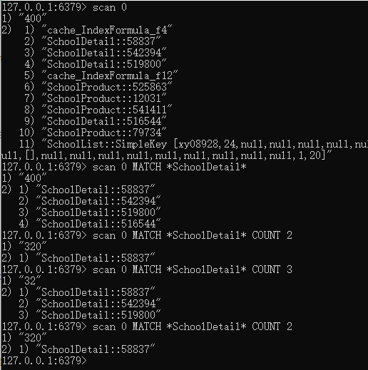 

##### （1）scan 相比 keys 具备有以下特点

1. 复杂度虽然也是 O(n)，但是它是通过游标分步进行的，不会阻塞线程; 

2. 提供 limit 参数，可以控制每次返回结果的最大条数，limit 只是一个 hint，返回的 结果可多可少; 

3. 同 keys 一样，它也提供模式匹配功能; 

4. 服务器不需要为游标保存状态，游标的唯一状态就是 scan 返回给客户端的游标整数; 

5. 返回的结果可能会有重复，需要客户端去重复，这点非常重要; 

6. 遍历的过程中如果有数据修改，改动后的数据能不能遍历到是不确定的; 

7. 单次返回的结果是空的并不意味着遍历结束，而要看返回的游标值是否为零

### 高级数据结构

#### 1. Redis HyperLogLog

Redis HyperLogLog 是用来做基数统计的算法

##### （1）**优点** 

- 在输入元素的数量或者体积非常非常大时，计算基数所需的空间总是固定 的、并且是很小的。
- 在 Redis 里面，每个 HyperLogLog 键只需要花费 12 KB 内存，就可以计算接近 2^64 个不同元素的基 数。这和计算基数时，元素越多耗费内存就越多的集合形成鲜明对比。

但是，因为 HyperLogLog 只会根据输入元素来计算基数，而不会储存输入元素本身，所以 HyperLogLog 不能像集合那样，返回输入的各个元素。

> **什么是基数？**

比如数据集 {1, 3, 5, 7, 5, 7, 8}， 那么这个数据集的**基数集**为 {1, 3, 5 ,7, 8},  **基数**(不重复元素)为5。 基数估计就是在误差可接受的范围内，快速计算基数。

##### （2）**应用场景** 

- 统计网站每个网页每天的UV数据（因为需要去重，而且数据量很大）

##### （3）实例 

以下实例演示了 HyperLogLog 的工作过程：

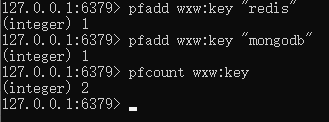 

**基本命令**  [命令参考文档](http://redisdoc.com/hyperloglog/pfmerge.html) 

- [PFADD key element [element ...\]](https://www.runoob.com/redis/hyperloglog-pfadd.html) ：添加指定元素到 HyperLogLog 中
- [PFCOUNT key [key ...\]](https://www.runoob.com/redis/hyperloglog-pfcount.html) 返回给定 HyperLogLog 的基数估算值
- [PFMERGE destkey sourcekey [sourcekey ...\]](https://www.runoob.com/redis/hyperloglog-pfmerge.html) 将多个 HyperLogLog 合并为一个 HyperLogLog   （复杂度：O(n)）

```powershell
redis> PFADD  nosql  "Redis"  "MongoDB"  "Memcached"
(integer) 1

redis> PFADD  RDBMS  "MySQL" "MSSQL" "PostgreSQL"
(integer) 1

redis> PFMERGE  databases  nosql  RDBMS
OK

redis> PFCOUNT  databases
(integer) 6
```

##### （5）HyperLogLog 实现原理

给定一系列的随机整数，我们记录下低位连续零位的最大长度 k，通 过这个 k 值可以估算出随机数的数量。 首先不问为什么，我们编写代码做一个实验，观察 一下随机整数的数量和 k 值的关系。

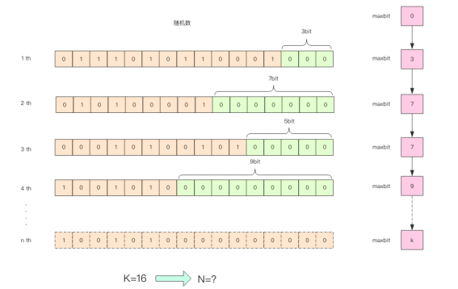 

通过这实验可以发现 K 和 N 的对数之间存在显著的线性相关性：

```bash
N=2^K # 约等于
```

如果 N 介于 2^K 和 2^(K+1) 之间，用这种方式估计的值都等于 2^K，这明显是不合 理的。这里可以采用多个 BitKeeper，然后进行加权估计，就可以得到一个比较准确的值。

上面的这 个算法在随机次数很少的情况下会出现除零错误，因为 maxbits=0 是不可以求倒数的

##### （6）常见问题

- **pf 的内存占用为什么是12k?** 

  在 Redis 的 HyperLogLog  实现中用到的是 16384 个桶，也就是 2^14，每个桶的 maxbits 需要 6 个 bits 来存储，最 

  大可以表示 maxbits=63，于是总共占用内存就是 2^14 * 6 / 8 = 12k 字节

#### 2. Redis **GeoHash** 

##### （1）基本用法  

Redis 提供的 Geo 指令只有 6 个，读者们瞬间就可以掌握。使用时，读者务必再次想 起，它只是一个普通的 zset 结构。

- geoadd：根据key，坐标，名称来添加地理位置的坐标。
- geopos：根据member名称，获取地理位置的坐标。
- geodist：根据member名称，计算两个位置之间的距离。
- georadius：根据用户给定的经纬度坐标来获取指定范围内的地理位置集合。
- georadiusbymember：根据储存在位置集合里面的某个地点获取指定范围内的地理位置集合。
- geohash：返回一个或多个位置对象的 geohash 值。

[具体参见《菜鸟教程》](https://www.runoob.com/redis/redis-geo.html) 

> **geoadd**：geoadd 用于存储指定的地理空间位置，可以将一个或多个经度(longitude)、纬度(latitude)、位置名称(member)添加到指定的 key 中

**语法格式：** ` GEOADD key longitude(经度) latitude(纬度) member(名称) [longitude latitude member ...]` 

以下实例中 key 为 Beijin、Gansu 为位置名称 ：

```bash
redis> GEOADD Sicily 13.361389 38.115556 "Palermo" 15.087269 37.502669 "Catania"
(integer) 2

redis> GEODIST Sicily Palermo Catania
"166274.15156960039"

redis> GEORADIUS Sicily 15 37 100 km
1) "Catania"

redis> GEORADIUS Sicily 15 37 200 km
1) "Palermo"
2) "Catania"
```

> **geopos** : 用于从给定的 key 里返回所有指定名称(member)的位置（经度和纬度），不存在的返回 nil。 

**语法格式：** ` GEOPOS key member [member ...]` 

```bash
redis> GEOADD Sicily 13.361389 38.115556 "Palermo" 15.087269 37.502669 "Catania"
(integer) 2
redis> GEOPOS Sicily Palermo Catania NonExisting
1) 1) "13.36138933897018433"
   2) "38.11555639549629859"
2) 1) "15.08726745843887329"
   2) "37.50266842333162032"
3) (nil)
redis>
```

> **geodist** ：geodist 用于返回两个给定位置之间的距离。

**语法格式：** ` GEODIST key member1 member2 [m|km|ft|mi]` 

member1 member2 为两个地理位置。

最后一个距离单位参数说明：

- m ：米，默认单位。
- km ：千米。
- mi ：英里。
- ft ：英尺。

举例： 计算 Palermo 与 Catania 之间的距离：

```bash
redis> GEOADD Sicily 13.361389 38.115556 "Palermo" 15.087269 37.502669 "Catania"
(integer) 2
redis> GEODIST Sicily Palermo Catania
"166274.1516"
redis> GEODIST Sicily Palermo Catania km
"166.2742"
redis> GEODIST Sicily Palermo Catania mi
"103.3182"
redis> GEODIST Sicily Foo Bar
(nil)
redis>
```

> georadius、georadiusbymember

- georadius 以给定的经纬度为中心， 返回键包含的位置元素当中， 与中心的距离不超过给定最大距离的所有位置元素
- georadiusbymember 和 GEORADIUS 命令一样， 都可以找出位于指定范围内的元素， 但是 georadiusbymember 的中心点是由给定的位置元素决定的， 而不是使用经度和纬度来决定中心点。

**语法格式：** 

```c
GEORADIUS key longitude latitude radius m|km|ft|mi [WITHCOORD] [WITHDIST] [WITHHASH] [COUNT count] [ASC|DESC] [STORE key] [STOREDIST key]
GEORADIUSBYMEMBER key member radius m|km|ft|mi [WITHCOORD] [WITHDIST] [WITHHASH] [COUNT count] [ASC|DESC] [STORE key] [STOREDIST key]

参数说明：

m ：米，默认单位。
km ：千米。
mi ：英里。
ft ：英尺。
WITHDIST: 在返回位置元素的同时， 将位置元素与中心之间的距离也一并返回。
WITHCOORD: 将位置元素的经度和维度也一并返回。
WITHHASH: 以 52 位有符号整数的形式， 返回位置元素经过原始 geohash 编码的有序集合分值。 这个选项主要用于底层应用或者调试， 实际中的作用并不大。
COUNT 限定返回的记录数。
ASC: 查找结果根据距离从近到远排序。
DESC: 查找结果根据从远到近排序。
```

georadius 实例：

```c
redis> GEOADD Sicily 13.361389 38.115556 "Palermo" 15.087269 37.502669 "Catania"
(integer) 2
redis> GEORADIUS Sicily 15 37 200 km WITHDIST
1) 1) "Palermo"
   2) "190.4424"
2) 1) "Catania"
   2) "56.4413"
redis> GEORADIUS Sicily 15 37 200 km WITHCOORD
1) 1) "Palermo"
   2) 1) "13.36138933897018433"
      2) "38.11555639549629859"
2) 1) "Catania"
   2) 1) "15.08726745843887329"
      2) "37.50266842333162032"
redis> GEORADIUS Sicily 15 37 200 km WITHDIST WITHCOORD
1) 1) "Palermo"
   2) "190.4424"
   3) 1) "13.36138933897018433"
      2) "38.11555639549629859"
2) 1) "Catania"
   2) "56.4413"
   3) 1) "15.08726745843887329"
      2) "37.50266842333162032"
redis>
```

georadiusbymember 实例：

```c
redis> GEOADD Sicily 13.583333 37.316667 "Agrigento"
(integer) 1
redis> GEOADD Sicily 13.361389 38.115556 "Palermo" 15.087269 37.502669 "Catania"
(integer) 2
redis> GEORADIUSBYMEMBER Sicily Agrigento 100 km
1) "Agrigento"
2) "Palermo"
redis>
```

##### （2）实践

​    让我们打开地址 http://geohash.org/wx4g52e1ce0，观察地图指向的位置是否正确。

- 在该平台可以在线测试坐标数据

 

很好，就是这个位置，非常准确。

##### （3）应用场景

- 附近的人

##### （4）Geo Hash 算法

> 业界比较通用的地理位置距离排序算法是 GeoHash 算法

GeoHash 算法会继续对这个整数做一次 base32 编码 (0-9,a-z 去掉 a,i,l,o 四个字母) 变 成一个字符串。在 Redis 里面，经纬度使用 52 位的整数进行编码，放进了 zset 里面，zset  的 value 是元素的 key，score 是 GeoHash 的 52 位整数值。zset 的 score 虽然是浮点数， 

但是对于 52 位的整数值，它可以无损存储。 

在使用 Redis 进行 Geo 查询时，我们要时刻想到它的内部结构实际上只是一个 zset(skiplist)。通过 zset 的 score 排序就可以得到坐标附近的其它元素 (实际情况要复杂一 些，不过这样理解足够了)，通过将 score 还原成坐标值就可以得到元素的原始坐标。 （具体参见《Redis深度历险》）

##### （5）小总结

​			在一个地图应用中，车的数据、餐馆的数据、人的数据可能会有百万千万条，如果使用 Redis 的 Geo 数据结构，它们将全部放在一个 zset 集合中。在 Redis 的集群环境中，集合 可能会从一个节点迁移到另一个节点，如果单个 key 的数据过大，会对集群的迁移工作造成 较大的影响，在集群环境中单个 key 对应的数据量不宜超过 1M，否则会导致集群迁移出现 卡顿现象，影响线上服务的正常运行。 

​			 所以，这里建议 Geo 的数据使用单独的 Redis 实例部署，不使用集群环境。 如果数据量过亿甚至更大，就需要对 Geo 数据进行拆分，按国家拆分、按省拆分，按 市拆分，在人口特大城市甚至可以按区拆分。这样就可以显著降低单个 zset 集合的大小。

## Redis 实践和应用

### Redis 缓存

#### Redis 双写一致性问题

方案1：Redis设置key的过期时间。
方案2：采用延时双删策略。
（1）先淘汰缓存
（2）再写数据库（这两步和原来一样）
（3）休眠1秒，再次淘汰缓存

这么做，可以将1秒内所造成的缓存脏数据，再次删除。(为何是1秒？需要评估自己的项目的读数据业务逻辑的耗时。这么做的目的，就是确保读请求结束，写请求可以删除读请求造成的缓存脏数据。当然这种策略还要考虑redis和数据库主从同步的耗时。)

**相关文章** 

1. [双写一致性问题和解决方案](https://blog.csdn.net/sufu1065/article/details/108459758) 


### Redis 客户端

#### 1. 前言

- Jedis api 在线网址：http://tool.oschina.net/uploads/apidocs/redis/clients/jedis/Jedis.html

- redisson 官网地址：https://redisson.org/

- redisson git项目地址：https://github.com/redisson/redisson

- lettuce 官网地址：https://lettuce.io/

- lettuce git项目地址：https://github.com/lettuce-io/lettuce-core

**概念** 

- Jedis：是Redis的Java实现客户端，提供了比较全面的Redis命令的支持，
- Redisson：实现了分布式和可扩展的Java数据结构。
- Lettuce：高级Redis客户端，用于线程安全同步，异步和响应使用，支持集群，Sentinel，管道和编码器。

**优点** 

- Jedis：比较全面的提供了Redis的操作特性
- Redisson：促使使用者对Redis的关注分离，提供很多分布式相关操作服务，例如，分布式锁，分布式集合，可通过Redis支持延迟队列
- Lettuce：主要在一些分布式缓存框架上使用比较多

**可伸缩性** 

- Jedis：使用阻塞的I/O，且其方法调用都是同步的，程序流需要等到sockets处理完I/O才能执行，不支持异步。Jedis客户端实例不是线程安全的，所以需要通过连接池来使用Jedis。

- Redisson：基于Netty框架的事件驱动的通信层，其方法调用是异步的。Redisson的API是线程安全的，所以可以操作单个Redisson连接来完成各种操作

- Lettuce：基于Netty框架的事件驱动的通信层，其方法调用是异步的。Lettuce的API是线程安全的，所以可以操作单个Lettuce连接来完成各种操作

**结论**  

- 建议使用：Jedis + Redisson

#### 2. Redis高级客户端Lettuce


**相关文章** 

1. 在线文档：https://www.cnblogs.com/throwable/p/11601538.html

#### 3. Jedis 客户端

#### 4. Redisson 客户端


