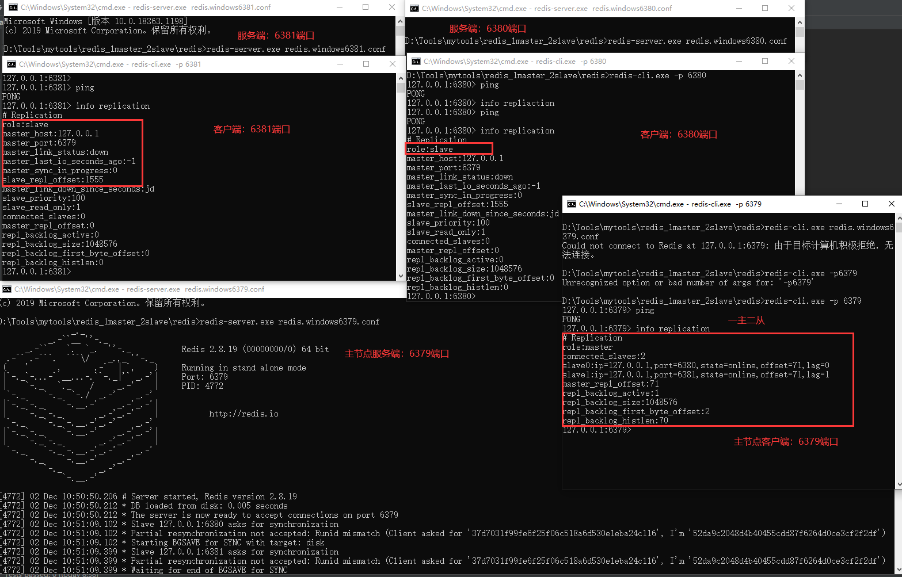

## Redis 基础和应用

- Redis数据类型简介。<http://redis.io/topics/data-types-intro>
- 直接在浏览器中尝试Redis。[http://try.redis.io](http://try.redis.io/)
- Redis命令的完整列表。<http://redis.io/commands>
- Redis官方文档中还有更多内容。<http://redis.io/documentation>
- Redis 源码：https://github.com/redis/redis
- Redis 专题：https://blog.csdn.net/qq_41893274/category_10057661.html

### Redis 概述

首先从宏观的角度回顾一下Redis实现高可用相关技术。它包括：持久化、复制、哨兵和集群，主要作用与解决的问题是：

- 持久化：持久化是最简单的高可用方法（有时甚至不被归为高可用的手段），主要作用是数据备份，即将数据存储在硬盘，保证数据不会因进程退出而丢失
- 复制：复制是高可用Redis的基础，哨兵和集群都在复制基础上实现高可用的。复制主要实现了数据的多机备份，以及读操作的负载均衡和简单的故障转移。缺陷：故障恢复无法自动化。写操作无法负载均衡、存储能力受到单击的限制
- 哨兵：在复制的基础上，哨兵实现了自动化的故障恢复。缺陷：写操作无法负载均衡；存储能力受到单机的限制。
- 集群：通过集群，Redis解决了写操作无法负载均衡，以及存储能力受到单机限制的问题，实现了较为完善的高可用方案。

 

### Redis 五种基本数据类型

#### 1.1 字符串—String

Redis 中的字符串是一种 **动态字符串**，这意味着使用者可以修改，它的底层实现有点类似于 Java 中的 **ArrayList**，有一个字符数组，从源码的 **sds.h/sdshdr 文件** 中可以看到 Redis 底层对于字符串的定义 **SDS**，即 *Simple Dynamic String* 结构：

#### 1.2 列表—list

Redis 的列表相当于 Java 语言中的 **LinkedList**，注意它是链表而不是数组。这意味着 list 的插入和删除操作非常快，时间复杂度为 O(1)，但是索引定位很慢，时间复杂度为 O(n)。

**链表的基本操作** 

- `LPUSH` 和 `RPUSH` 分别可以向 list 的左边（头部）和右边（尾部）添加一个新元素；
- `LRANGE` 命令可以从 list 中取出一定范围的元素；
- `LINDEX` 命令可以从 list 中取出指定下表的元素，相当于 Java 链表操作中的 `get(int index)` 操作；

**应用场景** 

1. l**ist 实现队列**是先进先出的数据结构，常用于消息排队和异步逻辑处理，它会确保元素的访问顺序：
2. **list 实现栈**是先进后出的数据结构，跟队列正好相反

#### 1.3 字典—hash

Redis 中的字典相当于 Java 中的 **HashMap**，内部实现也差不多类似，都是通过 **"数组 + 链表"** 的链地址法来解决部分 **哈希冲突**，同时这样的结构也吸收了两种不同数据结构的优点。

**字典的基本操作** 

hash 也有缺点，hash 结构的存储消耗要高于单个字符串，所以到底该使用 hash 还是字符串，需要根据实际情况再三权衡：

```scss
> HSET books java "think in java"    # 命令行的字符串如果包含空格则需要使用引号包裹
(integer) 1
> HSET books python "python cookbook"
(integer) 1
> HGETALL books    # key 和 value 间隔出现
1) "java"
2) "think in java"
3) "python"
4) "python cookbook"
> HGET books java
"think in java"
> HSET books java "head first java"  
(integer) 0        # 因为是更新操作，所以返回 0
> HMSET books java "effetive  java" python "learning python"    # 批量操作
OK
```

#### 1.4 集合—set

Redis 的集合相当于 Java 语言中的 **HashSet**，它内部的键值对是无序、唯一的。它的内部实现相当于一个特殊的字典，字典中所有的 value 都是一个值 NULL。

**集合 set 的基本使用** 

```scss
> SADD books java
(integer) 1
> SADD books java    # 重复
(integer) 0
> SADD books python golang
(integer) 2
> SMEMBERS books    # 注意顺序，set 是无序的
1) "java"
2) "python"
3) "golang"
> SISMEMBER books java    # 查询某个 value 是否存在，相当于 contains
(integer) 1
> SCARD books    # 获取长度
(integer) 3
> SPOP books     # 弹出一个
"java"
```

#### 1.5 有序列表—zset

这可能使 Redis 最具特色的一个数据结构了，它类似于 Java 中 **SortedSet** 和 **HashMap** 的结合体，一方面它是一个 set，保证了内部 value 的唯一性，另一方面它可以为每个 value 赋予一个 score 值，用来代表排序的权重。

它的内部实现用的是一种叫做 **「跳跃表」** 的数据结构。

**有序列表 zset 基础操作** 

```java
> ZADD books 9.0 "think in java"
> ZADD books 8.9 "java concurrency"
> ZADD books 8.6 "java cookbook"

> ZRANGE books 0 -1     # 按 score 排序列出，参数区间为排名范围
1) "java cookbook"
2) "java concurrency"
3) "think in java"

> ZREVRANGE books 0 -1  # 按 score 逆序列出，参数区间为排名范围
1) "think in java"
2) "java concurrency"
3) "java cookbook"

> ZCARD books           # 相当于 count()
(integer) 3

> ZSCORE books "java concurrency"   # 获取指定 value 的 score
"8.9000000000000004"                # 内部 score 使用 double 类型进行存储，所以存在小数点精度问题

> ZRANK books "java concurrency"    # 排名
(integer) 1

> ZRANGEBYSCORE books 0 8.91        # 根据分值区间遍历 zset
1) "java cookbook"
2) "java concurrency"

> ZRANGEBYSCORE books -inf 8.91 withscores  # 根据分值区间 (-∞, 8.91] 遍历 zset，同时返回分值。inf 代表 infinite，无穷大的意思。
1) "java cookbook"
2) "8.5999999999999996"
3) "java concurrency"
4) "8.9000000000000004"

> ZREM books "java concurrency"             # 删除 value
(integer) 1
> ZRANGE books 0 -1
1) "java cookbook"
2) "think in java"
```


> 来源：[Redis—5种基本数据结构](https://mp.weixin.qq.com/s/MT1tB2_7f5RuOxKhuEm1vQ) 

### Redis 主存复制工作原理

#### 1.1 一主二从windows环境配置

> 来源地址：[我的csdn](https://blog.csdn.net/qq_41893274/article/details/107372973) 

 

**主从复制测试：**

 

**主从同步过程简述** 

 

**相关文章** 

1. [redis环境搭建-主从模式](https://www.cnblogs.com/CSunShine/p/11475152.html) 

#### 1.2 Redis 主存复制


> 来源：[csdn](https://blog.csdn.net/qq_41893274/article/details/109121045) 

### Redis 哨兵模式工作原理

**经典文章** 


> 来源：[我的 CSDN](https://blog.csdn.net/qq_41893274/article/details/107371963) 

**相关文章** 

- [Redis Sentinel文档](https://github.com/redis/redis-doc/blob/master/topics/sentinel.md) 
- [sentinet-clients](https://github.com/redis/redis-doc/blob/master/topics/sentinel-clients.md) 

### Redis 集群模式工作原理


### Redis 布隆过滤器

> **场景分析**

 假如我们在使用新闻客户端看新闻时，它会给我们不停的推荐新的内容，而它每次推荐时，都要去重，以去掉那些我们已经看过的内容。那么问题来了，新闻客户端推荐系统是如何实现推送去重的？

你可能会想到：服务器已经记录了用户看过的所有历史记录，当推荐系统推送新闻时可以从每个用户的历史记录里进行筛选，以过滤掉那些已经存在的记录。问题是，当用户量很大、每个用户看过的新闻又很多的情况下，使用这种方式，推荐系统的去重工作在性能上能跟的上吗？

实际上，如果历史记录存储在关系数据库里，去重就需要频繁地对数据库进行exists查询，当系统并发量很高时，数据库是很难扛住压力的。

你可能又想到了缓存，但是将如此多的历史记录全部缓存起来，那得浪费多大的存储空间啊？而且这个存储空间是随着时间线性增长的，就算你撑得住一个月，你能撑得住几年吗？但是不缓存的话，性能又跟不上，这该怎么办？


高级数据结构布隆过滤器（Bloom Filter）登场了，它就是专门用来解决这种去重问题的。它在起到去重作用的同时，在空间上还能节省90%以上，只是稍微有那么点不准确，也就是有一定的误判率。

#### 1.1 布隆过滤器是什么

布隆过滤器（Bloom Filter）是1970年由[布隆](https://baike.baidu.com/item/%E5%B8%83%E9%9A%86/14216465)提出的。布隆过滤器可以用于检索一个元素是否在一个集合中，但是它可能会误判。它的优点是高效地插入和查询，缺点是有一定的误识别率和删除困难。

- 当布隆过滤器说某个值存在时，这个值可能不存在
- 当布隆过滤器说某个值不存在时，这个值一定不存在

套在上面的使用场景中，布隆过滤器能准确过滤掉那些用户已经看过的内容，那些用户没有看过的内容，它会过滤掉极小一部分（误判），但是绝大多数内容它都能准确识别。这样就可以保证推荐给用户的内容都是无重复的。

#### 1.2 Redis 中的布隆过滤器

redis 在 4.0 的版本中加入了 module 功能，布隆过滤器可以通过 module 的形式添加到 redis 中，所以使用 redis 4.0 以上的版本可以通过加载 [module](https://github.com/RedisLabsModules/rebloom) 来使用 redis 中的布隆过滤器。但是这不是最简单的方式

- 使用 docker 可以直接在 redis 中体验布隆过滤器。

```bash
> docker run -d -p 6379:6379 --name bloomfilter redislabs/rebloom
> docker exec -it bloomfilter redis-cli
```

- 给Redis安装布隆过滤器模块

  下载地址：<https://github.com/RedisBloom/RedisBloom>

- redis 布隆过滤器主要就两个命令：

```bash
- bf.add 添加元素到布隆过滤器中: bf.add urls https://jaychen.cc  ## 它在第一次add时创建过滤器
- bf.exists 判断某个元素是否在过滤器中: bf.exists urls https://jaychen.cc
- bf.reserve 显式创建布隆过滤器， 如果key已经存在，则bf.reserve 会报错
```

上面说过布隆过滤器存在误判的情况，在 redis 中有两个值决定布隆过滤器的准确率：

- `error_rate `：允许布隆过滤器的错误率，这个值越低过滤器的位数组的大小越大，占用空间也就越大。
- `initial_size `：布隆过滤器可以储存的元素个数，当实际存储的元素个数超过这个值之后，过滤器的准确率会下降。

redis 中有一个命令可以来设置这两个值：

```bash
bf.reserve urls 0.01 100

三个参数的含义：
  第一个值是过滤器的名字
  第二个值为 error_rate 的值（错误率）默认值 0.01
  第三个值为 initial_size 的值，默认值是 100
```

使用这个命令要注意一点：**执行这个命令之前过滤器的名字应该不存在，如果执行之前就存在会报错：(error) ERR item exists**

> **注意事项** 

1. 布隆过滤器的 ` initial_size` 设置过大，会浪费存储空间，设置的过小，就会影响准确率，用户在使用之前一定要尽可能的精确估计元素数量，还需要加上一定的冗余空间以避免实际元素可能会意外高出估计值很多，导致误判率上升。

2. 布隆过滤器的 ` error_rate` 越小，需要的存储空间就越大，对于不需要过于精确的场合，` error_rate` 设置稍微大一点也无伤大雅。

   比如：新闻客户端去重应用上，误判率高一点只会让小部分文章不能被合适的人看的，文章的整体阅读量不会因为这点误判率带来巨大的改变。

#### 1.3 布隆过滤器的原理

学会了布隆过滤器的使用，下面有必要解释一下原理。

**（1）HashMap 的问题** 

讲述布隆过滤器的原理之前，我们先思考一下，通常你判断某个元素是否存在用的是什么？应该蛮多人回答 HashMap 吧，确实可以将值映射到 HashMap 的 Key，然后可以在 O(1) 的时间复杂度内返回结果，效率很高。

但是 HashMap 的实现也有缺点：

1. **假如存储容量占比高，考虑到负载因子的存在，通常空间是不能被用满的**，而一旦你的值很多例如上亿的时候，那 HashMap 占据的内存大小就变得很大了。
2. 数据集存储在远程服务器上，本地服务接受输入，而数据集非常大不可能一次性读进内存构建 HashMap 的时候，也会存在问题

**（2）布隆过滤器原理** 

bitmap可以实现从一个比较大的整数集合中判断一个数字是否存在，但是实际场景中往往还会有其他的场景，**比如：** 

从10亿个身份证判断某个身份证号码是否存在，很显然采用bitmap就无法实现了，因为**bitmap只能判断整数**是否存在。所以如果有一种方式能够将身份证号码的字符串转换成一个整数，那么就可以使用bitmap来实现判断字符串是否存在于一个集合中的需求了。而通过字符串转换成整数的方式也很普遍，那就是采用hash函数通过计算字符串的hashCode来转换成整数。

而布隆过滤器实际就是一系列的hash函数+bitmap实现的。

> **字符串存入bitmap中** 

布隆过滤器是通过bitmap实现的，只不过在bitmap之上添加了多个hash函数来对传入的数据转换正常整数类型。如下图示

 

字符串hello和字符串world，通过hash计算之后分别hashCode值为1和8，那么就可以通过bitmap的功能将1和8分别存入bitmap中，就相当于hello和world两个字符串存入了bitmap中。判断字符串是否存在时就可以通过计算hashCode的方式，判断对应的hash值是否存在于bitmap中即可可以判断字符串是否存在于bitmap中了 

> **hash碰撞问题** 

虽然通过字符串计算hash值存入bitmap中表面上没有什么问题，但是hash函数是存在一定的碰撞概率的，也就是多个字符串计算出来的hash值是一样的，此时就会出现误判的情况。

 

如上图，判断字符串XXXX是否存在，就需要先计算hashCode值，结果为8，此时判断结果为hashCode为8已经存在于bitmap中的，此时就会得到错误的判断是字符串XXXX已经存在了，但是实际是并不存在的，而是出现了hashCode碰撞的情况。但是如果对应的hashCode在bitmap中不存在，那么就可以确认当前字符串不存在。而hashCode存在的情况下，只能说明当前字符串是可能存在。

所以你通过布隆过滤器只能实现的功能为：能够确认一个字符串不存在于集合中，但是无法确认一个字符串存在于集合中。

> **hash碰撞问题优化** 

由于hash函数会存在hash碰撞的情况，就导致布隆过滤器的功能会出现比较大的误差，那么既然一个hash函数存在hash碰撞，就可以采用多个hash函数来降低hash碰撞的概率。比较不同的字符串通过多个不同的hash函数还碰撞的概率会大大降低。如下图：

 

字符串hello通过三个hash函数分别计算出来的hash值为1、5、8；字符串world通过三个hash函数计算出来的hash值为5、8、15，虽然hash值为15发生了hash碰撞的情况，但是两位两个hash值均没有发生hash碰撞，只有当通过三个hash函数计算出来的hash值都存在时才能够判断一个字符串可能存在，如果某个字符串通过三个hash函数计算出来的hash值只有部分存在，那么就是存在hash碰撞，且该字符串肯定不存在。

虽然通过多个hash函数可以对于误判的情况进行优化，但是并没有本质上解决误判的情况，因为毕竟从理论上还是可能会存在多个hash值发生了hash碰撞的情况的。比如一个字符串通过三个hash函数计算的值分别为1、5、15，那么虽然和上面两个字符串都不是全部冲突了，但是1和hello发生了冲突，5和15和world发生了冲突，如果hello和world都存在，那么就会导致hash值为1、5、15的字符串产生误判的情况。

> **布隆过滤器删除元素** 

bitmap是支持删除元素的，因为bitmap不存在冲突的情况，每一个数字只会对应一个元素，而布隆过滤器的每一个元素都有可能会对应多个元素，所以不能通过删除的方式删除元素，因为这样可能会导致其他元素查询的结果不正确。

比如上图的例子，如果将world字符串删除，那么就需要将5、15、25三个位置的值置为0，此时再判断hello是否存在结果25的位置为0，那么就导致判断结果为hello字符串不存在了。

可以通过对每一位数字计算的方式判断每一位被hash冲突了多少次来实现删除元素的方式，但是每一位增加计算就会大大增加存储的空间。

#### 1.4 布隆过滤器的应用

1. 网页爬虫对 URL 去重，避免爬取相同的 URL 地址；

2. 邮箱系统的从数十亿的垃圾邮件过滤一些垃圾邮件和黑名单查询

3. 集合重复元素的判别

4. Google Chrome 使用布隆过滤器识别恶意 URL；

5. 查询加速（比如基于key-value的存储系统）

6. 新闻推荐系统，使用布隆过滤器避免推荐给用户已经读过的文章；

7. **redis缓存穿透问题的解决** 

   所谓的缓存穿透就是服务调用方每次都是查询不在缓存中的数据，这样每次服务调用都会到数据库中进行查询，如果这类请求比较多的话，就会导致数据库压力增大，这样缓存就失去了意义。

   所以先将需要查询的数据存入布隆过滤器，如果布隆过滤器不存在则直接返回；如果布隆过滤器存在则再从redis查询（此时只会有少数误差数据）；如果redis中还不存在则查询数据库（此时的访问很小了），并在查询数据库可以通过并发加锁处理，保证只有一个线程可以查询该数据并写入缓存，从而避免了缓存穿透的问题

##### **（1）场景分析一** 

假如现在有40亿个ip地址（string类型），然后给你一个ip地址，让你查找这个ip地址在不在这40亿个ip地址里？我们应该怎么做呢？

1. 如果用哈希表来处理的话，这里有40亿的数据，数据量太大，因此太占用空间
2. 如果用位图来处理的话，这里因为是字符串，有可能不同的字符串映射的是同一个位，会有哈希冲突的问题，导致误判
3. 因此我们采用的是哈希+位图的方法，也就是布隆过滤器

布隆过滤器是由布隆（Burton Howard Bloom）在1970年提出的一种紧凑型的、比较巧妙的概率型数据结构，特点是高效地插入和查询，可以用来告诉你 **“某样东西一定不存在或者可能存在”**，它是用多个哈希函数，将一个数据映射到位图结构中。

##### （2）场景分析二

经典面试题：一个10G大小的文件，存储内容为自然数，一行一个乱序排放，需要对其进行排序操作，但是机器的内存只有2G。

此时就可以通过布隆过滤器进行操作。首先将10G大小文件通过工具分隔成多个小文件，然后依次读取数据将数据存入bitmap中，10G的大小的自然数差不多可以存储27亿个左右的整数。

27亿个整数存入bitmap需要占用的空间为 2700000000/8/1024/1024 = 320M左右，所以内存是足够的。然后从1到最大值进行遍历判断是否存在于bitmap中从而达到排序的效果。

#### 1.5 常见问题

##### （1）空间占用评估

空间占用有一个简单的推到公式（推到过程自己调研）：

- n——预计元素的数量
- f——错误率
- L——位数组长度
- k——hash的最佳数量

```java
k = 0.7 * （L/n） // hash的最佳数量
f = 0.6185^(L/n)  // 错误率
```

从公式可以看出：

1. 位数组相对越长（L/n）: 错误率f 越低
2. 位数组相对越长（L/n）：hash函数需要的最佳数量也越多（但是影响计算效率） 

> 布隆过滤器在线计算工具：https://krisives.github.io/bloom-calculator/

##### （2）实际元素超出对误判率的影响

当实际元素超出预计元素时，错误率会增大

- t——实际元素和预计元素的倍数

```java
f = （1 - 0.5^t）^k   // 极限近似，k是hash函数的数量
```

当实际元素和预计元素的倍数 t 增大时，错误率 f 也会跟着增大；


