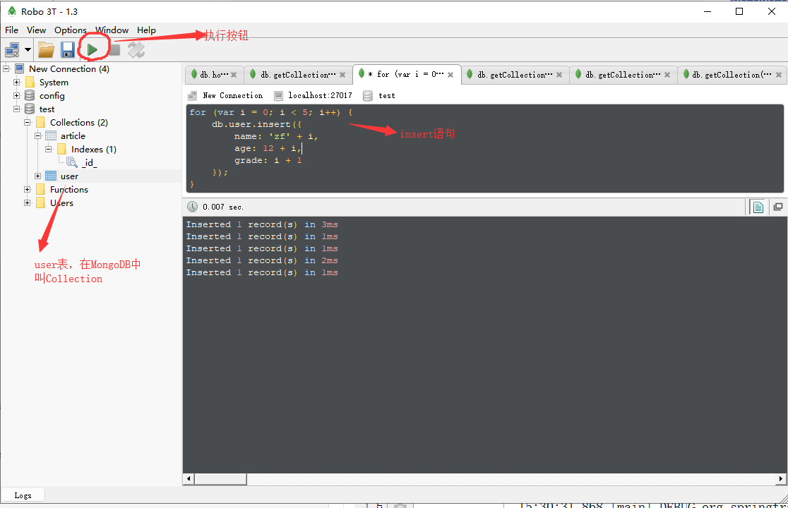
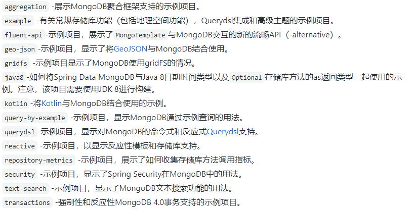

## MongoDB

MongoDB 是一个基于分布式文件存储的数据库。由 C++ 语言编写。旨在为 WEB 应用提供可扩展的高性能数据存储解决方案。

MongoDB 是一个介于关系数据库和非关系数据库之间的产品，是非关系数据库当中功能最丰富，最像关系数据库的。

- MongoDB 官网地址：https://www.mongodb.com/

- MongoDB 官方英文文档：https://docs.mongodb.com/manual/

- MongoDB 各平台下载地址：https://www.mongodb.com/download-center#community
- Mongodb 菜鸟教程：https://www.runoob.com/mongodb
- Mongodb github仓库地址：https://github.com/mongodb/mongo 
- MongoDB 电子书：https://github.com/GitHubWxw/wxw-ebook

## MogoDB 简介

### 关于 NoSQL

#### 1. 关系型数据遵循ACID原则

- **A (Atomicity) 原子性** 
- **C (Consistency) 一致性** 
- **I (Isolation) 独立性** 
- **D (Durability) 持久性** 

NoSQL，指的是非关系型的数据库。NoSQL有时也称作Not Only SQL的缩写，是对不同于传统的关系型数据库的数据库管理系统的统称。NoSQL用于超大规模数据的存储。（例如谷歌或Facebook每天为他们的用户收集万亿比特的数据）。这些类型的数据存储不需要固定的模式，无需多余操作就可以横向扩展。

### 分布式系统

#### 分布式系统优点

- **可靠性（容错） ：** 分布式计算系统中的一个重要的优点是可靠性。一台服务器的系统崩溃并不影响到其余的服务器。

- **可扩展性：** 在分布式计算系统可以根据需要增加更多的机器。

- **资源共享：**共享数据是必不可少的应用，如银行，预订系统。

- **灵活性：**由于该系统是非常灵活的，它很容易安装，实施和调试新的服务。

- **更快的速度：**分布式计算系统可以有多台计算机的计算能力，使得它比其他系统有更快的处理速度。

- **开放系统：**由于它是开放的系统，本地或者远程都可以访问到该服务。

- **更高的性能：**相较于集中式计算机网络集群可以提供更高的性能（及更好的性价比）。

#### 分布式系统缺点

- **故障排除：**故障排除和诊断问题。

- **软件：**更少的软件支持是分布式计算系统的主要缺点。

- **网络：**网络基础设施的问题，包括：传输问题，高负载，信息丢失等。

- **安全性：**开放系统的特性让分布式计算系统存在着数据的安全性和共享的风险等问题。

### CAP 定理

在计算机科学中, CAP定理（CAP theorem）, 又被称作 布鲁尔定理（Brewer's theorem）, 它指出对于一个分布式计算系统来说，不可能同时满足以下三点:

- **一致性(Consistency)** (所有节点在同一时间具有相同的数据)
- **可用性(Availability)** (保证每个请求不管成功或者失败都有响应)
- **分区容错性(Partition tolerance)** (系统中任意信息的丢失或失败不会影响系统的继续运作) 

CAP理论的核心是：一个分布式系统不可能同时很好的满足一致性，可用性和分区容错性这三个需求，最多只能同时较好的满足两个。

因此，根据 CAP 原理将 NoSQL 数据库分成了满足 CA 原则、满足 CP 原则和满足 AP 原则三 大类：

- CA - 单点集群，满足一致性，可用性的系统，通常在可扩展性上不太强大。
- CP - 满足一致性，分区容忍性的系统，通常性能不是特别高。
- AP - 满足可用性，分区容忍性的系统，通常可能对一致性要求低一些。

 

### BASE 理论

BASE：Basically Available, Soft-state, Eventually Consistent。 由 Eric Brewer 定义。

CAP理论的核心是：一个分布式系统不可能同时很好的满足一致性，可用性和分区容错性这三个需求，最多只能同时较好的满足两个。

BASE是NoSQL数据库通常对可用性及一致性的弱要求原则:

- Basically Availble --基本可用
- Soft-state --软状态/柔性事务。 "Soft state" 可以理解为"无连接"的, 而 "Hard state" 是"面向连接"的
- Eventual Consistency -- 最终一致性， 也是 ACID 的最终目的。

#### ACID vs BASE

| ACID                    | BASE                                  |
| :---------------------- | :------------------------------------ |
| 原子性(**A**tomicity)   | 基本可用(**B**asically **A**vailable) |
| 一致性(**C**onsistency) | 软状态/柔性事务(**S**oft state)       |
| 隔离性(**I**solation)   | 最终一致性 (**E**ventual consistency) |
| 持久性 (**D**urable)    |                                       |

#### NoSQL 数据库分类

| 类型          | 部分代表                                         | 特点                                                         |
| ------------- | ------------------------------------------------ | ------------------------------------------------------------ |
| 列存储        | HbaseCassandraHypertable                         | 顾名思义，是按列存储数据的。最大的特点是方便存储结构化和半结构化数据，方便做数据压缩，对针对某一列或者某几列的查询有非常大的IO优势。 |
| 文档存储      | MongoDBCouchDB                                   | 文档存储一般用类似json的格式存储，存储的内容是文档型的。这样也就有机会对某些字段建立索引，实现关系数据库的某些功能。 |
| key-value存储 | Tokyo Cabinet / TyrantBerkeley DBMemcacheDBRedis | 可以通过key快速查询到其value。一般来说，存储不管value的格式，照单全收。（Redis包含了其他功能） |
| 图存储        | Neo4JFlockDB                                     | 图形关系的最佳存储。使用传统关系数据库来解决的话性能低下，而且设计使用不方便。 |
| 对象存储      | db4oVersant                                      | 通过类似面向对象语言的语法操作数据库，通过对象的方式存取数据。 |
| xml数据库     | Berkeley DB XMLBaseX                             | 高效的存储XML数据，并支持XML的内部查询语法，比如XQuery,Xpath。 |

### 关于 MongoDB

MongoDB 是由C++语言编写的，是一个基于分布式文件存储的开源数据库系统。

在高负载的情况下，添加更多的节点，可以保证服务器性能。

MongoDB 旨在为WEB应用提供可扩展的高性能数据存储解决方案。

MongoDB 将数据存储为一个文档，数据结构由键值(key=>value)对组成。MongoDB 文档类似于 JSON 对象。字段值可以包含其他文档，数组及文档数组。

 

#### 主要特点

- MongoDB 是一个面向文档存储的数据库，操作起来比较简单和容易。
- 你可以在MongoDB记录中设置任何属性的索引 (如：FirstName="Sameer",Address="8 Gandhi Road")来实现更快的排序。
- 你可以通过本地或者网络创建数据镜像，这使得MongoDB有更强的扩展性。
- 如果负载的增加（需要更多的存储空间和更强的处理能力） ，它可以分布在计算机网络中的其他节点上这就是所谓的分片。
- Mongo支持丰富的查询表达式。查询指令使用JSON形式的标记，可轻易查询文档中内嵌的对象及数组。
- MongoDb 使用update()命令可以实现替换完成的文档（数据）或者一些指定的数据字段 。
- Mongodb中的Map/reduce主要是用来对数据进行批量处理和聚合操作。
- Map和Reduce。Map函数调用emit(key,value)遍历集合中所有的记录，将key与value传给Reduce函数进行处理。
- Map函数和Reduce函数是使用Javascript编写的，并可以通过db.runCommand或mapreduce命令来执行MapReduce操作。
- GridFS是MongoDB中的一个内置功能，可以用于存放大量小文件。
- MongoDB允许在服务端执行脚本，可以用Javascript编写某个函数，直接在服务端执行，也可以把函数的定义存储在服务端，下次直接调用即可。
- MongoDB支持各种编程语言:RUBY，PYTHON，JAVA，C++，PHP，C#等多种语言。
- MongoDB安装简单。

#### MongoDB 安装

- [Win10安装MongoDb](https://blog.csdn.net/xuforeverlove/article/details/88344213) 

- 启动命令：` net start Mongodb`   访问地址：` 127.0.0.1:27017` 
- 停止命令： ` net stop Mongodb ` 

启动后如下图所示：

#### MongoDB 客户端工具

- [Navicat Premium](http://www.navicat.com.cn/) 

- [Robo 3T](https://robomongo.org/) 

   

- [基于node的Web操作工具](https://github.com/mrvautin/adminMongo) 

## MongoDB Spring Boot 

- 传统的关系数据库一般由数据库（database）、表（table）、记录（record）三个层次概念组成，MongoDB是由数据库（database）、集合（collection）、文档对象（document）三个层次组成。MongoDB对于关系型数据库里的表，但是集合中没有列、行和关系概念，这体现了模式自由的特点。

- MongoDB中的一条记录就是一个文档，是一个数据结构，由字段和值对组成。MongoDB文档与JSON对象类似。字段的值有可能包括其它文档、数组以及文档数组。MongoDB支持OS X、Linux及Windows等操作系统，并提供了Python，PHP，Ruby，Java及C++语言的驱动程序，社区中也提供了对Erlang及.NET等平台的驱动程序。

- 应用场景

MongoDB的适合对大量或者无固定格式的数据进行存储，比如：日志、缓存等。对事物支持较弱，不适用复杂的多文档（多表）的级联查询。

- [springboot -mongodb 官网](https://docs.spring.io/spring-data/mongodb/docs/3.1.2/reference/html/#reference) 

- [springboot 官方mongo测试用例](https://github.com/spring-projects/spring-data-examples) 

   

