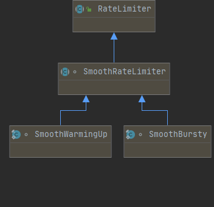
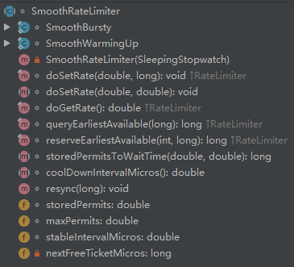

## Guava

- [在线Guava 源码](https://github.com/google/guava) 

- [官方文档——限流 RateLimiter](http://ifeve.com/guava-ratelimiter/) 

## 限流 RateLimiter

### 1. 限流概览

RateLimiter 有两种限流模式：

- 稳定模式（` SmoothBursty` ：令牌生成速度恒定）
- 渐进模式（` SmoothWarmingUp` : 令牌生成速度缓慢提升，直到维持在一个稳定值） 

主流架构图如下所示：

  

### 2. 核心思想

> 核心思想：响应本次请求之后，**动态计算下一次可以服务的时间，如果下一次请求在这个时间之前则需要进行等待**

#### 2.1 SmoothRateLimiter 抽象类

```java
abstract class SmoothRateLimiter extends RateLimiter {
    double storedPermits;              // 当前持有的令牌数
    double maxPermits;                 // 令牌数上限
    double stableIntervalMicros;       // 生成令牌桶需要的时间，即可 1/QPS
    private long nextFreeTicketMicros; // 下一次请求能获取令牌的时间
```

#### 2.2 SmoothBursty 稳定模式


#### 2.3 SmoothWarmingUp 预热模式


- 相关文章：
  1. [常见的限流算法解密](https://segmentfault.com/a/1190000020272200?utm_source=tag-newest) 