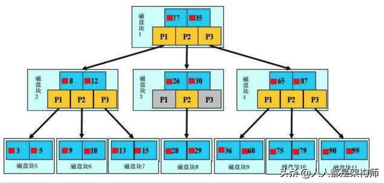

### [MySQL 深入浅出](https://dev.mysql.com/doc/refman/8.0/en/)  <!-- {docsify-ignore} -->   

---

| Linux系统安装MySQL | 体系结构    | 应用优化       | MySQL 常用工具 |
| ------------------ | ----------- | -------------- | -------------- |
| 索引               | 存储引擎    | 查询缓存优化   | MySQL 日志     |
| 视图               | 优化SQL步骤 | 内存管理及优化 | MySQL 主从复制 |
| 存储过程和函数     | 索引使用    | MySQL锁问题    | 综合案例       |
| 触发器             | SQL优化     | 常用SQL技巧    |                |

### 一、MySQL 入门

#### （1）前言

> 我们首先来分别看一下B+树，B树，平衡二叉树的结构特征。

##### 1.1 平衡二叉树

1. 非叶子节点最多拥有两个子节点。

2. 非叶子节值大于左边子节点、小于右边子节点。

3. 树的左右两边的层级数相差不会大于1。

4. 没有值相等重复的节点。

    

##### 1.2 B—树

B-树和平衡二叉树稍有不同的是B-树属于多叉树又名平衡多路查找树（查找路径不只两个）。

1. 在一个节点中，存放着数据（包括key和data）以及指针，且相互间隔。

2. 同一个节点，key增序。

3. 一个节点最左边的指针不为空，则它指定的节点左右的key小于最左边的key。右边同理。中间的指针指向的节点的key位于相邻两个key的中间。

4. B-Tree中不同节点存放的key和指针可能数量不一致，但是每个节点的域和上限是一致的，所以在实现中B-Tree往往对每个节点申请同等大小的空间。

5. 每个非叶子节点由n-1个key和n个指针组成，其中d<=n<=2d。

    

##### 1.3 B+树

 

1. 内节点不存储data，只存储key和指针；叶子节点不存储指针，存key和data。
2. 内节点和叶子节点大小不同。
3. 每个节点的指针上限为2d而不是2d+1。

##### 1.4 对比分析

> **平衡二叉树的问题** 

为了解决二叉树数据有序时出现的线性插入树太深问题，树的深度会明显降低，虽然极大提高性能，但是当数据量很大时，一般mysql中一张表达到3-5百万条数据是很普遍，因此平衡二叉树的深度会非常大，mysql读取时会消耗大量IO。

不仅如此，计算机从磁盘读取数据时以页(4KB)为单位的，每次读取4096byte。平衡二叉树每个节点只保存了一个关键字（如int即4byte），浪费了4092byte，极大的浪费了读取空间。

> **B-树相对于平衡二叉树的优点**

平衡二叉树基本都是存储在内存中才会使用的数据结构。

在大规模数据存储的时候，平衡二叉树往往出现由于树的深度过大而造成磁盘IO读写过于频繁，进而导致效率低下的情况。

我们知道要获取磁盘上数据，必须先通过磁盘移动臂移动到数据所在的柱面，然后找到指定盘面，接着旋转盘面找到数据所在的磁道，最后对数据进行读写。

磁盘IO代价主要花费在查找所需的柱面上，树的深度过大会造成磁盘IO频繁读写。根据磁盘查找存取的次数往往由树的高度所决定。

所以，只要我们通过某种较好的树结构减少树的结构尽量减少树的高度，B-树可以有多个子女，从几十到上千，可以降低树的高度，解决了平衡二叉树读取消耗大量内存空间的问题。

> **B-树的其他优点** 

数据库系统的设计者巧妙利用了磁盘预读原理，将一个节点的大小设为等于一个页，这样每个节点只需要一次I/O就可以完全载入。

为了达到这个目的，在实际实现B-Tree还使用了如下技巧：

每次新建节点时，直接申请一个页的空间，这样就保证一个节点物理上也存储在一个页里，加之计算机存储分配都是按页对齐的，就实现了一个node只需一次I/O。

另外如果经常访问的数据离根节点很近，而B树的非叶子节点本身存有关键字其数据的地址，所以这种数据检索的时候会相对其他数据结构更快。

> **B+树相对B-树的优点**

**B+树只有叶节点存放数据**，其余节点用来索引，而**B-树是每个索引节点都会有Data域**。

所以从Mysql（Inoodb）的角度来看，B+树是用来充当索引的，一般来说索引非常大，尤其是关系性数据库这种数据量大的索引能达到亿级别。

所以为了减少内存的占用，索引也会被存储在磁盘上。那么Mysql如何衡量查询效率呢？– 磁盘IO次数。

B-树/B+树 的特点就是每层节点数目非常多，层数很少，目的就是为了就少磁盘IO次数。

但是B-树的每个节点都有data域（指针），这无疑增大了节点大小，增加了磁盘IO次数，磁盘IO一次读出的数据量大小是固定的，单个数据变大，每次读出的就少，IO次数增多，一次IO多耗时。

所以我们可以看到B+树的优点：

**1、B+树的层级更少。**

相较于B树B+每个非叶子节点存储的关键字数更多，树的层级更少所以查询数据更快；

**2、B+树查询速度更稳定。**

B+所有关键字数据地址都存在叶子节点上，所以每次查找的次数都相同所以查询速度要比B树更稳定;

**3、B+树天然具备排序功能。** 

B+树所有的叶子节点数据构成了一个有序链表，在查询大小区间的数据时候更方便，数据紧密性很高，缓存的命中率也会比B树高。

**4、B+树全节点遍历更快。**

B+树遍历整棵树只需要遍历所有的叶子节点即可，而不需要像B树一样需要对每一层进行遍历，这有利于数据库做全表扫描。

#### （2）MySQL 索引

- 官网地址：[透传入口](https://dev.mysql.com/doc/refman/8.0/en/optimization.html) 

  

```mysql
mysql 安装完成之后, 会自动生成一个随机的密码, 并且保存在一个密码文件中 : /root/.mysql_secret
mysql -u root -p 
登录之后, 修改密码 :
set password = password('itcast');
授权远程访问 : 
grant all privileges on *.* to 'root' @'%' identified by 'itcast';
flush privileges;  ## 刷新权限
```

##### 1、索引概述

> MySQL官方对索引的定义为：索引(index) 是帮助MySQL高效获取数据的数据结构（有序）


- 左边是数据表，一共有两列七条记录，最左边的是数据记录的物理地址（注意逻辑上相邻的记录在磁盘上也并不是一定物理相邻的）。
- 为了加快Col2的查找，可以维护一个右边所示的二叉查找树，每个节点分别包含索引键值和一个指向对应数据记录物理地址的指针，这样就可以运用二叉查找快速获取到相应数据。

一般来说索引本身也很大，不可能全部存储在内存中，因此**索引往往以索引文件的形式存储在磁盘上**。索引是数据库中用来提高性能的最常用的工具。

##### 2、索引的优劣势

- 优势：
  1. 通过索引提高数据检索效率，降低数据库的IO成本
  2. 索引会对数据进行排序，降低数据排序的成本，降低CPU消耗
- 劣势：
  1. 索引会以索引文件的形式存储在磁盘，相当于一张表，该表中保存了主键和索引字段，并指向索引类的记录，所以索引也会占据一定的空间
  2. 索引提高了查询效率，但是也降低了表写入的效率（增删改）,因为更新表时，不仅需要保存数据，还要保存变化更新后的索引文件。

##### 3、索引结构

> ​        索引是在MySQL的存储引擎中实现的，而不是在服务器层实现的，所以每种存储引擎的索引不一定相同，也不是所有的存储引擎支持都支持所有索引类 型，MySQL目前提供了以下四种索引：

- BTREE 索引 ： 最常见的索引类型，大部分索引都支持 B 树索引。
- HASH 索引：只有Memory引擎支持 ， 使用场景简单 。
- R-tree 索引（空间索引）：空间索引是MyISAM引擎的一个特殊索引类型，主要用于地理空间数据类型，通常使用较少，不做特别介绍。
- Full-text （全文索引） ：全文索引也是MyISAM的一个特殊索引类型，主要用于全文索引，InnoDB从Mysql5.6版本开始支持全文索引。

<center><b>MyISAM、InnoDB、Memory三种存储引擎对各种索引类型的支持</b></center>
| 索引        | InnoDB引擎      | MyISAM引擎 | Memory引擎 |
| ----------- | --------------- | ---------- | ---------- |
| BTREE索引   | 支持            | 支持       | 支持       |
| HASH 索引   | 不支持          | 不支持     | 支持       |
| R-tree 索引 | 不支持          | 支持       | 不支持     |
| Full-text   | 5.6版本之后支持 | 支持       | 不支持     |

我们平常所说的索引，如果没有特别指明，都是指B+树（多路搜索树，并不一定是二叉的）结构组织的索引。其中聚集索引、复合索引、前缀索引、唯一索引默认都是使用 B+tree 索引，统称为 索引。

#####  4、索引分类

- 单值索引 ：即一个索引只包含单个列，一个表可以有多个单列索引

- 唯一索引 ：索引列的值必须唯一，但允许有空值

- 复合索引 ：即一个索引包含多个列

#### （3）视图

​       视图（View）是一种虚拟存在的表。视图并不在数据库中实际存在，行和列数据来自定义视图的查询中使用的表，并且是在使用视图时动态生成的。通俗的讲，视图就是一条SELECT语句执行后返回的结果集。所以我们在创建视图的时候，主要的工作就落在创建这条SQL查询语句上。

#### （4）触发器

- 触发器是与表有关的数据库对象，指在 insert/update/delete 之前或之后，触发并执行触发器中定义的SQL语句集合。触发器的这种特性可以协助应用在数据库端确保数据的完整性 , 日志记录 , 数据校验等操作 。

- 使用别名 OLD 和 NEW 来引用触发器中发生变化的记录内容，这与其他的数据库是相似的。现在触发器还只支持行级触发，不支持语句级触发。

  | 触发器类型      | NEW 和 OLD的使用                                        |
  | --------------- | ------------------------------------------------------- |
  | INSERT 型触发器 | NEW 表示将要或者已经新增的数据                          |
  | UPDATE 型触发器 | OLD 表示修改之前的数据 , NEW 表示将要或已经修改后的数据 |
  | DELETE 型触发器 | OLD 表示将要或者已经删除的数据                          |

##### 1、创建触发器

语法结构 : 

```sql
create trigger trigger_name 

before/after insert/update/delete

on tbl_name 

[ for each row ]  -- 行级触发器

begin

	trigger_stmt ;

end;
```


示例 

需求

```
通过触发器记录 emp 表的数据变更日志 , 包含增加, 修改 , 删除 ;
```

首先创建一张日志表 : 

```sql
create table emp_logs(
  id int(11) not null auto_increment,
  operation varchar(20) not null comment '操作类型, insert/update/delete',
  operate_time datetime not null comment '操作时间',
  operate_id int(11) not null comment '操作表的ID',
  operate_params varchar(500) comment '操作参数',
  primary key(`id`)
)engine=innodb default charset=utf8;
```

创建 insert 型触发器，完成插入数据时的日志记录 : 

```sql
DELIMITER $

create trigger emp_logs_insert_trigger
after insert 
on emp 
for each row 
begin
  insert into emp_logs (id,operation,operate_time,operate_id,operate_params) values(null,'insert',now(),new.id,concat('插入后(id:',new.id,', name:',new.name,', age:',new.age,', salary:',new.salary,')'));	
end $

DELIMITER ;
```

创建 update 型触发器，完成更新数据时的日志记录 : 

```sql
DELIMITER $

create trigger emp_logs_update_trigger
after update 
on emp 
for each row 
begin
  insert into emp_logs (id,operation,operate_time,operate_id,operate_params) values(null,'update',now(),new.id,concat('修改前(id:',old.id,', name:',old.name,', age:',old.age,', salary:',old.salary,') , 修改后(id',new.id, 'name:',new.name,', age:',new.age,', salary:',new.salary,')'));                                                                      
end $

DELIMITER ;
```

创建delete 行的触发器 , 完成删除数据时的日志记录 : 

```sql
DELIMITER $

create trigger emp_logs_delete_trigger
after delete 
on emp 
for each row 
begin
  insert into emp_logs (id,operation,operate_time,operate_id,operate_params) values(null,'delete',now(),old.id,concat('删除前(id:',old.id,', name:',old.name,', age:',old.age,', salary:',old.salary,')'));                                                                      
end $

DELIMITER ;
```


测试：

```sql
insert into emp(id,name,age,salary) values(null, '光明左使',30,3500);
insert into emp(id,name,age,salary) values(null, '光明右使',33,3200);

update emp set age = 39 where id = 3;

delete from emp where id = 5;
```

##### 2、删除触发器

语法结构 : 

```
drop trigger [schema_name.]trigger_name
```

如果没有指定 schema_name，默认为当前数据库 。

##### 3、查看触发器

可以通过执行 SHOW TRIGGERS 命令查看触发器的状态、语法等信息。

语法结构 ： 

```
show triggers ；
```

 

#### （5）存储过程和函数

- 存储过程和函数是  事先经过编译并存储在数据库中的一段 SQL 语句的集合，调用存储过程和函数可以简化应用开发人员的很多工作，减少数据在数据库和应用服务器之间的传输，对于提高数据处理的效率是有好处的。	

- 存储过程和函数的区别在于函数必须有返回值，而存储过程没有
  - 函数 ： 是一个有返回值的过程 ；
  - 过程 ： 是一个没有返回值的函数 ；

##### 1、创建存储过程

```sql
CREATE PROCEDURE procedure_name ([proc_parameter[,...]])
begin
	-- SQL语句
end ;
```

事例：

```mysql
delimiter $
   create procedure pro_test1()
   begin 
       select 'Hello Mysql' ;
   end$
delimiter ;
```

<strong><font color="red">知识小贴士</font></strong>

` delimiter`

​	该关键字用来声明SQL语句的分隔符 , 告诉 MySQL 解释器，该段命令是否已经结束了，mysql是否可以执行了。默认情况下，delimiter是分号;。在命令行客户端中，如果有一行命令以分号结束，那么回车后，mysql将会执行该命令。

##### 2、调用存储过程

```mysql
call procedure_name() ;	
```

##### 3、查看存储过程

```mysql
-- 查询db_name数据库中的所有的存储过程
select name from mysql.proc where db='db_name';

-- 查询存储过程的状态信息
show procedure status;

-- 查询某个存储过程的定义
show create procedure test.pro_test1 \G;
```

##### 4、删除存储过程

```mysql
DROP PROCEDURE  [IF EXISTS] sp_name ；
```

##### 5、语法

> **变量** ：declare 通过定义一个局部变量，该变量的作用域只能在 begin....end之间

```mysql
DECLARE var_name[,...] type [DEFAULT value]
```

例如：

- delimiter 定义开始和结束符号

```mysql
delimiter $
 create procedure pro_test2() 
 begin 
 	declare num int default 5;
 	select num+ 10; 
 end$
delimiter ; 
```

> **赋值** ：  SET

```mysql
  SET var_name = expr [, var_name = expr] ...
```

例如：

```mysql
 DELIMITER $
  
  CREATE  PROCEDURE pro_test3()
  BEGIN
  	DECLARE NAME VARCHAR(20);
  	SET NAME = 'MYSQL';
  	SELECT NAME ;
  END$
  
  DELIMITER ;
```

也可以通过select ... into 方式进行赋值操作 :

```mysql
DELIMITER $

CREATE  PROCEDURE pro_test5()
BEGIN
	declare  countnum int;
	select count(*) into countnum from city;
	select countnum;
END$

DELIMITER ;
```

> **If**  : 条件判断 

语法结构：

```mysql
if search_condition then statement_list

	[elseif search_condition then statement_list] ...
	
	[else statement_list]
	
end if;
```

例如：

```mysql
delimiter $

create procedure pro_test6()
begin
  declare  height  int  default  175; 
  declare  description  varchar(50);
  
  if  height >= 180  then
    set description = '身材高挑';
  elseif height >= 170 and height < 180  then
    set description = '标准身材';
  else
    set description = '一般身材';
  end if;
  
  select description ;
end$

delimiter ;
```

> 传递参数

语法格式 : 

```
create procedure procedure_name([in/out/inout] 参数名   参数类型)
...


IN :   该参数可以作为输入，也就是需要调用方传入值 , 默认
OUT:   该参数作为输出，也就是该参数可以作为返回值
INOUT: 既可以作为输入参数，也可以作为输出参数
```

**IN - 输入**

需求 :

```
根据定义的身高变量，判定当前身高的所属的身材类型 
```

示例  : 

```sql
delimiter $

create procedure pro_test5(in height int)
begin
    declare description varchar(50) default '';
  if height >= 180 then
    set description='身材高挑';
  elseif height >= 170 and height < 180 then
    set description='标准身材';
  else
    set description='一般身材';
  end if;
  select concat('身高 ', height , '对应的身材类型为:',description);
end$

delimiter ;
```


**OUT-输出**

 需求 :

```
根据传入的身高变量，获取当前身高的所属的身材类型  
```

示例:

```SQL 
create procedure pro_test5(in height int , out description varchar(100))
begin
  if height >= 180 then
    set description='身材高挑';
  elseif height >= 170 and height < 180 then
    set description='标准身材';
  else
    set description='一般身材';
  end if;
end$	
```

调用:

```
call pro_test5(168, @description)$

select @description$
```

<font color='red'>**小知识** </font>

@description :  这种变量要在变量名称前面加上“@”符号，叫做用户会话变量，代表整个会话过程他都是有作用的，这个类似于全局变量一样。

@@global.sort_buffer_size : 这种在变量前加上 "@@" 符号, 叫做 系统变量 

> **case结构**

语法结构 : 

```SQL
方式一 : 

CASE case_value

  WHEN when_value THEN statement_list
  
  [WHEN when_value THEN statement_list] ...
  
  [ELSE statement_list]
  
END CASE;


方式二 : 

CASE

  WHEN search_condition THEN statement_list
  
  [WHEN search_condition THEN statement_list] ...
  
  [ELSE statement_list]
  
END CASE;

```

需求:

```
给定一个月份, 然后计算出所在的季度
```

示例  :

```sql
delimiter $


create procedure pro_test9(month int)
begin
  declare result varchar(20);
  case 
    when month >= 1 and month <=3 then 
      set result = '第一季度';
    when month >= 4 and month <=6 then 
      set result = '第二季度';
    when month >= 7 and month <=9 then 
      set result = '第三季度';
    when month >= 10 and month <=12 then 
      set result = '第四季度';
  end case;
  
  select concat('您输入的月份为 :', month , ' , 该月份为 : ' , result) as content ;
  
end$


delimiter ;
```

> **while循环**

语法结构: 

```sql
while search_condition do

	statement_list
	
end while;
```

需求:

```
计算从1加到n的值
```

示例  : 

```sql
delimiter $

create procedure pro_test8(n int)
begin
  declare total int default 0;
  declare num int default 1;
  while num<=n do
    set total = total + num;
	set num = num + 1;
  end while;
  select total;
end$

delimiter ;
```

> **repeat结构**

有条件的循环控制语句, 当满足条件的时候退出循环 。while 是满足条件才执行，repeat 是满足条件就退出循环。

语法结构 : 

```SQL
REPEAT

  statement_list

  UNTIL search_condition

END REPEAT;
```

需求: 

```
计算从1加到n的值
```

示例  : 

```sql
delimiter $

create procedure pro_test10(n int)
begin
  declare total int default 0;
  
  repeat 
    set total = total + n;
    set n = n - 1;
    until n=0  
  end repeat;
  
  select total ;
  
end$


delimiter ;
```

> **loop语句**

LOOP 实现简单的循环，退出循环的条件需要使用其他的语句定义，通常可以使用 LEAVE 语句实现，具体语法如下：

```sql
[begin_label:] LOOP

  statement_list

END LOOP [end_label]
```

如果不在 statement_list 中增加退出循环的语句，那么 LOOP 语句可以用来实现简单的死循环。

> **leave语句**

用来从标注的流程构造中退出，通常和 BEGIN ... END 或者循环一起使用。下面是一个使用 LOOP 和 LEAVE 的简单例子 , 退出循环：

```SQL
delimiter $

CREATE PROCEDURE pro_test11(n int)
BEGIN
  declare total int default 0;
  
  ins: LOOP
    
    IF n <= 0 then
      leave ins;
    END IF;
    
    set total = total + n;
    set n = n - 1;
  	
  END LOOP ins;
  
  select total;
END$

delimiter ;
```

> **游标/光标**

游标是用来存储查询结果集的数据类型 , 在存储过程和函数中可以使用光标对结果集进行循环的处理。光标的使用包括光标的声明、OPEN、FETCH 和 CLOSE，其语法分别如下。

声明光标：

```sql
DECLARE cursor_name CURSOR FOR select_statement ;
```

OPEN 光标：

```sql
OPEN cursor_name ;
```

FETCH 光标：

```sql
FETCH cursor_name INTO var_name [, var_name] ...
```

CLOSE 光标：

```sql
CLOSE cursor_name ;
```


示例 : 

初始化脚本:

```sql
create table emp(
  id int(11) not null auto_increment ,
  name varchar(50) not null comment '姓名',
  age int(11) comment '年龄',
  salary int(11) comment '薪水',
  primary key(`id`)
)engine=innodb default charset=utf8 ;

insert into emp(id,name,age,salary) values(null,'金毛狮王',55,3800),(null,'白眉鹰王',60,4000),(null,'青翼蝠王',38,2800),(null,'紫衫龙王',42,1800);

```


```SQL
-- 查询emp表中数据, 并逐行获取进行展示
create procedure pro_test11()
begin
  declare e_id int(11);
  declare e_name varchar(50);
  declare e_age int(11);
  declare e_salary int(11);
  declare emp_result cursor for select * from emp;
  
  open emp_result;
  
  fetch emp_result into e_id,e_name,e_age,e_salary;
  select concat('id=',e_id , ', name=',e_name, ', age=', e_age, ', 薪资为: ',e_salary);
  
  fetch emp_result into e_id,e_name,e_age,e_salary;
  select concat('id=',e_id , ', name=',e_name, ', age=', e_age, ', 薪资为: ',e_salary);
  
  fetch emp_result into e_id,e_name,e_age,e_salary;
  select concat('id=',e_id , ', name=',e_name, ', age=', e_age, ', 薪资为: ',e_salary);
  
  fetch emp_result into e_id,e_name,e_age,e_salary;
  select concat('id=',e_id , ', name=',e_name, ', age=', e_age, ', 薪资为: ',e_salary);
  
  fetch emp_result into e_id,e_name,e_age,e_salary;
  select concat('id=',e_id , ', name=',e_name, ', age=', e_age, ', 薪资为: ',e_salary);
  
  close emp_result;
end$

```


通过循环结构 , 获取游标中的数据 : 

```sql
DELIMITER $

create procedure pro_test12()
begin
  DECLARE id int(11);
  DECLARE name varchar(50);
  DECLARE age int(11);
  DECLARE salary int(11);
  DECLARE has_data int default 1;
  
  DECLARE emp_result CURSOR FOR select * from emp;
  DECLARE EXIT HANDLER FOR NOT FOUND set has_data = 0;
  
  open emp_result;
  
  repeat
    fetch emp_result into id , name , age , salary;
    select concat('id为',id, ', name 为' ,name , ', age为 ' ,age , ', 薪水为: ', salary);
    until has_data = 0
  end repeat;
  
  close emp_result;
end$

DELIMITER ; 
```

> **存储函数**

语法结构:

```
CREATE FUNCTION function_name([param type ... ]) 
RETURNS type 
BEGIN
	...
END;
```

案例 : 

定义一个存储过程, 请求满足条件的总记录数 ;

```SQL
delimiter $

create function count_city(countryId int)
returns int
begin
  declare cnum int ;
  
  select count(*) into cnum from city where country_id = countryId;
  
  return cnum;
end$

delimiter ;
```

调用: 

```
select count_city(1);

select count_city(2);
```


### 二、MySQL 进阶

- 来源：[透传地址](https://dev.mysql.com/doc/refman/8.0/en/optimize-overview.html) 

#### （1）优化 概述

- 数据库性能取决于数据库级别的几个因素，例如表，查询和配置设置，这些软件构造导致在硬件级别执行CPU和I / O操作，您必须将这些操作最小化并使其尽可能高效。在研究数据库性能时，首先要学习软件方面的高级规则和准则，并使用时钟时间来衡量性能。成为专家后，您将了解有关内部情况的更多信息，并开始测量诸如CPU周期和I / O操作之类的东西
- 典型的用户旨在从其现有的软件和硬件配置中获得最佳的数据库性能。高级用户寻找机会改进MySQL软件本身，或开发自己的存储引擎和硬件设备以扩展MySQL生态系统。

>  **主要思路**

1. [在数据库级别优化](https://dev.mysql.com/doc/refman/8.0/en/optimize-overview.html#optimize-database-level) 

   使数据库应用程序快速运行的最重要因素是其基本设计：

   - 表格的结构是否正确？特别是，这些列是否具有正确的数据类型，并且每个表是否都具有适用于工作类型的适当列？例如，执行频繁更新的应用程序通常具有许多表，但表的列数很少。而分析大量数据的应用程序通常具有很少的表，表中的列数。
   - 是否安装了正确的 [索引](https://dev.mysql.com/doc/refman/8.0/en/optimization-indexes.html)以提高查询效率？
   - 您是否为每个表使用了适当的存储引擎，并利用了所使用的每个存储引擎的优势和功能？特别地，对于`InnoDB` 诸如`MyISAM` 性能或可伸缩性之类的事务性存储引擎或诸如非 事务性存储引擎的选择 可能非常重要。

   - 每个表都使用适当的行格式吗？该选择还取决于表使用的存储引擎。特别是，压缩表使用较少的磁盘空间，因此需要较少的磁盘I / O来读写数据。压缩适用于带有`InnoDB`表的所有工作负载 以及只读 `MyISAM`表。
   - 应用程序是否使用适当的 [锁定策略](https://dev.mysql.com/doc/refman/8.0/en/locking-issues.html)？例如，通过在可能的情况下允许共享访问，以便数据库操作可以同时运行，并在适当的时候请求独占访问，以使关键操作获得最高优先级。同样，存储引擎的选择很重要。该`InnoDB`存储引擎处理大部分锁定问题，而不需要您的参与，允许在数据库更好的并发，减少试验和调整的金额，让您的代码。
   - [用于缓存的](https://dev.mysql.com/doc/refman/8.0/en/buffering-caching.html) 所有[内存区域](https://dev.mysql.com/doc/refman/8.0/en/buffering-caching.html)大小是否正确？也就是说，足够大以容纳经常访问的数据，但又不能太大以至于它们会使物理内存过载并导致分页。要配置的主要内存区域是`InnoDB`缓冲池和`MyISAM`密钥缓存。

2. [在硬件级别优化](https://dev.mysql.com/doc/refman/8.0/en/optimize-overview.html#optimize-hardware-level) 

   随着数据库变得越来越繁忙，任何数据库应用程序最终都会达到硬件极限。DBA必须评估是否有可能调整应用程序或重新配置服务器以避免这些 [瓶颈](https://dev.mysql.com/doc/refman/8.0/en/glossary.html#glos_bottleneck)，或者是否需要更多的硬件资源。系统瓶颈通常来自以下来源：

   - 磁盘搜寻。磁盘查找数据需要花费时间。对于现代磁盘，此操作的平均时间通常小于10毫秒，因此理论上我们可以执行约100秒钟的搜索。这段时间随着新磁盘的使用而缓慢改善，并且很难为单个表进行优化。优化寻道时间的方法是将数据分发到多个磁盘上。
   - 磁盘读写。当磁盘位于正确的位置时，我们需要读取或写入数据。使用现代磁盘，一个磁盘至少可以提供10–20MB / s的吞吐量。与查找相比，优化起来更容易，因为您可以从多个磁盘并行读取。
   - CPU周期。当数据位于主存储器中时，我们必须对其进行处理以获得结果。与内存量相比，拥有较大的表是最常见的限制因素。但是对于小桌子，速度通常不是问题。
   - 内存带宽。当CPU需要的数据超出CPU缓存的容量时，主内存带宽将成为瓶颈。对于大多数系统来说，这是一个不常见的瓶颈，但要意识到这一点。

3. [平衡便捷性和性能](https://dev.mysql.com/doc/refman/8.0/en/optimize-overview.html#optimize-portability-performance) 

#### （2）优化SQL语句

- 入口地址：[透传](https://dev.mysql.com/doc/refman/8.0/en/statement-optimization.html) 

​      数据库应用程序的核心逻辑是通过SQL语句执行的，无论是通过解释程序直接发出还是通过API在后台提交。本节中的调整准则有助于加快各种MySQL应用程序的速度。该指南涵盖了读写数据的SQL操作，一般SQL操作的幕后开销以及在特定方案（例如数据库监视）中使用的操作。

- [8.2.1优化SELECT语句](https://dev.mysql.com/doc/refman/8.0/en/select-optimization.html)

- [8.2.2优化子查询，派生表，视图引用和公用表表达式](https://dev.mysql.com/doc/refman/8.0/en/subquery-optimization.html)

- [8.2.3优化INFORMATION_SCHEMA查询](https://dev.mysql.com/doc/refman/8.0/en/information-schema-optimization.html)

- [8.2.4优化性能模式查询](https://dev.mysql.com/doc/refman/8.0/en/performance-schema-optimization.html)

- [8.2.5优化数据更改语句](https://dev.mysql.com/doc/refman/8.0/en/data-change-optimization.html)

- [8.2.6优化数据库特权](https://dev.mysql.com/doc/refman/8.0/en/permission-optimization.html)

- [8.2.7其他优化技巧](https://dev.mysql.com/doc/refman/8.0/en/miscellaneous-optimization-tips.html)

优化查询的主要考虑因素是：

- 为了使慢速`SELECT ... WHERE`查询更快，首先要检查的是是否可以添加 [索引](https://dev.mysql.com/doc/refman/8.0/en/glossary.html#glos_index) ，为了避免浪费磁盘空间，尽量构建较小索引。

- 对于使用[联接](https://dev.mysql.com/doc/refman/8.0/en/glossary.html#glos_join)和 [外键之类的](https://dev.mysql.com/doc/refman/8.0/en/glossary.html#glos_foreign_key)功能引用不同表的查询，索引尤其重要 。您可以使用该[`EXPLAIN`](https://dev.mysql.com/doc/refman/8.0/en/explain.html)语句来确定用于的索引 [`SELECT`](https://dev.mysql.com/doc/refman/8.0/en/select.html)。请参见 [第8.3.1节“ MySQL如何使用索引”](https://dev.mysql.com/doc/refman/8.0/en/mysql-indexes.html)和 [第8.8.1节“使用EXPLAIN优化查询”](https://dev.mysql.com/doc/refman/8.0/en/using-explain.html)。
- 隔离和调整查询中花费过多时间的任何部分，例如函数调用。根据查询的结构方式，可以对结果集中的每一行调用一次函数，甚至可以对表中的每一行调用一次函数，从而极大地提高了效率。
- 最小化 查询中[全表扫描](https://dev.mysql.com/doc/refman/8.0/en/glossary.html#glos_full_table_scan)的次数 ，特别是对于大表。
- 通过[`ANALYZE TABLE`](https://dev.mysql.com/doc/refman/8.0/en/analyze-table.html)定期使用该语句来使表统计信息保持最新 ，因此优化器具有构造有效执行计划所需的信息。
- 了解特定于每个表的存储引擎的调整技术，索引技术和配置参数。双方`InnoDB`并 `MyISAM`有两套准则的实现和维持查询高性能。有关详细信息，请参见[第8.5.6节“优化InnoDB查询”](https://dev.mysql.com/doc/refman/8.0/en/optimizing-innodb-queries.html)和 [第8.6.1节“优化MyISAM查询”](https://dev.mysql.com/doc/refman/8.0/en/optimizing-queries-myisam.html)。
- 您可以`InnoDB`使用[第8.5.3节“优化InnoDB只读事务”中](https://dev.mysql.com/doc/refman/8.0/en/innodb-performance-ro-txn.html)的技术[优化](https://dev.mysql.com/doc/refman/8.0/en/innodb-performance-ro-txn.html)表的 单查询事务 。
- 避免以难以理解的方式转换查询，尤其是在优化程序自动执行某些相同转换的情况下。
- 如果使用基本准则之一不能轻松解决性能问题，请通过阅读[`EXPLAIN`](https://dev.mysql.com/doc/refman/8.0/en/explain.html)计划并调整索引，`WHERE`子句，连接子句等来调查特定查询的内部详细信息 。（当您达到一定的专业水平时，阅读 [`EXPLAIN`](https://dev.mysql.com/doc/refman/8.0/en/explain.html)计划可能是每个查询的第一步。）
- 调整MySQL用于缓存的内存区域的大小和属性。通过有效地使用 `InnoDB` [缓冲池](https://dev.mysql.com/doc/refman/8.0/en/glossary.html#glos_buffer_pool)， `MyISAM`键高速缓存和MySQL查询高速缓存，重复查询的运行速度更快，因为第二次及以后都从内存中检索了结果。
- 即使对于使用缓存区域快速运行的查询，您仍可能会进一步优化，以使它们需要更少的缓存，从而使您的应用程序更具可伸缩性。可伸缩性意味着您的应用程序可以处理更多的并发用户，更大的请求等，而不会导致性能大幅下降。
- 处理锁定问题，其中其他会话同时访问表可能会影响查询速度。


