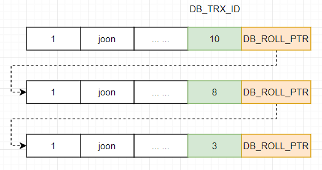
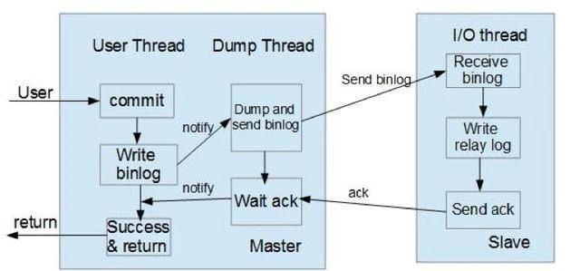

## MySQL 数据库


### 基础知识

#### 1. union 和 union all 的区别

- union all：对两个结果集直接进行并集操作，记录可能有重复，不会进行排序。

- union：对两个结果集进行并集操作，会进行去重，记录不会重复，按字段的默认规则排序。

因此，从效率上说，UNION ALL 要比 UNION 更快。


### 锁

#### 1.  说说共享锁和排他锁？

**共享锁**又称为读锁，简称S锁，顾名思义，共享锁就是多个事务对于同一数据可以共享一把锁，都能访问到数据，但是只能读不能修改。

**排他锁**又称为写锁，简称X锁，顾名思义，排他锁就是不能与其他锁并存，如一个事务获取了一个数据行的排他锁，其他事务就不能再获取该行的其他锁，包括共享锁和排他锁，但是获取排他锁的事务可以对数据就行读取和修改。

常见的几种 SQL 语句的加锁情况如下：

```mysql
select * from table：不加锁
update/insert/delete：排他锁

select * from table where id = 1 for update：id为索引，加排他锁
select * from table where id = 1 lock in share mode：id为索引，加共享锁
```

#### 2. 说说数据库的行锁和表锁？

**行锁**：操作时只锁某一（些）行，不对其它行有影响。开销大，加锁慢；会出现死锁；锁定粒度小，发生锁冲突的概率低，并发度高。

**表锁**：即使操作一条记录也会锁住整个表。开销小，加锁快；不会出现死锁；锁定粒度大，发生锁冲突概率高，并发度最低。

**页锁**：操作时锁住一页数据（16kb）。开销和加锁速度介于表锁和行锁之间；会出现死锁；锁定粒度介于表锁和行锁之间，并发度一般。

InnoDB 有行锁和表锁，MyIsam 只有表锁。

#### 3. InnoDB 的行锁是怎么实现的？

**InnoDB 行锁** 是通过索引上的索引项来实现的。意味者：只有通过索引条件检索数据，InnoDB 才会使用行级锁，否则，InnoDB将使用表锁！

- 对于主键索引：直接 锁住 主键索引即可。

- 对于普通索引：先锁住普通索引，接着锁住主键索引，这是因为一张表的索引可能存在多个，通过主键索引才能确保锁是唯一的，不然如果同时有2个事务对同1条数据的不同索引分别加锁，那就可能存在2个事务同时操作一条数据了。

#### 4. InnoDB 锁的算法有哪几种？

- Record lock：记录锁，单条索引记录上加锁，锁住的永远是索引，而非记录本身。

- Gap lock：间隙锁，在索引记录之间的间隙中加锁，或者是在某一条索引记录之前或者之后加锁，并不包括该索引记录本身。

- Next-key lock：Record lock 和 Gap lock 的结合，即除了锁住记录本身，也锁住索引之间的间隙。\

#### 5. MySQL 如何实现悲观锁和乐观锁？

乐观锁：更新时带上版本号（cas更新）

悲观锁：使用共享锁和排它锁，select...lock in share mode，select…for update。

#### 6. InnoDB 和 MyISAM 的区别？

| 对比项                     | InnoDB                   | MyIsam                                             |
| -------------------------- | ------------------------ | -------------------------------------------------- |
| 事务                       | 支持                     | 不支持                                             |
| 锁类型                     | 行锁、表锁               | 表锁                                               |
| 缓存                       | 缓存索引和数据           | 只缓存索引                                         |
| 主键                       | 必须有，用于实现聚簇索引 | 可以没有                                           |
| 索引                       | B+树，主键是聚簇索引     | B+树，非聚簇索引                                   |
| select count(*) from table | 较慢，扫描全表           | 贼快，用一个变量保存了表的行数，只需读出该变量即可 |
| hash索引                   | 支持                     | 不支持                                             |
| 记录存储顺序               | 按主键大小有序插入       | 按记录插入顺序保存                                 |
| 外键                       | 支持                     | 不支持                                             |
| 全文索引                   | 5.7 支持                 | 支持                                               |
| 关注点                     | 事务                     | 性能                                               |

#### 7. 存储引擎的选择？

没有特殊情况，使用 InnoDB 即可。如果表中绝大多数都只是读查询，可以考虑 MyISAM。


### 索引

#### 1. 什么是索引？

索引（Index）是帮助 MySQL 高效获取数据的排好序的数据结构

#### 2. 索引类型有哪些？

常见的索引类型有：hash、b树、b+树。

- hash：底层就是 hash 表。进行查找时，根据 key 调用hash 函数获得对应的 hashcode，根据 hashcode 找到对应的数据行地址，根据地址拿到对应的数据。
- B树：B树是一种多路搜索树，n 路搜索树代表每个节点最多有 n 个子节点。每个节点存储 key + 指向下一层节点的指针+ 指向 key 数据记录的地址。查找时，从根结点向下进行查找，直到找到对应的key。
- B+树：B+树是b树的变种，主要区别在于：B+树的非叶子节点只存储 key + 指向下一层节点的指针。另外，B+树的叶子节点之间通过指针来连接，构成一个有序链表，因此对整棵树的遍历只需要一次线性遍历叶子结点即可。

#### 3. 为什么MySQL用B+树索引？而不用红黑树、Hash、B树？

**红黑树**：如果在内存中，红黑树的查找效率比B树更高，但是涉及到磁盘操作，B树就更优了。因为红黑树是二叉树，数据量大时树的层数很高，从树的根结点向下寻找的过程，每读1个节点，都相当于一次IO操作，因此红黑树的I/O操作会比B树多的多。

**hash 索引**：如果只查询单个值的话，hash 索引的效率非常高。但是 hash 索引有几个问题：

- 不支持范围查询；
- 不支持索引值的排序操作；
- 不支持联合索引的最左匹配规则。

**B树索引**：B树索相比于B+树，在进行范围查询时，需要做局部的中序遍历，可能要跨层访问，跨层访问代表着要进行额外的磁盘I/O操作；另外，B树的非叶子节点存放了数据记录的地址，会导致存放的节点更少，树的层数变高。

#### 4. MySQL 中索引叶子节点存放的是什么？

MyISAM和InnoDB都是采用的B+树作为索引结构，但是叶子节点的存储上有些不同。

**MyISAM**：主键索引和辅助索引（普通索引）的叶子节点都是存放 key 和 key 对应数据行的地址。在MyISAM 中，主键索引和辅助索引没有任何区别。

**InnoDB**：

- **主键索引**：存放的是 key 和 key 对应的数据行。
- **辅助索引**：存放的是 key 和 key 对应的主键值。

因此在使用辅助索引时，通常需要检索两次索引，首先检索辅助索引获得主键值，然后用主键值到主键索引中检索获得记录。

#### 5. 什么是聚簇索引（聚集索引）？

**聚簇索引**：并不是一种单独的索引类型，而是一种数据存储方式。聚簇索引将索引和数据行放到了一块，找到索引也就找到了数据。因为无需进行回表操作，所以效率很高。

InnoDB 中必然会有，且只会有一个聚簇索引。通常是主键，如果没有主键，则优先选择非空的唯一索引，如果唯一索引也没有，则会创建一个隐藏的row_id 作为聚簇索引。至于为啥会只有一个聚簇索引，其实很简单，因为我们的数据只会存储一份。

**非聚簇索引**：则将数据存储和索引分开，找到索引后，需要通过对应的地址找到对应的数据行。MyISAM 的索引方式就是非聚簇索引。

#### 6. 什么是回表查询？

InnoDB 中，对于主键索引，只需要走一遍主键索引的查询就能在叶子节点拿到数据。

而对于普通索引，叶子节点存储的是 key + 主键值，因此需要再走一次主键索引，通过主键索引找到行记录，这就是所谓的回表查询，先定位主键值，再定位行记录。

#### 7. 走普通索引，一定会出现回表查询吗？

不一定，如果查询语句所要求的字段全部命中了索引，那么就不必再进行回表查询。

很容易理解，有一个 user 表，主键为 id，name 为普通索引，则再执行：select id, name from user where name = 'joonwhee' 时，通过name 的索引就能拿到 id 和 name了，因此无需再回表去查数据行了。

#### 8. 什么是覆盖索引（索引覆盖）吗？

覆盖索引是 SQL-Server 中的一种说法，上面讲的例子其实就实现了覆盖索引。具体的：当索引上包含了查询语句中的所有列时，我们无需进行回表查询就能拿到所有的请求数据，因此速度会很快。

当explain的输出结果Extra字段为Using index时，则代表触发覆盖索引。以上面的例子为例：

 

#### 9. 联合索引（复合索引）的底层实现？最佳左前缀原则？

联合索引底层还是使用B+树索引，并且还是只有一棵树，只是此时的排序会：首先按照第一个索引排序，在第一个索引相同的情况下，再按第二个索引排序，依次类推。

这也是为什么有“最佳左前缀原则”的原因，因为（在叶子节点上）右边（后面）的索引都是在左边（前面）的索引排序的基础上进行排序的，如果没有左边的索引，单独看右边的索引，其实是无序的。

#### 10. B+树中一个节点到底多大合适？

1页或页的倍数最为合适。因为如果一个节点的大小小于1页，那么读取这个节点的时候其实也会读出1页，造成资源的浪费。所以为了不造成浪费，所以最后把一个节点的大小控制在1页、2页、3页等倍数页大小最为合适。

这里说的“页”是 MySQL 自定义的单位（和操作系统类似），MySQL 的 Innodb 引擎中1页的默认大小是16k，可以使用命令 查看。

```mysql
SHOW GLOBAL STATUS LIKE 'Innodb_page_size'
```

 

#### 11. MySQL 中B+树的一个节点大小为多大呢？

在 MySQL 中 B+ 树的一个节点大小为“1页”，也就是16k。

#### 12. 为什么MySQL一个节点为1页就够了？

Innodb中，B+树中的一个节点存储的内容是：

- 非叶子节点：key + 指针（指向子节点）
- 叶子节点：数据行（key 通常是数据的主键）

**对于叶子节点**：我们假设1行数据大小为1k（对于普通业务绝对够了），那么1页能存16条数据。

**对于非叶子节点**：key 使用 bigint 则为8字节，指针在 MySQL 中为6字节，一共是14字节，则16k能存放 16 * 1024 / 14 = 1170个指针。那么一颗高度为3的B+树能存储的数据为：1170 * 1170 * 16 = 21902400（千万级）。

所以在 InnoDB 中B+树高度一般为3层时，就能满足千万级的数据存储。在查找数据时一次页的查找代表一次IO，所以通过主键索引查询通常只需要1-3次 IO 操作即可查找到数据。千万级别对于一般的业务来说已经足够了，所以一个节点为1页，也就是16k是比较合理的。

### 事务

#### 1. MySQL 的事务隔离级别有哪些？分别用于解决什么问题？

 主要用于解决脏读、不可重复读、幻读。

- 脏读：一个事务读取到另一个事务还未提交的数据。
- 不可重复读：在一个事务中多次读取同一个数据时，结果出现不一致。
- 幻读：在一个事务中使用相同的 SQL 两次读取，第二次读取到了其他事务新插入的行。

不可重复读注重于数据的修改，而幻读注重于数据的插入

#### 2. MySQL 的可重复读怎么实现的？

使用 MVCC 实现的，即 Mutil-Version Concurrency Control，多版本并发控制。关于 MVCC，比较常见的说法如下，包括《高性能 MySQL》也是这么介绍的。

InnoDB 会在每行记录后面增加三个隐藏字段：

- DB_ROW_ID：行ID，随着插入新行而单调递增，如果有主键，则不会包含该列。

- DB_TRX_ID：记录插入或更新该行的事务的事务ID。

- DB_ROLL_PTR：回滚指针，指向 undo log 记录。每次对某条记录进行改动时，该列会存一个指针，可以通过这个指针找到该记录修改前的信息,当某条记录被多次修改时，该行记录会存在多个版本，通过DB_ROLL_PTR 链接形成一个类似版本链的概念。

 

接下来进入正题，以 RR 级别为例：每开启一个事务时，系统会给该事务会分配一个事务 Id，在该事务执行第一个 select 语句的时候，会生成一个当前时间点的事务快照 ReadView，主要包含以下几个属性：

- trx_ids：生成 ReadView 时当前系统中活跃的事务 Id 列表，就是还未执行事务提交的。
- up_limit_id：低水位，取 trx_ids 中最小的那个，trx_id 小于该值都能看到。
- low_limit_id：高水位，生成 ReadView 时系统将要分配给下一个事务的id值，trx_id 大于等于该值都不能看到。
- creator_trx_id：生成该 ReadView 的事务的事务 Id。

有了这个ReadView，这样在访问某条记录时，只需要按照下边的步骤判断记录的某个版本是否可见:

1. 如果被访问版本的trx_id与ReadView中的creator_trx_id值相同，意味着当前事务在访问它自己修改过的记录，所以该版本可以被当前事务访问。

2. 如果被访问版本的trx_id小于ReadView中的up_limit_id值，表明生成该版本的事务在当前事务生成ReadView前已经提交，所以该版本可以被当前事务访问。

3. 如果被访问版本的trx_id大于ReadView中的low_limit_id值，表明生成该版本的事务在当前事务生成ReadView后才开启，所以该版本不可以被当前事务访问。

4. 如果被访问版本的trx_id属性值在ReadView的up_limit_id和low_limit_id之间，那就需要判断一下trx_id属性值是不是在trx_ids列表中。如果在，说明创建ReadView时生成该版本的事务还是活跃的，该版本不可以被访问；如果不在，说明创建ReadView时生成该版本的事务已经被提交，该版本可以被访问

在进行判断时，首先会拿记录的最新版本来比较，如果该版本无法被当前事务看到，则通过记录的 DB_ROLL_PTR 找到上一个版本，重新进行比较，直到找到一个能被当前事务看到的版本。

**对于删除**，其实就是一种特殊的更新，InnoDB 用一个额外的标记位 delete_bit 标识是否删除。当我们在进行判断时，会检查下 delete_bit 是否被标记，如果是，则跳过该版本，通过 DB_ROLL_PTR 拿到下一个版本进行判断。

以上内容是对于 RR 级别来说，而对于 RC 级别，其实整个过程几乎一样，唯一不同的是生成 ReadView 的时机，

- RR 级别只在事务开始时生成一次，之后一直使用该 ReadView。而
- RC 级别则在每次 select 时，都会生成一个 ReadView。

#### 3. MVCC解决唤读了吗？

- 幻读：在一个事务中使用相同的 SQL 两次读取，第二次读取到了其他事务新插入的行，则称为发生了幻读。

> 例如下面这种情况：

1. 事务1第一次查询：select * from user where id < 10 时查到了 id = 1 的数据

2. 事务2插入了 id = 2 的数据

3. 事务1使用同样的语句第二次查询时，查到了 id = 1、id = 2 的数据，出现了幻读。

谈到幻读，首先我们要引入“当前读”和“快照读”的概念，聪明的你一定通过名字猜出来了：

**快照读**：生成一个事务快照（ReadView），之后都从这个快照获取数据。普通 select 语句就是快照读。

**当前读**：读取数据的最新版本。常见的 update/insert/delete、还有 select ... for update、select ... lock in share mode 都是当前读。

- 对于快照读，MVCC 因为因为从 ReadView 读取，所以必然不会看到新插入的行，所以天然就解决了幻读的问题。

- 对于**当前读的幻读，MVCC 是无法解决的**。需要使用 Gap Lock 或 Next-Key Lock（Gap Lock + Record Lock）来解决。

其实原理也很简单，用上面的例子稍微修改下以触发当前读：select * from user where id < 10 for update，当使用了 Gap Lock 时，Gap 锁会锁住 id < 10 的整个范围，因此其他事务无法插入 id < 10 的数据，从而防止了幻读。

#### 4. 经常有人说 Repeatable Read 解决了幻读是什么情况

SQL 标准中规定的 RR 并不能消除幻读，但是 MySQL 的 RR 可以，靠的就是 Gap 锁。

- 在 RR 级别下，Gap 锁是默认开启的，
- 而在 RC 级别下，Gap 锁是关闭的。

### 存储引擎

#### 1. 什么是 Buffer Pool？

Buffer Pool 是 InnoDB 维护的一个缓存区域，用来缓存数据和索引在内存中，主要用来加速数据的读写，如果 Buffer Pool 越大，那么 MySQL 就越像一个内存数据库，默认大小为 128M。

InnoDB 会将那些热点数据和一些 InnoDB 认为即将访问到的数据存在 Buffer Pool 中，以提升数据的读取性能

InnoDB 在修改数据时，如果数据的页在 Buffer Pool 中，则会直接修改 Buffer Pool，此时我们称这个页为脏页，InnoDB 会以一定的频率将脏页刷新到磁盘，这样可以尽量减少磁盘I/O，提升性能。

#### 2. InnoDB 四大特性知道吗？

（1）**插入缓冲（insert buffer）：** 

索引是存储在磁盘上的，所以对于索引的操作需要涉及磁盘操作。如果我们使用自增主键，那么在插入主键索引（聚簇索引）时，只需不断追加即可，不需要磁盘的随机 I/O。但是如果我们使用的是普通索引，大概率是无序的，此时就涉及到磁盘的随机 I/O，而随机I/O的性能是比较差的（Kafka 官方数据：磁盘顺序I/O的性能是磁盘随机I/O的4000~5000倍）。

因此，InnoDB 存储引擎设计了 Insert Buffer ，对于非聚集索引的插入或更新操作，不是每一次直接插入到索引页中，而是先判断插入的非聚集索引页是否在缓冲池（Buffer pool）中，若在，则直接插入；若不在，则先放入到一个 Insert Buffer 对象中，然后再以一定的频率和情况进行 Insert Buffer 和辅助索引页子节点的 merge（合并）操作，这时通常能将多个插入合并到一个操作中（因为在一个索引页中），这就大大提高了对于非聚集索引插入的性能。

插入缓冲的使用需要满足以下两个条件：1）索引是辅助索引；2）索引不是唯一的。

因为在插入缓冲时，数据库不会去查找索引页来判断插入的记录的唯一性。如果去查找肯定又会有随机读取的情况发生，从而导致 Insert Buffer 失去了意义。

（2）**二次写（double write）** 

脏页刷盘风险：InnoDB 的 page size一般是16KB，操作系统写文件是以4KB作为单位，那么每写一个 InnoDB 的 page 到磁盘上，操作系统需要写4个块。于是可能出现16K的数据，写入4K 时，发生了系统断电或系统崩溃，只有一部分写是成功的，这就是 partial page write（部分页写入）问题。这时会出现数据不完整的问题。

这时是无法通过 redo log 恢复的，因为 redo log 记录的是对页的物理修改，如果页本身已经损坏，重做日志也无能为力。

doublewrite 就是用来解决该问题的。doublewrite 由两部分组成，一部分为内存中的 doublewrite buffer，其大小为2MB，另一部分是磁盘上共享表空间中连续的128个页，即2个区(extent)，大小也是2M。

为了解决 partial page write 问题，当 MySQL 将脏数据刷新到磁盘的时候，会进行以下操作：

1）先将脏数据复制到内存中的 doublewrite buffer

2）之后通过 doublewrite buffer 再分2次，每次1MB写入到共享表空间的磁盘上（顺序写，性能很高）

3）完成第二步之后，马上调用 fsync 函数，将doublewrite buffer中的脏页数据写入实际的各个表空间文件（离散写）。

如果操作系统在将页写入磁盘的过程中发生崩溃，InnoDB 再次启动后，发现了一个 page 数据已经损坏，InnoDB 存储引擎可以从共享表空间的 doublewrite 中找到该页的一个最近的副本，用于进行数据恢复了。

（3）**自适应哈希索引(adaptive hash index）：** 

哈希（hash）是一种非常快的查找方法，一般情况下查找的时间复杂度为 O(1)。但是由于不支持范围查询等条件的限制，InnoDB 并没有采用 hash 索引，但是如果能在一些特殊场景下使用 hash 索引，则可能是一个不错的补充，而 InnoDB 正是这么做的。 

具体的，InnoDB 会监控对表上索引的查找，如果观察到某些索引被频繁访问，索引成为热数据，建立哈希索引可以带来速度的提升，则建立哈希索引，所以称之为自适应（adaptive）的。自适应哈希索引通过缓冲池的 B+ 树构造而来，因此建立的速度很快。而且不需要将整个表都建哈希索引，InnoDB 会自动根据访问的频率和模式来为某些页建立哈希索引。

（4）**预读（read ahead）：** 

InnoDB 在 I/O 的优化上有个比较重要的特性为预读，当 InnoDB 预计某些 page 可能很快就会需要用到时，它会异步地将这些 page 提前读取到缓冲池（buffer pool）中，这其实有点像空间局部性的概念。

空间局部性（spatial locality）：如果一个数据项被访问，那么与他地址相邻的数据项也可能很快被访问。 

InnoDB使用两种预读算法来提高I/O性能：线性预读（linear read-ahead）和随机预读（randomread-ahead）。

其中，线性预读以 extent（块，1个 extent 等于64个 page）为单位，而随机预读放到以 extent 中的 page 为单位。线性预读着眼于将下一个extent 提前读取到 buffer pool 中，而随机预读着眼于将当前 extent 中的剩余的 page 提前读取到 buffer pool 中

- **线性预读（Linear read-ahead）**：线性预读方式有一个很重要的变量 innodb_read_ahead_threshold，可以控制 Innodb 执行预读操作的触发阈值。如果一个 extent 中的被顺序读取的 page 超过或者等于该参数变量时，Innodb将会异步的将下一个 extent 读取到 buffer pool中，innodb_read_ahead_threshold 可以设置为0-64（一个 extend 上限就是64页）的任何值，默认值为56，值越高，访问模式检查越严格。 

- **随机预读（Random read-ahead）**: 随机预读方式则是表示当同一个 extent 中的一些 page 在 buffer pool 中发现时，Innodb 会将该 extent 中的剩余 page 一并读到 buffer pool中，由于随机预读方式给 Innodb code 带来了一些不必要的复杂性，同时在性能也存在不稳定性，在5.5中已经将这种预读方式废弃。要启用此功能，请将配置变量设置 innodb_random_read_ahead 为ON。

### MySQL 优化

#### 1. explain 用过吗，有哪些字段分别是啥意思？

explain 字段有：

- id：标识符
- select_type：查询的类型
- table：输出结果集的表
- partitions：匹配的分区
- type：表的连接类型
- possible_keys：查询时，可能使用的索引
- key：实际使用的索引
- key_len：使用的索引字段的长度
- ref：列与索引的比较
- rows：估计要检查的行数
- filtered：按表条件过滤的行百分比
- Extra：附加信息

#### 2. type 中有哪些常见的值？

按类型排序，从好到坏，常见的有：const > eq_ref > ref > range > index > ALL。

- const：通过主键或唯一键查询，并且结果只有1行（也就是用等号查询）。因为仅有一行，所以优化器的其余部分可以将这一行中的列值视为常量。
- eq_ref：通常出现于两表关联查询时，使用主键或者非空唯一键关联，并且查询条件不是主键或唯一键的等号查询。
- ref：通过普通索引查询，并且使用的等号查询。
- range：索引的范围查找（>=、<、in 等）。
- index：全索引扫描。
- All：全表扫描

#### 3. explain 主要关注哪些字段？

主要关注 type、key、row、extra 等字段。主要是看是否使用了索引，是否扫描了过多的行数，是否出现 Using temporary、Using filesort 等一些影响性能的主要指标。

#### 4. 如何做慢 SQL 优化？

首先要搞明白慢的原因是什么：

1. 查询条件没有命中索引？
2. load 了不需要的数据列？
3. 还是数据量太大？

所以优化也是针对这三个方向来的。

- 首先用 explain 分析语句的执行计划，查看使用索引的情况，是不是查询没走索引，如果可以加索引解决，优先采用加索引解决。
- 分析语句，看看是否存在一些导致索引失效的用法，是否 load 了额外的数据，是否加载了许多结果中并不需要的列，对语句进行分析以及重写。
- 如果对语句的优化已经无法进行，可以考虑表中的数据量是否太大，如果是的话可以进行垂直拆分或者水平拆分。

#### 5. 说说 MySQL 的主从复制？

MySQL主从复制涉及到三个线程，一个运行在主节点（Log Dump Thread），其余两个（I/O Thread，SQL Thread）运行在从节点，如下图所示

 

主从复制默认是异步的模式，具体过程如下。

1. 从节点上的I/O 线程连接主节点，并请求从指定日志文件（bin log file）的指定位置（bin log position，或者从最开始的日志）之后的日志内容；
2. 主节点接收到来自从节点的 I/O请求后，读取指定文件的指定位置之后的日志信息，返回给从节点。返回信息中除了日志所包含的信息之外，还包括本次返回的信息的 bin-log file 以及 bin-log position；从节点的 I/O 进程接收到内容后，将接收到的日志内容更新到 relay log 中，并将读取到的 bin log file（文件名）和position（位置）保存到 master-info 文件中，以便在下一次读取的时候能够清楚的告诉 Master “我需要从某个bin-log 的哪个位置开始往后的日志内容”；
3. 从节点的 SQL 线程检测到 relay-log 中新增加了内容后，会解析 relay-log 的内容，并在本数据库中执行。

#### 6. 异步复制，主库宕机后，数据可能丢失？

可以使用半同步复制或全同步复制。

- **半同步复制：**

修改语句写入bin log后，不会立即给客户端返回结果。而是首先通过log dump 线程将 binlog 发送给从节点，从节点的 I/O 线程收到 binlog 后，写入到 relay log，然后返回 ACK 给主节点，主节点 收到 ACK 后，再返回给客户端成功。

 

半同步复制的特点：

- 确保事务提交后 binlog 至少传输到一个从库
- 不保证从库应用完这个事务的 binlog
- 性能有一定的降低，响应时间会更长
- 网络异常或从库宕机，卡主主库，直到超时或从库恢复


- **全同步复制** 

主节点和所有从节点全部执行了该事务并确认才会向客户端返回成功。因为需要等待所有从库执行完该事务才能返回，所以全同步复制的性能必然会收到严重的影响。

#### 7. 主库写压力大，从库复制很可能出现延迟？

可以使用并行复制（并行是指从库多个SQL线程并行执行 relay log），解决从库复制延迟的问题。

MySQL 5.7 中引入基于组提交的并行复制，其核心思想：一个组提交的事务都是可以并行回放，因为这些事务都已进入到事务的 prepare 阶段，则说明事务之间没有任何冲突（否则就不可能提交）。

判断事务是否处于一个组是通过 last_committed 变量，last_committed 表示事务提交的时候，上次事务提交的编号，如果事务具有相同的 last_committed，则表示这些事务都在一组内，可以进行并行的回放。

**相关文章** 

1. [MySQL 常见题目](https://joonwhee.blog.csdn.net/article/details/106893197) ——程序员囧辉