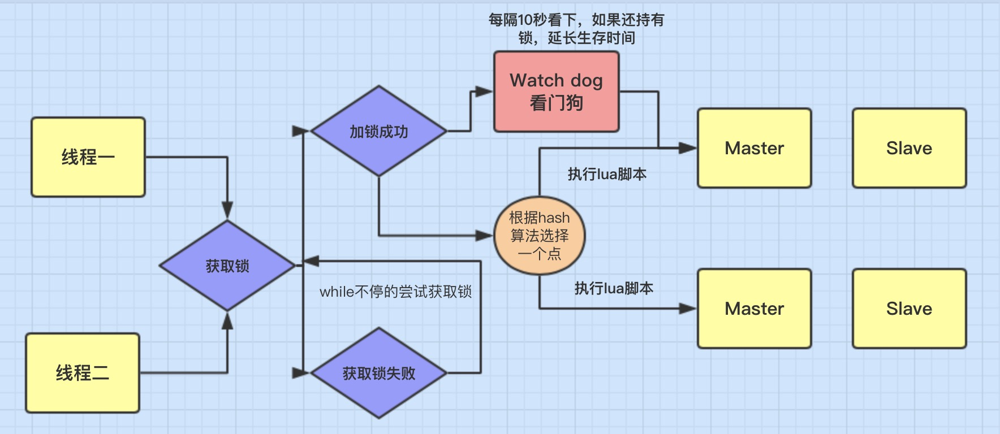
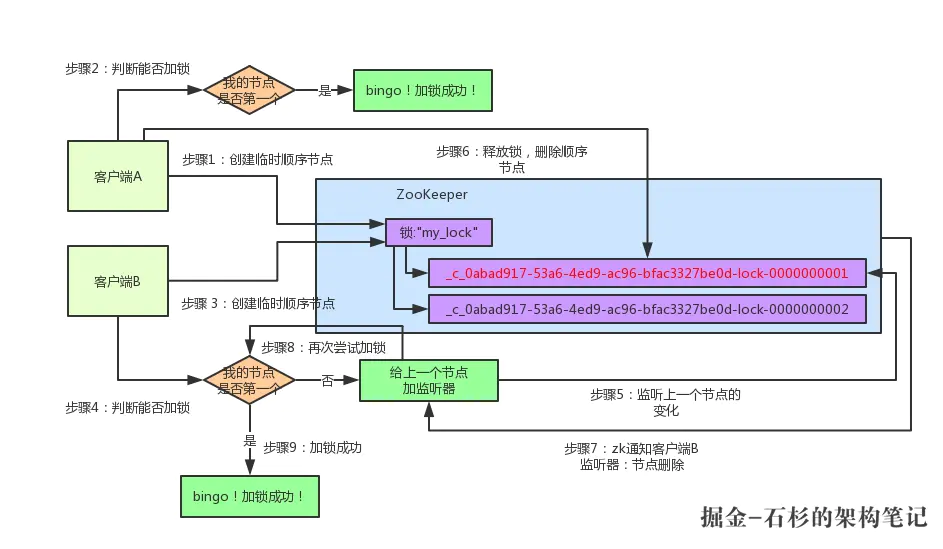

### 分布式锁

- 学习资源：链接：https://pan.baidu.com/s/1z0qldoBpqG2ikxOpGWZyTQ   提取码：wwxw 

### 分布式锁实现技术

#### 1.0 前言

当我们在设计分布式锁的时候，我们应该考虑分布式锁至少要满足的一些条件，同时考虑如何高效的设计分布式锁，这里我认为以下几点是必须要考虑的。

- **互斥** :在分布式高并发的条件下，我们最需要保证，同一时刻只能有一个线程获得锁，这是最基本的一点。

- **防止死锁**：在分布式高并发的条件下，比如有个线程获得锁的同时，还没有来得及去释放锁，就因为系统故障或者其它原因使它无法执行释放锁的命令,导致其它线程都无法获得锁，造成死锁。

所以分布式非常有必要设置锁的`有效时间`，确保系统出现故障后，在一定时间内能够主动去释放锁，避免造成死锁的情况。

- **性能** ：对于访问量大的共享资源，需要考虑减少锁等待的时间，避免导致大量线程阻塞。所以在锁的设计时，需要考虑两点。
  1. 锁的颗粒度要尽量小。比如你要通过锁来减库存，那这个锁的名称你可以设置成是商品的ID,而不是任取名称。这样这个锁只对当前商品有效,锁的颗粒度小。
  2. 锁的范围尽量要小。比如只要锁2行代码就可以解决问题的，那就不要去锁10行代码了。
- **可重入** ：我们知道ReentrantLock是可重入锁，那它的特点就是：同一个线程可以重复拿到同一个资源的锁。重入锁非常有利于资源的高效利用。关于这点之后会做演示。

#### 1.1 基于数据库实现分布式锁

- 性能较差，容易出现单点故障
- 锁没有失效时间，容易死锁

#### 1.2 基于缓存实现分布式锁

- 优点是性能很高，但实现复杂（比如设置过期时间、以及过期时间判断）——redis/memcache等
- 存在死锁（或短时间死锁）的可能（执行逻辑宕机后还未到过期时间，则锁得不到释放）

#### 1.3 基于Zookeeper实现分布式锁

- 实现相对简单
- 可靠性高
- 性能较好

### JDK 锁面临的问题

#### 1.1 模拟并发场景

示例代码：订单服务————>订单编号生成类 并发测试

```java
public class ConcurrentTestDemo {

    // 模拟并发无法保证 订单号的唯一性
    public static void main(String[] args) {
        int currency = 20;
        CyclicBarrier cb = new CyclicBarrier(currency);
        CountDownLatch cdl = new CountDownLatch(currency); // 倒计数锁存器

        OrderService orderService = new OrderServiceImpl();
        OrderService orderServiceLock = new OrderServiceImplWithLock();

        // 多线程模拟高并发
        for (int i = 0; i < currency; i++) {
            new Thread(new Runnable() {
                @Override
                public void run() {
                    System.out.println(Thread.currentThread().getName() + "：我准备好");
                    // 等待一起出发
                    try {
                        // 方式一
                        cb.await();
                        // 方式二
//                        cdl.countDown();
//                        cdl.await();
                    } catch (InterruptedException | BrokenBarrierException e) {
                        e.printStackTrace();
                    }
                    // 调用创建订单服务
                    orderService.createOrder();
//                    orderServiceLock.createOrder();
                }
            }).start();
        }
    }
}
```

#### 1.2 模拟分布式并发场景

示例代码：模拟分布式集群 并发测试

```java
public class ConcurrentTestDistributeDemo {

    public static void main(String[] args) {
        // 并发数
        int currency = 20;
        CyclicBarrier cb = new CyclicBarrier(currency);   // 循环屏障
        CountDownLatch cdl = new CountDownLatch(currency); // 倒计数锁存器

        OrderService orderService = new OrderServiceImpl();
//        OrderService orderServiceLock = new OrderServiceImplWithLock();

        // 多线程模拟高并发
        for (int i = 0; i < currency; i++) {
            new Thread(new Runnable() {
                @Override
                public void run() {
                    //模拟分布式集群场景
                    OrderService orderServiceLock = new OrderServiceImplWithLock();
                    System.out.println(Thread.currentThread().getName() + "：我准备好");
                    // 等待一起出发
                    try {
                        // 方式一
                        cb.await();
                        // 方式二
//                        cdl.countDown();
//                        cdl.await();
                    } catch (InterruptedException | BrokenBarrierException e) {
                        e.printStackTrace();
                    }
                    // 调用创建订单服务
//                    orderService.createOrder();
                    orderServiceLock.createOrder();
                }
            }).start();
        }
    }
}
```

**完整源码**： [Github快速访问](https://github.com/GitHubWxw/Java-concurrent/tree/master/cloud-concurrent-redis/src/main/java/com/wxw/common/distributed_lock) 

### 基于Redis实现分布式锁

#### 1.1 Redis 实现分布式锁


#### 1.2 Redission 实现分布式锁

 


#### 1.3 常见问题

**（1）attempt to unlock lock, not locked by current thread by node id: 046f5254-fcdc-4806-81b0-29eb409f5ed4 thread-id: 314**

 

- 原因分析：

  线程1 进来获得锁后，但它的业务逻辑需要执行2秒，在 线程1 执行1秒后，这个锁就自动过期了，那么这个时候 
  线程2 进来了获得了锁。在线程1去解锁就会抛上面这个异常（因为解锁和当前锁已经不是同一线程了）

- 所以我们需要注意，设置锁的过期时间不能设置太小，一定要合理，宁愿设置大点。

**（2）在哨兵模式或者主从模式下，如果 master实例宕机的时候，可能导致多个客户端同时完成加锁,产生脏数据**  

> 过程分析

`客户端1` 对某个`master节点`写入了redisson锁，此时会异步复制给对应的 slave节点。但是这个过程中一旦发生 master节点宕机，主备切换，slave节点从变为了 master节点。这时`客户端2` 来尝试加锁的时候，在新的master节点上也能加锁，此时就会导致多个客户端对同一个分布式锁完成了加锁。

这时系统在业务语义上一定会出现问题，**导致各种脏数据的产生**。

**相关文章** 

1. [redission分布式锁原理](https://www.cnblogs.com/qdhxhz/p/11059200.html)  

### 基于Zookeeper实现分布式锁

**zookeeper分布式锁流程** 

 

### 分布式锁技术选型

#### （1）强一致性 分布式锁

- 如果要满足上述分布式锁之间的强一致性, 可以采用 Zookeeper 的分布式锁, **因为它底层的 ZAB协议(原子广播协议), 天然满足 CP**

但是这也意味着性能的下降, 所以不站在具体数据下看 Redis 和 Zookeeper, 代表着性能和一致性的取舍

#### （2）最终一致性 分布式锁

- 如果项目没有强依赖 ZK, 使用 Redis 就好了, 因为现在 Redis 用途很广, 大部分项目中都引用了 Redis，没必要对此再引入一个新的组件, 如果业务场景对于 Redis 异步方式的同步数据造成锁丢失无法忍受, 在业务层处理就好了

  

**相关文章**  

1. [zookeeper 分佈式锁](https://www.cnblogs.com/ysw-go/p/11444993.html) 


